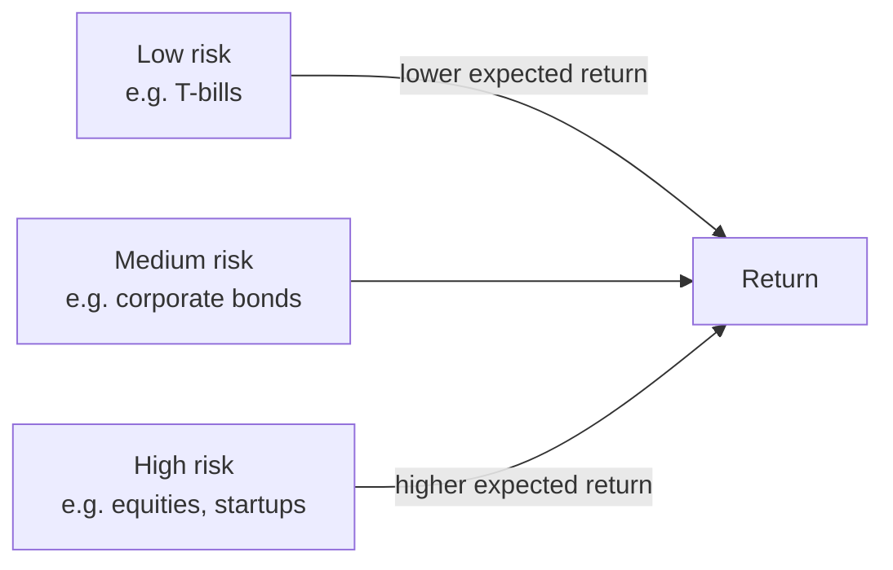

# Money and Finance

Money is the lubricant of an economy and finance is the machinery that moves resources
across time and risk. This note covers what money is, why interest rates exist, how banks
and credit create purchasing power, the trade-off between risk and return, what financial
markets are *for*, and why asset prices sometimes detach from reality into bubbles. It sits
directly under [macroeconomics](macroeconomics.md) — money and credit are the channels
through which monetary policy acts — and it draws on
[Mankiw's *Principles*](mankiw-principles-of-economics.md) and the price-signal insight of
[Adam Smith](smith-wealth-of-nations.md).

## What money is and does

Money is not wealth; it is a *claim on* wealth that solves the awkwardness of barter.
Economists define it by three functions:

- **Medium of exchange** — everyone accepts it, so you needn't find a double coincidence
  of wants.
- **Unit of account** — it gives a common yardstick for prices, making comparison and
  [marginal thinking](marginal-thinking-and-incentives.md) tractable.
- **Store of value** — it carries purchasing power into the future (imperfectly, since
  inflation erodes it — see [macroeconomics](macroeconomics.md)).

Modern money is *fiat*: it has value because a government designates it legal tender and
because everyone expects everyone else to accept it — a self-fulfilling social convention.

## Interest and the time value of money

A dollar today is worth more than a dollar next year, because today's dollar can be
invested to grow, and because the future is uncertain. The **interest rate** is the price
of moving money across time. This gives the **time value of money**: a future cash flow is
worth its *present value*, discounted by the interest rate:

```
PV = FV / (1 + r)^n
```

The same discounting that values a bond values a factory, a degree, or a startup — every
investment is a bet that discounted future returns exceed today's cost, a direct
application of [opportunity cost](opportunity-cost-and-scarcity.md).

## Banking and credit creation

Banks are intermediaries: they take deposits and lend them out. Because depositors rarely
all withdraw at once, a bank need hold only a fraction as reserves and can lend the rest —
so the banking system as a whole *creates* money, expanding the money supply well beyond
the physical currency in circulation. Credit lets a household buy a home before saving its
full price and lets a firm build a factory before earning the revenue to pay for it. It is
enormously productive and enormously fragile: the same fractional-reserve mechanism that
multiplies money in good times can collapse in a bank run, a destabilizing [feedback
loop](../systems-thinking/feedback-loops.md) where fear of insolvency causes the
insolvency.

## Risk and return

No return is free. The central law of finance is that expected return rises with risk,
because risk-averse investors must be *paid* to bear uncertainty. A government bond pays
little because it is nearly certain; a startup equity might pay enormously or nothing.
Quantifying that uncertainty is where [statistics](../statistics/index.md) enters finance —
expected value, variance, and correlation are the raw material of portfolio theory, whose
key insight is that **diversification** cancels idiosyncratic risk for free: uncorrelated
bets pooled together have the same expected return but lower variance.



## What financial markets are for

Financial markets exist to (1) channel savings to their most productive use, (2) let
people and firms shift consumption across time (borrow young, save middle-aged, draw down
old), (3) spread and transfer risk (insurance, derivatives), and (4) aggregate dispersed
information into a **price**. That last function is why prices are informative:
[information economics](information-economics-and-network-effects.md) shows how a market
price can summarize what thousands of participants each know only in part — Smith's
invisible hand as an information-processing system.

## Asset prices and bubbles

Efficient-market theory holds that prices already reflect available information, so you
cannot reliably beat the market. Reality is messier. Because an asset's value depends on
what *others* will pay, expectations can become self-referential: rising prices attract
buyers who bid prices higher still, a [feedback loop](../systems-thinking/feedback-loops.md)
untethered from fundamentals. That is a **bubble** — and its inevitable reversal is a
crash. [Behavioral economics](behavioral-economics.md) explains why: herding,
overconfidence, and the extrapolation of recent trends are systematic, not random, so the
madness of crowds recurs (tulips, 1929, dot-coms, 2008 housing) with dispiriting
regularity.

## Why it matters

Finance decides which ideas get funded, how households smooth a lifetime of uneven income,
and how risk is shared across a society. Done well, it is a growth engine that turns idle
savings into [productive capital](economic-growth.md). Done badly — or trusted blindly — it
concentrates risk until a shock cascades through the whole [macroeconomy](macroeconomics.md).

## References

- [Mankiw — *Principles of Economics*](mankiw-principles-of-economics.md)
- [Adam Smith — *The Wealth of Nations*](smith-wealth-of-nations.md)
