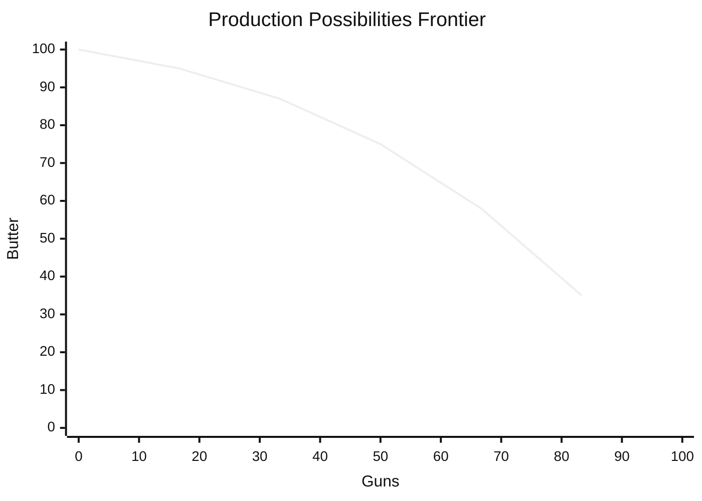

# Opportunity Cost and Scarcity

Scarcity is the founding premise of economics: resources — time, labour, capital,
raw materials, attention — are finite, while human wants are effectively unlimited.
Because you cannot have everything at once, **every choice is a trade-off**. Economics
is, at bottom, the study of how people, firms, and societies allocate scarce means
among competing ends.

## Opportunity cost: the true price of a choice

The **opportunity cost** of an action is the value of the *next-best alternative you
give up* to take it. It is not what you paid in dollars; it is what you *forgo*.

- The opportunity cost of a year in graduate school is not just tuition but the salary
  you didn't earn.
- The opportunity cost of an hour spent gaming is the reading, sleep, or paid work that
  hour could have been.

Two corollaries follow, and both recur throughout the field:

1. **There is no free lunch.** Every benefit has a cost measured in forgone
   alternatives, even when no money changes hands.
2. **Rational decisions weigh opportunity cost, not accounting cost.** This connects
   directly to [marginal-thinking-and-incentives](marginal-thinking-and-incentives.md):
   a good decision compares the marginal benefit of an option to what the same resources
   would yield elsewhere.

## The production possibilities frontier

For a whole economy, scarcity is captured by the **production possibilities frontier
(PPF)** — the set of maximum output combinations of two goods achievable with fixed
resources and technology.

- **Points *on* the curve** are efficient: every resource is fully used.
- **Points *inside*** are attainable but wasteful (idle labour, unused plant).
- **Points *outside*** are unattainable given current resources — only
  [economic-growth](economic-growth.md) (more inputs or better technology) can push the
  frontier outward.
- The curve **bows outward** because resources are not equally good at everything;
  shifting from butter to guns first uses the resources best suited to guns, then ever
  less suitable ones. This rising slope *is* increasing opportunity cost.

Choosing a point on the PPF is a **constrained optimization** problem — maximise value
subject to a resource limit — the same structure formalised in
[../linear-optimization/optimization-problems.md](../linear-optimization/optimization-problems.md).

## Comparative advantage and the gains from trade

Scarcity would seem to make one party's gain another's loss. It doesn't. **Comparative
advantage** (Ricardo) is the key: a party should specialise in what it produces at the
*lowest opportunity cost*, not necessarily what it produces best in absolute terms.

Consider a lawyer who types faster than her assistant. She has an *absolute* advantage
at both lawyering and typing. But her opportunity cost of typing — the billable legal
work she gives up — is enormous. The assistant's opportunity cost of typing is low. So
the lawyer specialises in law, the assistant in typing, and **both are better off** than
if each did everything. Trade lets total output exceed what either could reach alone —
it moves the *joint* consumption possibilities beyond either party's individual PPF.

This is the microfoundation of Adam Smith's argument for the division of labour and
markets in [smith-wealth-of-nations](smith-wealth-of-nations.md), and it scales from
two people to two nations.

## Why it matters

Opportunity cost and scarcity are the lens through which every later idea is read.
Prices in [supply-and-demand](supply-and-demand.md) are society's running estimate of
opportunity cost. [Microeconomics](microeconomics.md) formalises the individual
optimisation these ideas describe. The concepts explain everything from why you can't
"just print money" to why comparative advantage, not self-sufficiency, makes nations
rich. They also connect to broader questions of value and choice raised in
[../philosophy/index.md](../philosophy/index.md) and how societies coordinate scarce
resources, explored in [../sociology/index.md](../sociology/index.md).

## References

- [Principles of Economics](mankiw-principles-of-economics.md) — Mankiw's "ten
  principles" open with scarcity, trade-offs, and opportunity cost.
- [The Wealth of Nations](smith-wealth-of-nations.md) — the classical case for
  specialisation and the division of labour.
