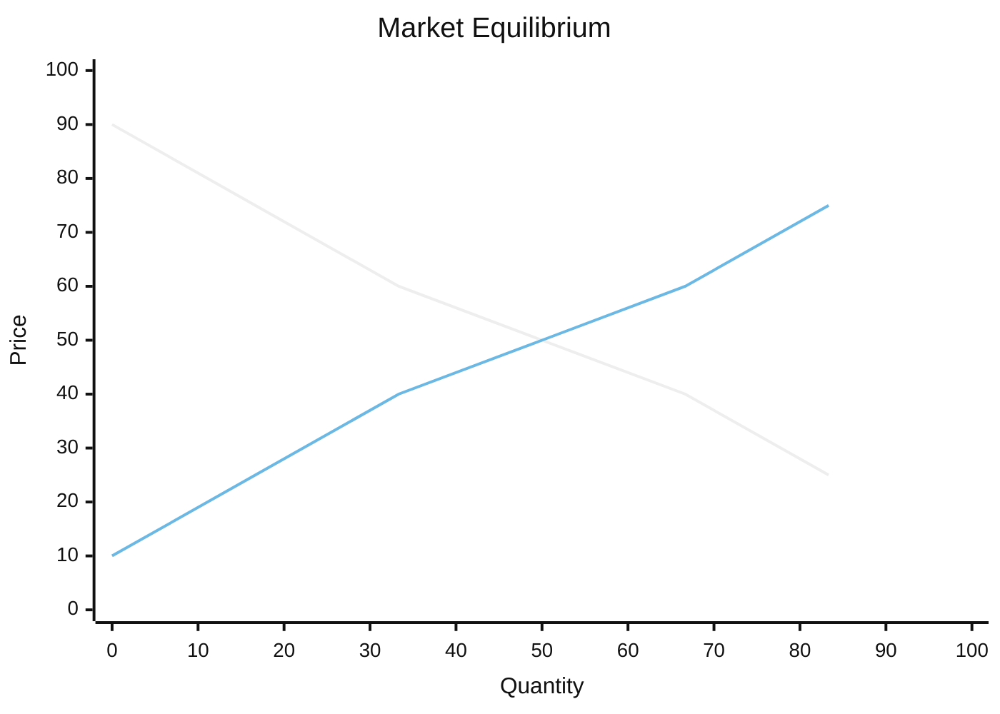

# Supply and Demand

Supply and demand is the workhorse model of economics: it explains how, in a market, the
independent decisions of countless buyers and sellers get coordinated by a single signal
— the **price** — with no one in charge. It is the mechanism behind Adam Smith's
"invisible hand" in [smith-wealth-of-nations](smith-wealth-of-nations.md).

## The two curves

- **Demand** relates the price of a good to the quantity buyers *want to buy*. It slopes
  **downward**: as price falls, buyers purchase more (they substitute toward the cheaper
  good and can afford more of it). Each point reflects the marginal buyer's willingness
  to pay — an application of [marginal-thinking-and-incentives](marginal-thinking-and-incentives.md).
- **Supply** relates price to the quantity sellers *want to sell*. It slopes **upward**:
  higher prices cover higher marginal costs and draw more producers in.

The falling line is demand, the rising line is supply.

## Equilibrium

**Equilibrium** is the price–quantity pair where the curves cross: the quantity buyers
want to buy exactly equals the quantity sellers want to sell. It is self-correcting:

- Above equilibrium, a **surplus** (excess supply) pushes sellers to cut prices.
- Below it, a **shortage** (excess demand) lets sellers raise prices.

The price gravitates back to the crossing point. This is the same fixed-point/equilibrium
idea studied more generally in
[../linear-optimization/optimization-problems.md](../linear-optimization/optimization-problems.md)
and, at the level of whole coordinated systems, in
[../systems-thinking/complex-adaptive-systems.md](../systems-thinking/complex-adaptive-systems.md):
order emerges from decentralised local rules, not central design.

## Shifts vs. movements — the classic trap

A **movement *along*** a curve is a response to that good's *own* price changing. A
**shift** of the *whole curve* is a response to *anything else*:

| Shifts **demand** | Shifts **supply** |
|---|---|
| Income, tastes, prices of substitutes/complements, expectations, number of buyers | Input costs, technology, taxes/subsidies, expectations, number of sellers |

Confusing the two is the most common beginner error. Rule of thumb: only a change in the
good's *own price* moves you along a fixed curve; everything else shifts it.

## Elasticity

**Elasticity** measures *how much* quantity responds to a change, in percentage terms.
Price elasticity of demand = (% change in quantity) / (% change in price).

- **Elastic** (|E| > 1): quantity is very responsive (luxuries, goods with close
  substitutes). Raising price *lowers* total revenue.
- **Inelastic** (|E| < 1): quantity barely moves (necessities, addictive goods,
  short-run essentials). Raising price *raises* total revenue.

Elasticity tells you who ultimately bears a tax, whether a price cut grows revenue, and
how sharply a shock ripples through a market.

## Surplus: measuring the gains

- **Consumer surplus** = what buyers were willing to pay minus what they actually paid
  (area under demand, above price).
- **Producer surplus** = price received minus the seller's marginal cost (area above
  supply, below price).

At the competitive equilibrium, their sum — **total surplus** — is maximised. This is the
efficiency case for free markets. Where that case breaks (externalities, monopoly, public
goods), see [market-failure-and-externalities](market-failure-and-externalities.md).

## Price controls

When a government fixes a price away from equilibrium, the market can't clear:

- A **price ceiling** below equilibrium (e.g. rent control) creates a persistent
  **shortage**, queues, and quality erosion.
- A **price floor** above equilibrium (e.g. minimum wage, farm price supports) creates a
  persistent **surplus** (e.g. unemployment, unsold crops).

Controls don't repeal supply and demand; they suppress the price signal and force the
imbalance to surface elsewhere.

## Why it matters

Supply and demand is the first tool you reach for to reason about *any* market — labour,
housing, oil, currencies. The deeper lesson, central to
[smith-wealth-of-nations](smith-wealth-of-nations.md) and Hayek, is informational: the
price aggregates dispersed knowledge that no planner could gather, letting a society
coordinate scarce resources ([opportunity-cost-and-scarcity](opportunity-cost-and-scarcity.md))
through voluntary exchange. It is the entry point to the formal treatment in
[microeconomics](microeconomics.md).

## References

- [Principles of Economics](mankiw-principles-of-economics.md) — "markets are usually a
  good way to organise economic activity"; the canonical undergraduate treatment.
- [The Wealth of Nations](smith-wealth-of-nations.md) — the original account of prices
  and the invisible hand.
