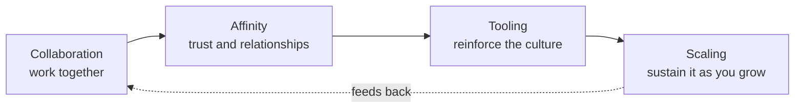

# Effective DevOps

Jennifer Davis and Katherine Daniels (O'Reilly, 2016) argue that DevOps is
fundamentally a **cultural movement, not a set of tools or a job title**. The
subtitle names the thesis directly: building a culture of collaboration,
affinity, and tooling at scale. The book's central move is to reframe DevOps
away from the pipeline diagrams and toolchains it is usually reduced to, and
toward the human systems — how people relate, trust, and share work — that make
those tools actually pay off. Tools that reinforce a healthy culture help; tools
bolted onto a broken culture just automate the dysfunction.

## Culture over tooling

The recurring failure mode is treating DevOps as something you can *buy* or
*hire*. You can install every automation platform and still ship slowly and
break constantly if the organization keeps developers and operations in
separate silos with misaligned incentives. Culture is the substrate; tooling is
an expression of it. The authors organize the material around four pillars that
build on each other.

## The four pillars

- **Collaboration** — Break down the silos between development and operations
  (and QA, security, the business). Shared goals, shared context, and shared
  responsibility for the whole lifecycle from concept to production. Blameless
  handling of incidents so people surface problems instead of hiding them.
- **Affinity** — The multiplier. Affinity is the relationships and *trust*
  between people and teams: knowing each other, respecting each other's
  constraints, and being willing to depend on one another. Collaboration is the
  behavior; affinity is the connective tissue that makes collaboration cheap and
  durable rather than forced. Weak affinity is why cross-team initiatives stall.
- **Tooling** — Tools exist to **reinforce** culture, not replace it. Good
  tooling encodes shared practice, lowers the friction of collaborating, makes
  the right thing the easy thing, and gives everyone the same visibility.
  Choosing and building tools is itself a cultural act — who gets a say, what it
  makes easy, and what it makes hard.
- **Scaling** — Practices that keep collaboration and affinity alive as the org
  grows. What works for one small team (everyone knows everyone) has to be
  deliberately re-engineered as headcount, teams, and services multiply — team
  structure, communication norms, hiring, and onboarding all become scaling
  problems for culture, not just for infrastructure.

## Anti-patterns

The authors are explicit about what DevOps is *not*:

- **DevOps as a job title** — hiring "a DevOps engineer" to be the person who
  does DevOps. This just renames the ops silo.
- **DevOps as a team** — creating a separate "DevOps team" that sits between dev
  and ops. That adds a *third* silo rather than dissolving the wall.
- **DevOps as a product** — believing you can purchase DevOps by buying a
  platform. Tools can support the culture but cannot substitute for it.

## Why it matters

This connects to the broader "effectiveness over activity" theme in
[The Effective Engineer](the-effective-engineer.md): leverage comes from
improving the system people work in, not from working harder inside a broken
one. On the operational side, the collaboration-and-ownership stance pairs
naturally with the reliability practices in
[Production-Ready Microservices](production-ready-microservices.md) — services
that teams can be trusted to run in production presuppose exactly the shared
responsibility and trust the affinity pillar describes.

## References

- [Effective DevOps — O'Reilly](https://www.oreilly.com/library/view/effective-devops/9781491926291/)
