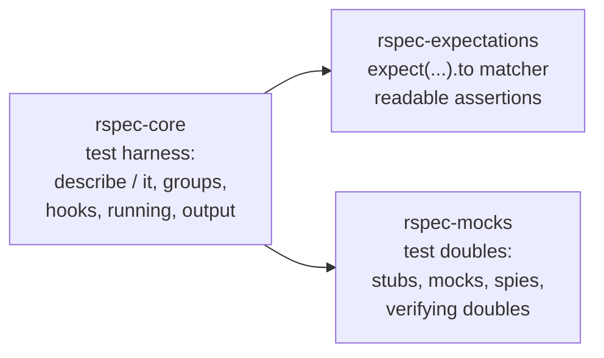

# Effective Testing with RSpec 3

Myron Marston (RSpec's principal maintainer) and Ian Dees teach RSpec 3 as a
disciplined tool for writing tests that give you confidence to change code. The
book frames RSpec through **behavior-driven development (BDD)** — a vocabulary and
workflow layered on top of [test-driven development](test-driven-development-by-example.md):
you describe the behavior you want, watch the description fail, then make it pass.
The payoff is the same one TDD promises — a fast feedback loop and a safety net that
makes refactoring safe — expressed in language that reads like a specification.

The book is organized in three phases: short introductory exercises, a multi-chapter
worked example that builds a real app, then deep dives into each of RSpec's parts.

## RSpec is three independent gems

RSpec is not one monolith. It's three gems that cooperate but can be used separately
(or mixed with other frameworks):



- **rspec-core** — the harness that discovers, organizes, and runs your specs, and
  reports results.
- **rspec-expectations** — the `expect(...).to ...` assertion syntax and its library
  of matchers.
- **rspec-mocks** — creating and controlling test doubles so you can isolate the code
  under test.

## Structure: describe, context, it

Specs are organized into **example groups** and **examples**.

- `describe` opens an example group — usually named for the thing under test (a class,
  a method, a feature).
- `context` is an alias for `describe`, used to signal a particular set of
  circumstances ("when the account is overdrawn").
- `it` defines a single **example** — one concrete behavior. The string reads as a
  sentence describing what should happen.

Groups nest, and the nesting is how you keep related setup and expectations together.
The names combine into readable output that documents the system's behavior.

```ruby
RSpec.describe Account do
  context "when overdrawn" do
    it "rejects a withdrawal" do
      # ...
    end
  end
end
```

## Expectations and matchers

An expectation has three parts: the **subject** (`expect(actual)`), a **direction**
(`.to` / `.not_to`), and a **matcher** that encodes the pass/fail criterion.

```ruby
expect(result).to eq(42)
expect(list).to include("apple")
expect { risky }.to raise_error(IOError)
```

Matchers come in families:

- **Primitive value matchers** — `eq`, `be`, `include`, `match`, `be_within`, and
  predicate matchers like `be_empty` (which call `empty?` on the subject).
- **Block matchers** — passed a `{ ... }` block instead of a value, for behavior that
  happens over time or as a side effect: `raise_error`, `change`, `output`, `throw_symbol`.
- **Higher-order / composable matchers** — matchers that take other matchers as
  arguments (`include(a_string_matching(/foo/))`, `contain_exactly(...)`), letting you
  express precise criteria declaratively.

You can also build your own: delegate to existing matchers via helper methods, define
**matcher aliases** for readability, negate matchers, use the matcher DSL, or write a
full matcher class for complex cases.

## Hooks, let, and subject

RSpec provides shared-setup tools so examples stay focused and duplication-free:

- **Hooks** run code around examples:
  - `before` / `after` — run before/after each example (`:example`) or once per group
    (`:context`).
  - `around` — wraps the example, useful for setup that must bracket the run (e.g. a
    database transaction).
- **`let`** — a lazily-evaluated, memoized helper. The block runs the first time the
  name is referenced in an example and is cached for that example. `let!` forces eager
  evaluation in a `before` hook.
- **`subject`** — names the object under test, enabling one-liner examples and the
  implicit subject used by `is_expected`.

These favor a fresh, isolated state per example over shared mutable setup — the
foundation of [reliable unit tests](tdd-unit-tests.md).

## Test doubles: stubs, mocks, spies

`rspec-mocks` lets you stand in for real collaborators so you can test one object in
isolation. The book slices doubles along three axes:

- **Usage mode** — what the double is for:
  - **Stub** — provides canned return values (`allow(obj).to receive(:x).and_return(1)`).
    It answers queries; it makes no demands.
  - **Mock** — sets an expectation that a message *must* be received
    (`expect(obj).to receive(:save)`); the example fails if it isn't. Good for verifying
    commands / outgoing interactions.
  - **Spy** — records calls so you can assert on them *after the fact*
    (`expect(obj).to have_received(:save)`), keeping arrange/act/assert order natural.
- **Origin** — where the double comes from:
  - **Pure double** — a stand-alone fake object created with `double`.
  - **Partial double** — stubbing/mocking a method on a real object.
  - **Verifying double** — `instance_double` / `class_double`, which check the stubbed
    methods actually exist (with matching arity) on the real class, so your doubles
    can't drift out of sync with production code.

You configure responses (`and_return`, `and_raise`, `and_yield`) and constrain them
(argument matchers, call counts). The book warns about the **risks of mocking
third-party code**: prefer wrapping a dependency behind your own thin interface and
mock *that*, or use **high-fidelity fakes** (e.g. faking I/O with `StringIO`) so your
tests don't encode assumptions the real library doesn't honor.

## Testing philosophy: layers and their trade-offs

A central theme is that different kinds of specs buy you different things at different
costs:

- **Unit specs** — test one object in isolation (often with doubles). Fast, precise,
  and pinpoint failures. This is where most of your specs should live — see
  [what makes a good unit test](tdd-unit-tests.md).
- **Integration specs** — exercise several components together (e.g. code plus a real
  database). Slower, but catch wiring problems doubles hide.
- **Acceptance / end-to-end specs** — drive the whole app the way a user would.
  Highest confidence that it "really works," but slow and brittle in bulk.

The guidance: keep the bulk of coverage in fast, isolated, reliable unit specs, and use
a thin layer of integration/acceptance specs to confirm the pieces connect. Watch the
cost/benefit balance — identify and prune slow examples, run just what you need while
iterating, and mark work in progress with pending specs.

## Building a real suite

Part 2 works this end-to-end on an expense-tracking app: start from an **acceptance
spec** that describes the API behavior, drive out **unit specs** underneath it, hook up
a real database, isolate each spec with **database transactions**, and only then
confirm the whole thing works for real. It's a concrete demonstration of the
outside-in BDD loop this book advocates — the same craft-through-practice ethos in
[learning the craft](learning-the-craft.md) and the small-step discipline of
[TDD's five practices](tdd-five-practices.md) and
[Test-Driven Development by Example](test-driven-development-by-example.md).

Later parts round this out with RSpec Core configuration (metadata and filtering,
shared examples and shared context, custom formatters, `RSpec.configure`,
command-line defaults) and cover using RSpec alongside Bundler, Rake, and Rails.

## References

- [Effective Testing with RSpec 3 — Pragmatic Bookshelf](https://pragprog.com/titles/rspec3/effective-testing-with-rspec-3/)
