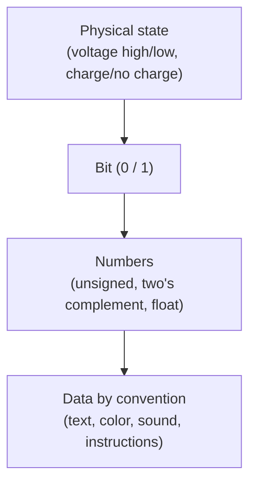

# Binary and Data Representation

Everything a computer knows is stored as **bits** — and a bit is not an abstract symbol,
it is a physical condition: a wire that is near the supply voltage or near ground, a
capacitor that is charged or drained, a magnetic domain pointing one way or the other.
This note is about the bridge from that physical condition to *information*: why the
physics favors two states, how numbers are built from bits, and how everything else —
text, color, sound — reduces to numbers.

## Why two states, not ten

You could imagine a computer that represented a digit 0–9 as ten distinct voltage bands
on a wire. Nobody builds one, and the reason is **noise margins**. Real signals are
corrupted by thermal noise, crosstalk, and voltage droop. With only two target levels —
say "low" is anything under 0.8 V and "high" is anything over 2.0 V — a signal can be
degraded by a large margin and still be read correctly, because the receiver only has to
decide *which side of a wide gap* the voltage fell on. The gap between the levels is the
noise margin, and a comparator (or a transistor acting as a switch) regenerates a clean
full-swing value on the far side. Ten levels would slice that same voltage range into ten
narrow bands with tiny margins, so noise that a binary system shrugs off would flip a
digit. Binary trades numeric density for **noise immunity and cheap, reliable switching**,
and that trade is why digital electronics works at all. The two levels also map perfectly
onto [boolean algebra](../logic/boolean-algebra.md) (true/false) and onto the switch-like
behavior of transistors — see [semiconductors-and-transistors](semiconductors-and-transistors.md).

## Numbers from bits

A single bit distinguishes two things. Line up *n* bits and you can distinguish 2ⁿ things
— this exponential is the whole leverage of binary and connects directly to counting and
combinatorics in [discrete mathematics](../math/discrete-mathematics.md). Positional
binary works exactly like decimal but with base 2: each position is a power of two.

| bits | value (unsigned) |
| --- | --- |
| `0000` | 0 |
| `0101` | 4 + 1 = 5 |
| `1111` | 8 + 4 + 2 + 1 = 15 |

A group of 8 bits is a **byte**, the standard addressable unit of [memory](memory-and-storage-hardware.md),
holding one of 256 values. Wider natural chunks — 16, 32, 64 bits — are **words**, sized
to the [CPU's](cpu-and-datapath.md) registers.

### Signed integers: two's complement

Negative numbers need an encoding. The universal choice is **two's complement**: to negate
a value, flip every bit and add 1. In an *n*-bit word the top bit carries negative weight
(−2ⁿ⁻¹) while the rest carry positive weight. Its virtue is that ordinary binary addition
"just works" for signed values — the same adder [circuit](digital-circuits.md) handles
signed and unsigned operands, and subtraction is addition of a negated operand. There is a
single zero (unlike sign-and-magnitude, which wastes a bit pattern on −0), at the cost of
one extra negative value (an 8-bit byte runs −128…+127, asymmetric by one).

### Fractions: floating point

Integers can't express 3.14 or 6.022×10²³. **Floating point** (the IEEE 754 standard)
stores a number in scientific notation, in binary: a **sign** bit, an **exponent** field,
and a **mantissa** (significand). The value is roughly `sign × mantissa × 2^exponent`, so a
fixed number of bits can span an enormous dynamic range by sliding the binary point. The
price is that most values are *approximations* — 0.1 has no exact finite binary expansion,
so accumulated floating-point error is a real hazard in numeric code.

## Everything else is numbers

Once you can store numbers, all other data is a matter of agreeing on a **code** — a
mapping from numbers to meanings:

- **Text**: assign each character a number. ASCII uses 7 bits (`A` = 65); Unicode extends
  this to every script, with UTF-8 encoding code points as one to four bytes.
- **Color**: a pixel is three numbers — red, green, blue intensities, typically one byte
  each (24-bit color).
- **Sound**: sample the air-pressure waveform thousands of times per second and store each
  sample as a number (e.g. 44,100 sixteen-bit samples per second for CD audio).

The bits are identical in all cases; **meaning lives entirely in the agreed interpretation**,
not in the storage. A byte `01000001` is the number 65, the letter `A`, a shade of gray, or
part of an instruction — the same physical charges, read through different conventions. This
is the deep move that makes a general-purpose computer possible: reduce every kind of
information to bits, and one machine that manipulates bits can manipulate everything.

## Why it matters

The bit is the atom of computing. Choosing two states buys reliability; positional binary
and two's complement let simple [logic gates](logic-gates-and-boolean-hardware.md) do
arithmetic; and the numbers-plus-a-code trick means a single bit-manipulating machine is
universal. Every layer above — instruction sets, files, programs — is ultimately patterns
of these two-state physical conditions.

## References

- [Petzold, *Code: The Hidden Language of Computer Hardware and Software*](petzold-code.md)
- [Nisan & Schocken, *The Elements of Computing Systems*](nisan-schocken-elements-of-computing-systems.md)
