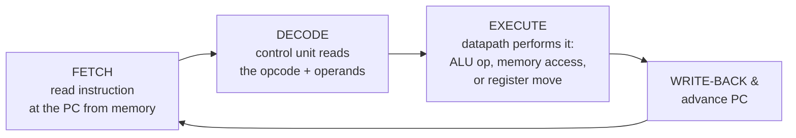

# CPU and Datapath

A **central processing unit** is the part of the machine that actually *does* things. Seen
from far enough away it is astonishing — it runs arbitrary programs — but seen up close it
is just a large arrangement of [logic gates](logic-gates-and-boolean-hardware.md) and
[digital circuits](digital-circuits.md), driven by a clock, doing one dumb thing after
another very fast. This note explains how that pile of gates comes to run a program.

## The datapath: where bits flow and get transformed

The **datapath** is the plumbing — the circuits that hold and move and combine data. Its
main organs:

- **Registers** — a small bank of very fast storage cells (typically a few dozen, each one
  word wide) built right into the CPU. They are the working set: the operands an
  instruction acts on live here. Fast because they are physically adjacent to the logic;
  this is the top of the [memory hierarchy](memory-and-storage-hardware.md).
- **ALU (arithmetic logic unit)** — the combinational circuit that computes. Given two
  operands and an operation selector, it produces add, subtract, AND, OR, XOR, shift,
  comparison, etc. It is a pure function of its inputs (no memory), assembled from adders
  and gate networks; two's-complement encoding (see
  [binary-and-data-representation](binary-and-data-representation.md)) is what lets one
  adder serve signed and unsigned arithmetic.
- **Buses** — shared bundles of wires that route a word from one place to another (register
  to ALU, ALU result back to a register, register to/from memory). Muxes select which
  source drives the bus in a given step.

The datapath alone is inert: it *can* add, *can* move a word, but it has no idea what to do
when. It needs to be told, step by step, which switches to close.

## The control unit: the conductor

The **control unit** supplies exactly that. Each machine instruction is a bit pattern; the
control unit **decodes** it and asserts the correct control signals — "route register 3 to
ALU input A, register 5 to input B, set the ALU to subtract, latch the result into register
3." The control unit is a finite state machine (see [digital-circuits](digital-circuits.md)),
built from gates and flip-flops, whose job is to translate the *what* of an instruction into
the *when-and-which* control lines of the datapath. Datapath + control unit = the processor.

## The clock: making time discrete

Everything is coordinated by the **clock**, a square wave ticking millions or billions of
times a second. On each tick, results settle through the [combinational logic](digital-circuits.md)
and the **flip-flops** capture the new state at the edge. The clock chops continuous
electrical activity into discrete *steps*, so the machine advances as a clean sequence of
well-defined states rather than a smear of racing signals. The clock period must be long
enough for the slowest signal path to settle — which is why clock speed is bounded by
physics.

## The fetch–decode–execute cycle in hardware

Running a program is one loop, repeated forever:

A dedicated register, the **program counter (PC)**, holds the address of the next
instruction. Each cycle: fetch the instruction the PC points at from
[memory](memory-and-storage-hardware.md), decode it, execute it in the datapath, write any
result back, and advance the PC (usually +1 instruction, or to a new address for a jump or
branch). Nothing about this loop understands your program's *purpose* — it only knows how to
do the next instruction. Meaning is an emergent property of the sequence.

## The instruction set: the machine's vocabulary

The **instruction set** is the fixed menu of operations the CPU can decode and execute:
load a word from memory, store a word, add two registers, compare, jump, branch-if-zero,
and so on. It is the machine's entire vocabulary — every program, no matter how elaborate,
is a sequence drawn from this menu. The instruction set is one half of the **instruction set
architecture (ISA)**, the contract between hardware and software explored in
[hardware-software-boundary](hardware-software-boundary.md); it is also the abstraction that
[computer architecture](../computer-science/computer-architecture.md) studies and optimizes
(pipelining, caches, superscalar execution) while keeping the visible instruction set
stable.

## Why it matters

The CPU is where the physical stack culminates: bits become computation. The datapath makes
transformation *possible*, the control unit makes it *directed*, the clock makes it
*orderly*, and the instruction set makes it *programmable*. A compiler for a language like
[Go](../languages-and-frameworks/go.md) ultimately emits nothing but sequences of these
instructions — the fetch–decode–execute loop is the thin, tireless engine every piece of
software eventually rides on.

## References

- [Petzold, *Code: The Hidden Language of Computer Hardware and Software*](petzold-code.md)
- [Nisan & Schocken, *The Elements of Computing Systems*](nisan-schocken-elements-of-computing-systems.md)
