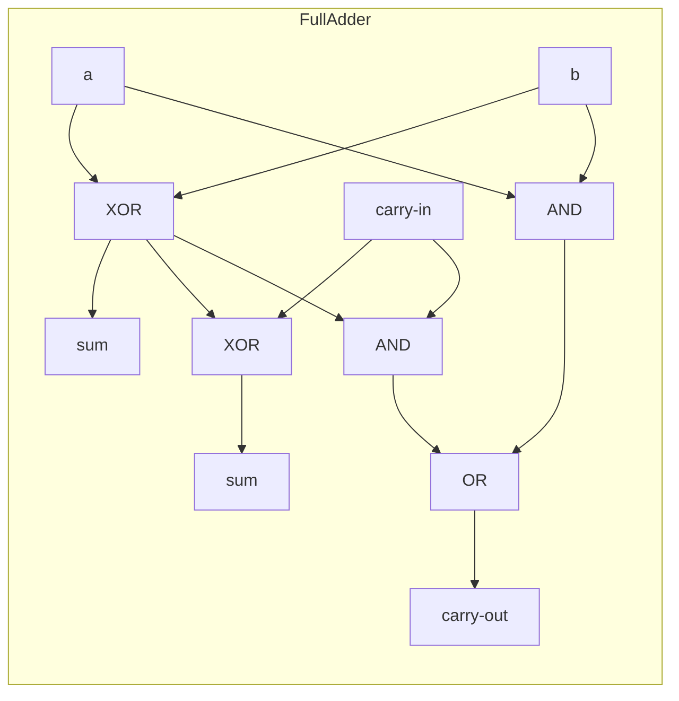
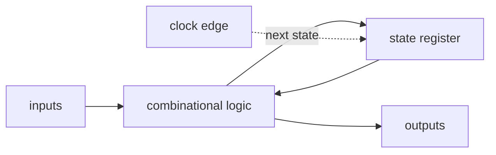

# Digital Circuits

A single [logic gate](logic-gates-and-boolean-hardware.md) computes one Boolean function of
its inputs. A **digital circuit** is many gates wired together so their outputs feed other
gates' inputs. Composition is where computation actually appears: from gates we get circuits
that *calculate* (combinational logic) and circuits that *remember* (sequential logic).
Together they are everything the [CPU and datapath](cpu-and-datapath.md) is made of.

## Combinational logic: circuits that calculate

A **combinational** circuit has no memory. Its outputs depend only on its current inputs; the
same inputs always produce the same outputs. It is a pure function realized in gates. Three
workhorses recur everywhere:

- **Adder.** A *half adder* (two inputs) produces a sum bit (XOR) and a carry bit (AND). A
  *full adder* adds three bits — two operands plus a carry-in — and produces a sum and a
  carry-out. Chain full adders, feeding each carry-out into the next stage's carry-in, and you
  get a **ripple-carry adder** that adds two multi-bit numbers. This is the circuit that makes
  arithmetic physical; how those numbers are encoded is covered in
  [binary and data representation](binary-and-data-representation.md).
- **Multiplexer (mux).** A "selector": several data inputs, a few select lines, one output. The
  select lines choose *which* input is passed through. A mux is how a datapath routes: "send
  register A, not register B, to the adder." The complementary device, a **demultiplexer**,
  fans one input out to a chosen output.
- **Decoder.** Turns an n-bit code into one-of-2ⁿ active output lines. A 3-bit decoder lights
  exactly one of 8 outputs. Decoders drive address selection in memory and instruction
  decoding in the CPU.

Each of these is just gates arranged to satisfy a truth table — no feedback, no clock, no
state.

## Sequential logic: circuits that remember

Combinational logic alone cannot store anything — the instant inputs change, outputs follow.
To *remember*, a circuit needs **feedback**: route an output back to an input so the circuit
can hold a value even after the input that set it goes away.

- **Latch / flip-flop.** Cross-couple two NOR (or NAND) gates so each drives the other, and the
  pair has two stable states — it holds a single bit. This is the **SR latch**. Refine it so it
  only changes on the edge of a clock signal and you get a **D flip-flop**: the value on its
  D input is captured at the clock edge and held until the next edge. A flip-flop is the
  hardware atom of memory, the mirror image of the gate (the atom of computation). Deeper
  storage arrays are the subject of
  [memory and storage hardware](memory-and-storage-hardware.md).
- **Register.** A row of D flip-flops sharing one clock stores a multi-bit value in one step —
  an 8-bit register is eight flip-flops. Registers are the CPU's fast local scratchpad.
- **The clock.** A single square-wave signal ticking millions or billions of times a second.
  Every flip-flop updates *together* on the clock edge, so the whole machine advances in
  lockstep from one well-defined state to the next. The clock is what turns a tangle of
  feedback into orderly, predictable steps; the clock rate (e.g. 3 GHz) is one bound on how
  fast the machine runs.

### Finite state machines

Combine a register (holding the current **state**) with combinational logic (computing, from
the state and the inputs, both the outputs and the *next* state) and you have a **finite state
machine (FSM)** — the general pattern for any circuit whose behavior depends on history. Each
clock tick reads the present state, computes the next, and latches it.

The FSM is the theoretical backbone of a processor's control unit: fetch, decode, execute is
literally a state machine cycling through phases. The same abstraction appears in
[computer architecture](../computer-science/computer-architecture.md) and in the theory of
[computation](../computer-science/theory-of-computation.md).

## From circuits to a computer

With combinational logic to compute and sequential logic to remember, the remaining work is
organization: wire an arithmetic-logic unit (adders + muxes) to a bank of registers, add a
control FSM to sequence operations, and connect memory — and you have the
[CPU and datapath](cpu-and-datapath.md). Everything above this point is arrangement of the two
primitives established here.

## References

- Nisan & Schocken, *The Elements of Computing Systems* —
  [nisan-schocken-elements-of-computing-systems.md](nisan-schocken-elements-of-computing-systems.md)
  (adders, multiplexers, flip-flops, and registers built from gates, chapters 1–3).
- Petzold, *Code: The Hidden Language of Computer Hardware and Software* —
  [petzold-code.md](petzold-code.md) (the flip-flop, the clock, and adders explained by hand).
- Horowitz & Hill, *The Art of Electronics* —
  [horowitz-hill-art-of-electronics.md](horowitz-hill-art-of-electronics.md) (practical
  combinational and sequential digital design).
