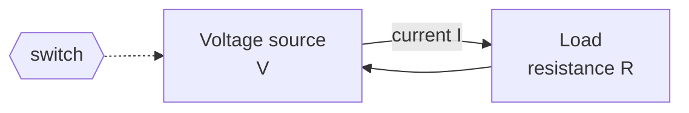

# Electricity and Circuits

Everything a computer does is, at bottom, the orchestrated motion of electrons. Before a
machine can hold a bit or evaluate a logic gate, it must first push charge through matter
in a controlled way. This note lays the physical substrate: what electric charge is, the
three quantities that describe its flow (voltage, current, resistance), the law that ties
them together, and the notion of a circuit as a closed path that does useful work.

## Charge and the electron as carrier

Charge is a fundamental property of matter, measured in **coulombs (C)**. The electron
carries the elementary negative charge, about −1.602 × 10⁻¹⁹ C. In a metal, the outermost
("valence") electrons are not bound to any single atom; they form a shared "sea" of free
electrons drifting randomly. Apply an electric field and that random drift acquires a net
direction — a current. The deep origin of this field and the force it exerts is the subject
of [electromagnetism](../physics/electromagnetism.md); here we take it as given and reason
about it in circuit terms.

A subtlety worth internalizing: **conventional current** is defined as the direction
positive charge would move, which is *opposite* to the actual electron flow. Circuit
analysis universally uses conventional current, so we do too.

## The three quantities

- **Voltage (V, volts)** — the potential-energy difference per unit charge between two
  points. It is the "pressure" or "push" that drives charge. A 1.5 V battery maintains a
  1.5-joule-per-coulomb difference between its terminals. Voltage is always *between* two
  points; a single point has no voltage in isolation, only relative to a chosen reference
  ("ground").
- **Current (I, amperes)** — the rate of charge flow past a point, one ampere = one coulomb
  per second. Current is the *flow* the voltage produces.
- **Resistance (R, ohms, Ω)** — how strongly a material opposes that flow. It arises from
  electrons colliding with the atomic lattice, dissipating energy as heat.

A useful analogy: voltage is like water pressure, current is the flow rate through the pipe,
and resistance is the narrowness of the pipe. The analogy is imperfect but pumps intuition.

## Ohm's law and power

For an ordinary (ohmic) resistor these three quantities obey the simplest possible relation,
**Ohm's law**:

$$ V = I \cdot R $$

Push harder (more V) or lower the resistance, and more current flows. Rearranged, it lets
you solve for whichever quantity is unknown. It is the single most-used equation in circuit
design.

The rate at which a circuit converts electrical energy (into heat, light, motion, or
computation) is **power (P, watts)**:

$$ P = V \cdot I = I^2 R = \frac{V^2}{R} $$

Power matters enormously for computers: every switching transistor dissipates a little
energy, and billions of them switching billions of times per second is why processors need
heatsinks and why energy efficiency, not raw speed, is the binding constraint on modern
chips (see [semiconductors and transistors](semiconductors-and-transistors.md)).

## Circuits: the closed path

Charge only flows continuously around a **closed loop** — a circuit. Break the loop (open a
switch) and current stops. A minimal circuit has a source (battery, supply) that maintains a
voltage, and a load (resistor, lamp, logic gate) that the current passes through. Two
conservation principles, **Kirchhoff's laws**, govern any circuit:

- **Current law** — charge is conserved, so the current flowing *into* any node equals the
  current flowing *out*.
- **Voltage law** — energy is conserved, so the voltage rises and drops around any closed
  loop sum to zero.

These two laws, plus Ohm's law, are enough to analyze any resistive network.

## Conductors, insulators, and the gap between

Materials sort by how freely charge moves through them:

| Class | Free carriers | Examples | Role in a computer |
|---|---|---|---|
| Conductor | many | copper, aluminum, gold | wires, traces, interconnect |
| Insulator | almost none | glass, rubber, silicon dioxide | isolation, gate dielectric |
| **Semiconductor** | few, but *controllable* | silicon, germanium | the switch itself |

The last row is the pivot of the whole story. A conductor always conducts and an insulator
never does; neither can compute. A **semiconductor** sits in between, and — crucially — its
conductivity can be *switched* by an applied voltage. That controllability is what turns
physics into logic, and it is the subject of the next layer:
[semiconductors and transistors](semiconductors-and-transistors.md).

## Why this is the substrate

Every higher abstraction — a gate, a bit, a register, a CPU — ultimately reduces to voltages
on wires and currents through devices. When a
[logic gate](logic-gates-and-boolean-hardware.md) outputs a "1," it is really holding a wire
near the supply voltage; a "0" holds it near ground. When
[data is represented in binary](binary-and-data-representation.md), each bit is a physical
voltage level somewhere on the chip. Electricity is not a metaphor for computation; it *is*
the computation, viewed close up.

## References

- Petzold, *Code: The Hidden Language of Computer Hardware and Software* —
  [petzold-code.md](petzold-code.md) (builds the circuit → logic story from first principles).
- Horowitz & Hill, *The Art of Electronics* —
  [horowitz-hill-art-of-electronics.md](horowitz-hill-art-of-electronics.md) (the practical
  reference for circuits and devices).
- Halliday, Resnick & Walker, *Fundamentals of Physics* —
  [../physics/halliday-resnick-walker-fundamentals-of-physics.md](../physics/halliday-resnick-walker-fundamentals-of-physics.md)
  (the physics of charge, current, and fields).
