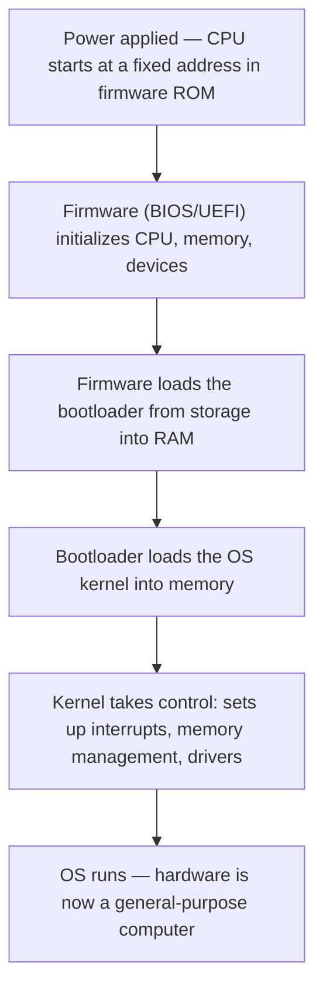

# The Hardware/Software Boundary

This is the seam of the whole stack: the top of the physical machine and the bottom of the
software world. Below it lie voltages, gates, and the [CPU](cpu-and-datapath.md); above it
lie programs, files, and eventually the [operating system](../computer-science/operating-systems.md).
The boundary is not fuzzy — it is a precise, published **contract**, and understanding it is
understanding how a lump of silicon becomes a computer that runs software.

## The ISA: the contract

The **instruction set architecture (ISA)** is that contract. It specifies everything
software is allowed to assume about the hardware and nothing more: the available
instructions and their exact bit encodings, the registers, the memory model, how addresses
work, how interrupts behave. x86-64, ARM, and RISC-V are ISAs.

The power of the ISA is that it **decouples the two worlds**. Hardware designers can build
any circuit they like — pipelined, multi-core, wildly reordered internally (the domain of
[computer architecture](../computer-science/computer-architecture.md)) — and as long as it
honors the ISA, existing software runs unchanged. Software authors can target the ISA
without knowing the transistor layout. The ISA is where EE stops and CS begins.

## Machine code: what actually executes

Above the boundary, a program is text; below it, a program is **machine code** — the actual
binary instructions the [control unit decodes](cpu-and-datapath.md). A compiler for a
language like [Go](../languages-and-frameworks/go.md) translates source into a sequence of
these ISA-defined instruction words; assembly language is just a thin human-readable naming
of the same instructions. Machine code is nothing but numbers
([bits by convention](binary-and-data-representation.md)) laid out in
[memory](memory-and-storage-hardware.md), fetched and executed one at a time.

## Firmware, BIOS/UEFI: the code that is almost hardware

Some software sits so close to the boundary it lives in the machine itself. **Firmware** is
code stored in non-volatile ROM/flash that runs before any disk-based software exists. On a
PC the **BIOS/UEFI** firmware runs the moment power is applied: it initializes the CPU,
tests and configures memory and buses, discovers attached devices, and then locates and
loads the first stage of an operating system. Firmware is the fixed bridge that turns
powered-on hardware into something ready to run general software.

## Interrupts: how hardware talks back

The [fetch–decode–execute loop](cpu-and-datapath.md) is relentless, so how does the CPU ever
notice a keypress or an arriving network packet without wastefully polling for them? An
**interrupt**: a hardware signal that says "stop what you're doing." On receiving one, the
CPU finishes the current instruction, saves its state, and jumps to a predefined **interrupt
handler**, then resumes where it left off. Interrupts are the mechanism that lets an
[operating system](../operating-systems/index.md) respond to the outside world and multitask
— the hardware hook the whole software model of concurrency hangs from.

## The boot sequence: crossing the boundary

Power-on is a bootstrap that climbs the stack rung by rung:

Each step loads and hands control to something more capable than itself, until the
[operating system](../computer-science/operating-systems.md) is running and can host
arbitrary programs. That handoff — firmware to bootloader to kernel — is the literal moment
the physical stack finishes and the software stack begins.

## Why it matters

The hardware/software boundary is the abstraction that makes the whole modern computing
world modular. It lets billions of programs run across radically different chips, lets
hardware evolve for decades without breaking software, and defines exactly where
electrical engineering hands off to computer science. Everything in HAL's software layers
sits, ultimately, on top of an ISA and a boot sequence.

## References

- [Petzold, *Code: The Hidden Language of Computer Hardware and Software*](petzold-code.md)
- [Nisan & Schocken, *The Elements of Computing Systems*](nisan-schocken-elements-of-computing-systems.md)
