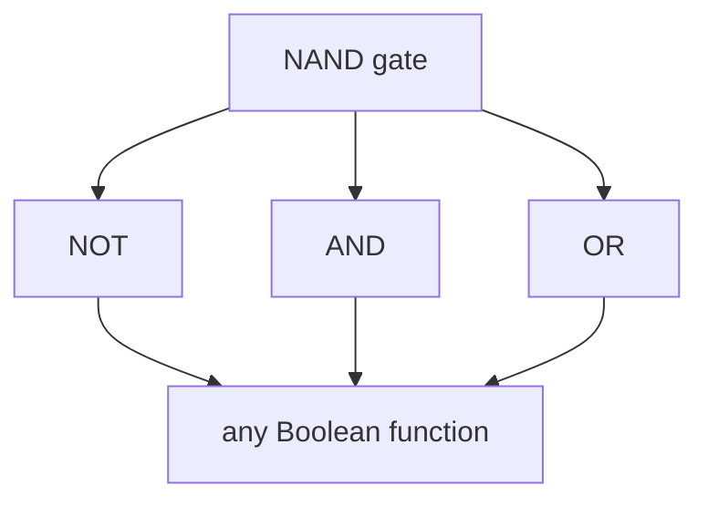

# Logic Gates and Boolean Hardware

A [transistor](semiconductors-and-transistors.md) is a switch. A **logic gate** is a small
arrangement of switches that computes a Boolean function of its inputs. This is the layer
where physics becomes mathematics: the same AND, OR, and NOT operations studied abstractly in
[Boolean algebra](../logic/boolean-algebra.md) and
[propositional logic](../logic/propositional-logic.md) are here realized as voltages on
silicon. Once a gate exists, we stop reasoning about electrons and start reasoning about
0s and 1s.

## Voltages become truth values

The convention is simple: a wire held near the supply voltage is a logical **1** (true); a
wire held near ground is a logical **0** (false). Because a digital transistor is driven
fully on or fully off, the in-between region is transient and ignored, which is what makes
digital logic noise-immune — a slightly-degraded 4.9 V is still unambiguously a "1." Every
gate takes one or more such levels in and drives its output wire to the level dictated by its
truth table.

## Building the basic gates from transistors

In CMOS, gates are built from complementary NMOS/PMOS pairs so that in either stable state
almost no current flows (power is spent only while switching).

- **NOT (inverter)** — one PMOS on top, one NMOS on the bottom. A high input turns the NMOS on
  and pulls the output to ground (0); a low input turns the PMOS on and pulls the output high
  (1). It simply inverts.
- **NAND** — two inputs; the output is 0 *only* when both inputs are 1. Built from two NMOS in
  series (pulling low) and two PMOS in parallel (pulling high).
- **NOR** — output is 1 only when both inputs are 0. The dual of NAND: NMOS in parallel, PMOS
  in series.
- **AND / OR** — CMOS naturally produces *inverting* gates, so AND is a NAND followed by an
  inverter, and OR is a NOR followed by an inverter.

Each gate's behavior is fully captured by a **truth table**:

| a | b | AND | OR | NAND | NOR | XOR |
|---|---|-----|----|------|-----|-----|
| 0 | 0 |  0  | 0  |  1   |  1  |  0  |
| 0 | 1 |  0  | 1  |  1   |  0  |  1  |
| 1 | 0 |  0  | 1  |  1   |  0  |  1  |
| 1 | 1 |  1  | 1  |  0   |  0  |  0  |

These tables are exactly the truth tables of [propositional logic](../logic/propositional-logic.md)
— conjunction, disjunction, negation — with 1/0 standing in for true/false. Hardware and logic
are the same structure seen from two directions.

## NAND is universal

A remarkable fact anchors the whole design of computers: **every Boolean function can be built
from NAND gates alone** (NOR is equally universal). NAND is *functionally complete*. The
constructions are direct:

- NOT(a) = a NAND a
- AND(a, b) = NOT(a NAND b)
- OR(a, b) = (NOT a) NAND (NOT b)

This universality is why a chip foundry can, in principle, manufacture just one kind of gate
and compose everything from it. It is the hardware echo of a result in
[Boolean algebra](../logic/boolean-algebra.md): a single connective (the Sheffer stroke,
i.e. NAND) suffices to express the entire algebra. The abstract completeness theorem and the
physical single-gate factory are the same idea.

## Boolean algebra made physical

Because gates obey Boolean algebra exactly, the algebra's laws are engineering tools. De
Morgan's laws (NOT(a AND b) = (NOT a) OR (NOT b)) let a designer swap a gate topology for an
equivalent one that is cheaper or faster. Algebraic simplification of an expression directly
reduces the transistor count of the circuit that implements it. The designer manipulates
symbols on paper and the silicon inherits the result — this is the payoff of having a clean
correspondence between logic and hardware.

## Why gates matter: the next layer

A single gate computes one bit of one function. The power comes from *composition*. Wire gates
so their outputs feed other gates' inputs and you get circuits that add numbers, select among
inputs, and — with feedback — remember. That is the subject of
[digital circuits](digital-circuits.md), which in turn compose into the
[CPU and datapath](cpu-and-datapath.md). The gate is the last rung where the reasoning is
still purely about a handful of switches; above it, we think in words, adders, and registers.

## References

- Petzold, *Code: The Hidden Language of Computer Hardware and Software* —
  [petzold-code.md](petzold-code.md) (builds gates from switches and relays step by step).
- Nisan & Schocken, *The Elements of Computing Systems* —
  [nisan-schocken-elements-of-computing-systems.md](nisan-schocken-elements-of-computing-systems.md)
  (Chapter 1 constructs all gates from NAND).
- Horowitz & Hill, *The Art of Electronics* —
  [horowitz-hill-art-of-electronics.md](horowitz-hill-art-of-electronics.md) (digital logic
  families and their electrical behavior).
