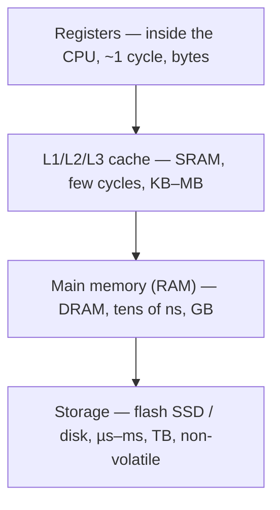

# Memory and Storage Hardware

The [CPU](cpu-and-datapath.md) computes, but it needs somewhere to keep the bits it is
working on and somewhere to keep them when the power is off. That "somewhere" is not one
thing but a **hierarchy** of technologies, each trading speed against capacity and cost.
This note covers the physical devices that store bits and why they are arranged the way
software assumes.

## Two flavors of RAM: SRAM vs DRAM

Both hold bits only while powered (they are **volatile**), but they store a bit very
differently:

- **SRAM (static RAM)** holds each bit in a little feedback loop of ~6 transistors — two
  cross-coupled inverters that latch a stable 0 or 1. It is *fast* and needs no
  maintenance, but each cell is large and expensive, so you get little of it. This is what
  [CPU caches](../computer-science/computer-architecture.md) and registers are built from.
- **DRAM (dynamic RAM)** stores each bit as charge on a tiny **capacitor**, gated by a
  single transistor. One transistor + one capacitor is minuscule, so you get *lots* of it
  cheaply — this is main memory (RAM). The catch: the capacitor leaks, so every cell must
  be **refreshed** (read and rewritten) thousands of times a second, and access is slower
  than SRAM.

The whole trade — few-and-fast vs many-and-slow — falls straight out of these cell designs.

## The memory hierarchy

No single technology is both fast enough and big enough, so machines stack them, fastest
and smallest at the top:

Each level is a fast buffer for the slower level below it. The scheme works only because of
**locality**: programs tend to reuse the same data and nearby data soon after touching it,
so a small fast cache captures most accesses. When the CPU needs a word, hardware checks the
cache first; a *hit* is quick, a *miss* falls through to RAM (and stalls the pipeline). The
hierarchy is a hardware fact, but software — from compilers to the
[operating system](../computer-science/operating-systems.md) — is written to exploit it.

## Non-volatile storage: keeping bits without power

RAM forgets when the power drops. **Non-volatile** devices retain state on their own:

- **Flash** (SSDs, USB drives, phone storage) traps charge on a floating gate that stays put
  for years without power. It is the dominant fast non-volatile storage; it wears out after
  many writes, which controllers manage by spreading writes around.
- **Magnetic disk (HDD)** stores bits as the orientation of magnetic domains on spinning
  platters, read by a moving head. Cheap per byte and huge, but mechanically slow (ms seek
  times) — increasingly relegated to bulk/archival storage.
- **ROM / firmware** holds bits that rarely or never change — the boot code that runs the
  instant power is applied (see [hardware-software-boundary](hardware-software-boundary.md)).

## Addressing: finding a specific bit

Memory is useful only if the CPU can name a specific location. Every byte-sized cell has a
numeric **address**; the CPU puts an address on the address bus, and the memory decodes it
(a [combinational decoder](digital-circuits.md) selecting one row/column) and returns or
stores the word on the data bus. *n* address wires can name 2ⁿ locations — the same
exponential from [binary representation](binary-and-data-representation.md) — which is why a
machine's word/address width sets a hard ceiling on how much memory it can address (e.g. a
32-bit address space tops out at 4 GB). The address space is a flat array of numbered cells;
the [operating system](../computer-science/operating-systems.md) later layers virtual memory
on top of this physical reality.

## Why it matters

The comfortable software fiction of "just store it in a variable" or "read the file" rests
on this physical stack. The reason a well-written loop can run orders of magnitude faster
than a cache-hostile one, the reason data survives a reboot, the reason a program has a hard
memory ceiling — all trace directly to which device the bits physically live in and how it
is addressed.

## References

- [Petzold, *Code: The Hidden Language of Computer Hardware and Software*](petzold-code.md)
- [Nisan & Schocken, *The Elements of Computing Systems*](nisan-schocken-elements-of-computing-systems.md)
