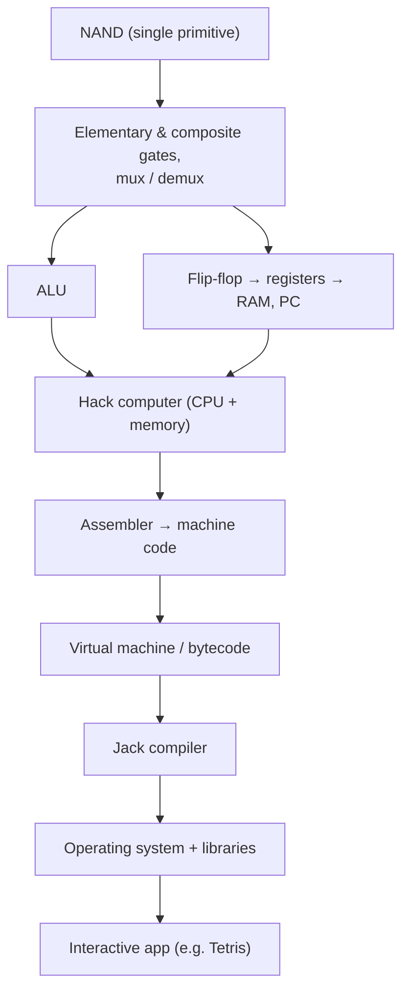

# The Elements of Computing Systems (Nand2Tetris)

*The Elements of Computing Systems* by Noam Nisan and Shimon Schocken (MIT Press; second
edition 2021), and its free companion course **Nand2Tetris**, take the "build it to
understand it" philosophy further than any other work in the field: the reader constructs
a complete, general-purpose computer and a modern software stack starting from a single
primitive gate — NAND — and finishing with an operating system running an interactive
program (famously, a Tetris clone). It is a hands-on, project-driven counterpart to
Petzold's narrative [Code](petzold-code.md): where *Code* explains, Nand2Tetris makes you
*implement*, verifying each layer with supplied simulators and test scripts.

## The twelve-project climb

The work is organized as roughly a dozen build projects, split into a hardware half and a
software half, each layer using only the layer below it.

**Hardware (Projects 1–5).** Starting from NAND — which is functionally complete, so every
other gate can be derived from it — the reader builds AND, OR, NOT, multiplexers, and
demultiplexers, establishing [logic gates and Boolean hardware](logic-gates-and-boolean-hardware.md)
concretely (the underlying algebra is [../logic/boolean-algebra.md](../logic/boolean-algebra.md)).
These compose into an adder and then an **ALU**; flip-flops give a bit of memory that scales
into registers, RAM, and a program counter. Project 5 wires these into the **Hack computer**:
a CPU plus memory realizing a stored-program machine — a full [CPU and datapath](cpu-and-datapath.md)
in the von Neumann tradition of [../computer-science/computer-architecture.md](../computer-science/computer-architecture.md).
Chips are specified in a simple hardware description language (HDL) and checked against a
gate/CPU simulator, so "it works" is a testable claim, not a hope.

**Software (Projects 6–12).** The software half climbs the
[hardware–software boundary](hardware-software-boundary.md) explicitly. Project 6 is an
**assembler** translating Hack symbolic assembly into binary machine code — the first place
the reader sees instructions as just bit patterns the CPU decodes. Projects 7–8 build a
**virtual machine** and its stack-based bytecode, an intermediate layer that decouples the
high-level language from the raw instruction set. Projects 9–11 introduce **Jack**, a simple
Java-like object-based language, and build its **compiler** (tokenizer, parser, code
generation targeting the VM). Project 12 writes a basic **operating system** — math, memory
allocation, string and array libraries, screen and keyboard I/O — closing the stack so a
Jack program can run interactively on the Hack machine you built by hand.

## Why it anchors the field

Nand2Tetris's contribution is the *end-to-end* verified path: it removes every black box
between a NAND gate and a running application, and it does so with runnable projects rather
than prose. It demonstrates two deep ideas viscerally — **functional completeness** (all of
computing hardware reduces to one gate) and **layered abstraction** (each level exposes a
clean interface the level above depends on without knowing its internals). It is the ideal
practical complement to [Code](petzold-code.md) and to formal architecture texts.

## Related notes

- [logic gates and Boolean hardware](logic-gates-and-boolean-hardware.md) — NAND and the gates derived from it
- [CPU and datapath](cpu-and-datapath.md) — the Hack CPU, ALU, registers, program counter
- [hardware–software boundary](hardware-software-boundary.md) — assembler, VM, compiler, OS crossing the line
- [Code (Petzold)](petzold-code.md) — the narrative companion to this build-it approach
- [../logic/boolean-algebra.md](../logic/boolean-algebra.md) — the algebra realized in the gate projects
- [../computer-science/computer-architecture.md](../computer-science/computer-architecture.md) — the stored-program model built here

## References

- [Nand2Tetris — Noam Nisan & Shimon Schocken](https://www.nand2tetris.org/)
