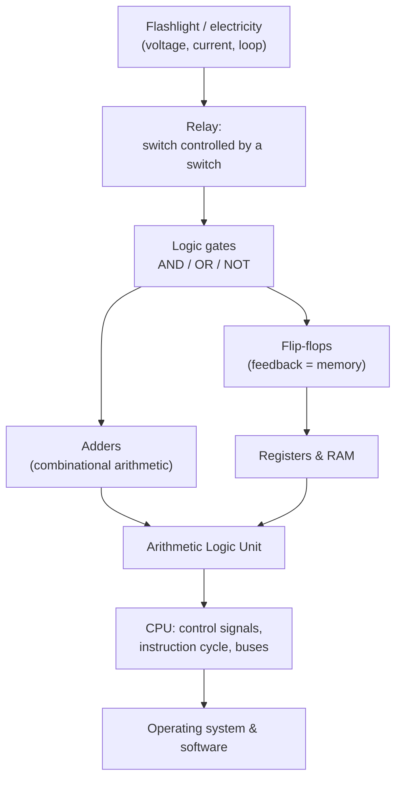

# Code: The Hidden Language of Computer Hardware and Software

Charles Petzold's *Code* (1999; second edition 2022) is the canonical popular account
of how a computer works, built strictly from the ground up. Its distinguishing move is
that it takes nothing for granted: it starts from a child signaling a friend with a
flashlight and, brick by brick, arrives at a working programmable computer — never
invoking a black box it has not already constructed. It is the definitive
electron→bit→CPU narrative and the ideal single-book bridge from physical electricity to
running software.

## The arc of the book

Petzold's central pedagogical trick is that **codes** — ways of representing information
with a small set of symbols — are the through-line connecting every layer. He opens with
Morse code and Braille to establish that meaning can be carried by combinations of two
states (dot/dash, raised/flat). Counting the combinations available with *n* symbols
leads naturally to powers of two and thus to binary, so the reader discovers
[binary and data representation](binary-and-data-representation.md) as the answer to a
question they already feel, not as an arbitrary convention. Bytes, hexadecimal, and the
progression from ASCII to Unicode follow as practical encodings of that same idea.

From representation he turns to the **physical substrate**. A flashlight circuit teaches
electricity, voltage, and the closed loop of current. The electrical telegraph and the
relay — a switch thrown by an electromagnet rather than a finger — supply the one crucial
component: a switch that other switches can control. Wiring relays in series and parallel
reproduces AND, OR, and NOT, so
[logic gates and Boolean hardware](logic-gates-and-boolean-hardware.md) emerge as a direct
physical realization of Boolean algebra (see [../logic/boolean-algebra.md](../logic/boolean-algebra.md)).
Petzold notes that vacuum tubes, transistors, and integrated circuits are all later,
faster switches playing the same role — the *logic* is independent of the technology.

Gates are then composed into arithmetic. Half and full adders chain into a multi-bit
adder; feedback turns a pair of gates into a flip-flop that *remembers*, and flip-flops
assemble into registers and memory. A clock sequences the whole thing. By the closing
chapters Petzold has an [arithmetic logic unit](cpu-and-datapath.md), registers and buses,
control signals, and an instruction cycle with loops, jumps, and calls — a genuine
[CPU and datapath](cpu-and-datapath.md) executing a stored program in a von Neumann style.
The final chapters lift off the metal into peripherals, operating systems, and high-level
coding, closing the loop from switch to software.

## Why it anchors the field

*Code* is valuable precisely because it refuses layer-skipping: every abstraction is cashed
out in the layer below, so the reader sees that a CPU is "just" an elaborate arrangement of
switches, and software is "just" patterns of bits those switches manipulate. That makes it
the natural companion to more formal treatments — it supplies the intuition that
[computer architecture](../computer-science/computer-architecture.md) texts assume.

## Related notes

- [binary and data representation](binary-and-data-representation.md) — the coding thread that opens the book
- [logic gates and Boolean hardware](logic-gates-and-boolean-hardware.md) — relays realizing AND/OR/NOT
- [CPU and datapath](cpu-and-datapath.md) — ALU, registers, buses, control signals
- [electricity and circuits](electricity-and-circuits.md) — the flashlight-circuit starting point
- [../logic/boolean-algebra.md](../logic/boolean-algebra.md) — the algebra the gates implement
- [../computer-science/computer-architecture.md](../computer-science/computer-architecture.md) — the formal treatment this book motivates

## References

- [Code: The Hidden Language of Computer Hardware and Software — Charles Petzold](https://www.charlespetzold.com/code/)
