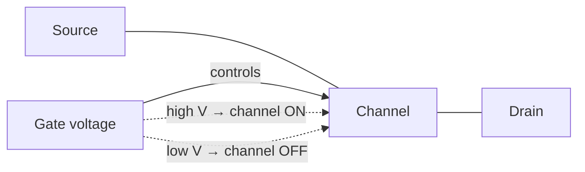

# Semiconductors and Transistors

If [electricity and circuits](electricity-and-circuits.md) is the raw substrate, the
transistor is the *switch* — the single device that lets one electrical signal control
another. A controllable switch is the atom of computing: chain switches together and you can
build any logic function, and from logic, everything else. This note explains how a
semiconductor is coaxed into switching, how the transistor works as a voltage-controlled
switch (and amplifier), and why the ability to make these devices smaller and cheaper drove
the entire digital era.

## Semiconductors: conductivity you can control

A pure semiconductor such as silicon is almost an insulator at rest: its valence electrons
are tied up in covalent bonds. What makes it special is that a small nudge — heat, light, or
an applied voltage — can free some of those electrons to carry current. The band structure
behind this (a small "band gap" between the filled valence band and the empty conduction
band) is a quantum-mechanical effect; the underlying theory lives in
[quantum mechanics](../physics/quantum-mechanics.md). For our purposes the key fact is:
silicon's conductivity is not fixed. It can be *engineered* and *switched*.

### Doping: n-type and p-type

Left alone, pure silicon is not useful. Engineers **dope** it — deliberately introduce trace
impurity atoms — to create two flavors:

- **n-type** — doped with atoms that donate spare electrons (e.g. phosphorus). Carriers are
  negative electrons.
- **p-type** — doped with atoms that accept electrons, leaving positively charged "holes"
  (e.g. boron). Carriers behave as positive holes.

Neither type alone is interesting. The magic is in the **junctions** where p meets n.

## The diode: the one-way junction

Join a p-type and an n-type region and you get a **p–n junction diode**. At the boundary,
electrons and holes recombine and leave behind a thin "depletion region" that blocks further
flow. Apply voltage one way (forward bias) and the barrier collapses — current flows freely.
Apply it the other way (reverse bias) and the barrier grows — current is blocked. A diode is
thus a **one-way valve for current**. It is the simplest useful semiconductor device and the
conceptual stepping stone to the transistor.

## The transistor (MOSFET): a voltage-controlled switch

Stack junctions cleverly and you get a device with a *third* terminal that controls the flow
between the other two. The dominant type in digital chips is the **MOSFET** (Metal-Oxide-
Semiconductor Field-Effect Transistor). It has three terminals:

- **Source** and **drain** — the two ends of the channel current flows through.
- **Gate** — a control electrode separated from the channel by a thin insulating layer of
  silicon dioxide.

The gate touches nothing electrically; it acts by its *field* alone. Put a voltage on the
gate and it attracts carriers into the channel, forming a conductive path between source and
drain — the switch is **ON**. Remove the gate voltage and the channel disappears — the switch
is **OFF**. A small voltage on the gate thus governs a much larger current between source and
drain, with almost no current drawn by the gate itself.

Two complementary types exist — **NMOS** (conducts when gate is high) and **PMOS** (conducts
when gate is low). Pairing them gives **CMOS**, the technology in essentially every modern
chip, prized because it draws almost no power except at the instant it switches.

### Switch *and* amplifier

The same three-terminal control has two readings. Treated as a **switch** (fully on or fully
off), the transistor is the atom of digital logic — the subject of
[logic gates and Boolean hardware](logic-gates-and-boolean-hardware.md). Operated in its
intermediate region, a small change at the gate produces a large, proportional change in the
output current — an **amplifier**, the atom of analog electronics (radios, sensors, audio).
Digital design lives at the two extremes on purpose: full-on and full-off are noise-immune
and unambiguous, which is exactly what you need to represent a clean 0 or 1.

## Why a controllable switch is the atom of computing

A relay, a vacuum tube, and a transistor all do the same essential thing: one signal opens or
closes a path for another. That single capability is universal — from it you can build the
NOT, AND, and OR operations of [Boolean algebra](../logic/boolean-algebra.md), and Boolean
algebra can express any computable function. The transistor won because it is tiny, fast,
cheap, reliable, and consumes little power — not because it does something a relay cannot.
The step from "a switch" to "logic" is the bridge from physics to computer science.

## Moore's law and scaling

In 1965 Gordon Moore observed that the number of transistors economically placed on a chip
was doubling roughly every one to two years. This **Moore's law** held for decades: shrinking
each transistor made it faster, cheaper, and lower-power all at once, so the whole industry
compounded. A modern processor packs tens of billions of MOSFETs onto a chip smaller than a
fingernail. The exponential is now slowing as devices approach atomic dimensions (leakage,
heat, and quantum effects intrude), pushing designers toward multicore, specialization, and
3D stacking rather than raw shrinkage — a shift felt directly up in
[computer architecture](../computer-science/computer-architecture.md).

## References

- Petzold, *Code: The Hidden Language of Computer Hardware and Software* —
  [petzold-code.md](petzold-code.md) (relays, then transistors, as the switch behind logic).
- Horowitz & Hill, *The Art of Electronics* —
  [horowitz-hill-art-of-electronics.md](horowitz-hill-art-of-electronics.md) (definitive
  treatment of diodes, transistors, and their circuits).
- Nisan & Schocken, *The Elements of Computing Systems* —
  [nisan-schocken-elements-of-computing-systems.md](nisan-schocken-elements-of-computing-systems.md)
  (takes the switch as given and builds a computer from it).
