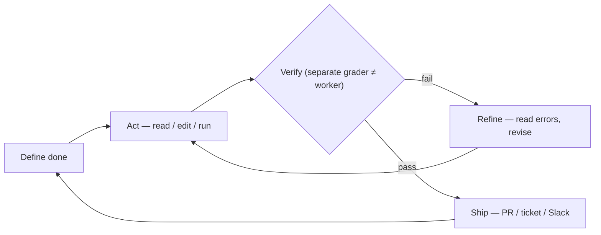

# Engineer the Loop, Not the Prompt

An infographic (Nikhil Kassetty, sourced from Claude Code docs) on **loop engineering**:
define "done" once → the agent acts, gets verified, refines, and repeats until the
condition is actually true.

## What loop engineering is

Designing self-prompting, iterative cycles for AI agents instead of prompting one step
at a time. You stop typing "keep going" and build a system that finds work, checks it,
and decides the next step on its own.

## Key mechanisms

- **`/goal`** — sets a *verifiable completion condition*: a measurable end state, a
  check, and constraints on what must not change. The agent keeps working across turns
  until it holds (e.g. "all tests in test/auth pass, lint clean, no other test file
  modified").
- **`/loop`** — re-runs a prompt on a time interval; scheduled tasks, hooks, and GitHub
  Actions keep the cycle alive. Auto mode removes per-tool prompts.

## The loop (one cycle, run until done)

**Define done** (testable end state) → **Act** (read · edit · run shell) → **Verify**
(a *separate* grader model, ≠ the worker) → **Refine** (read the error log, revise, run
again) → **Ship** (PRs · tickets · Slack) → back to Define done.

Two principles called out:
- **The grader is a separate fast model** — the agent that wrote the code never decides
  the work is finished.
- **State lives on disk, not in context** (`progress.md`/board): the model forgets
  between runs, the repo doesn't; the next run picks up where the last stopped.
- **Scale out in parallel:** each subagent gets its own git worktree (`isolation:
  worktree`) so parallel loops never collide on files.
- **You still own the merge:** a green evaluator is a *claim, not a proof*.

## The loop

## Cross-links

The worker≠grader rule is the verification layer of
[Agent Harness Engineering](agent-harness-engineering.md). `/goal` and `/loop` are the
low rungs of [The Autonomy Ladder](autonomy-ladder.md). Determinism-around-intelligence
is [The Double Dovetail](double-dovetail.md).
