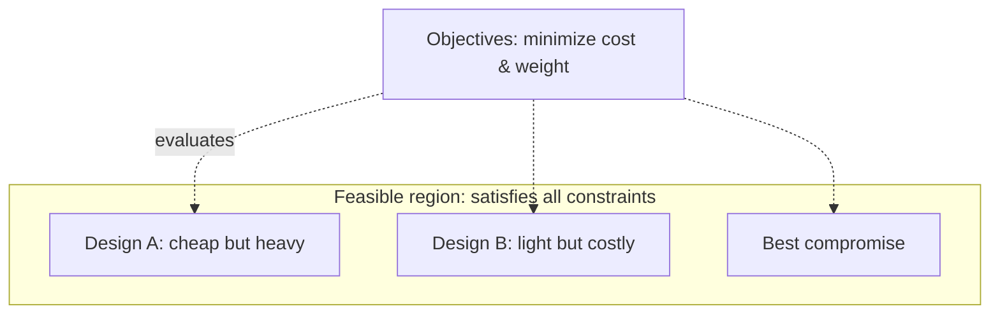

# Design Under Constraints

The defining feature of engineering is not that it solves problems but that it solves them
**within constraints**. A mathematician can prove a theorem in the abstract; an engineer
must deliver something that works given a fixed budget, a deadline, the properties of real
materials, the laws of physics, and a tolerance for risk. Remove the constraints and the
problem stops being engineering. As the saying goes, **engineering is the art of the
good-enough** — the search for a solution that satisfies the requirements, not a mythical
perfect one.

## The structure of a design problem

Every design problem decomposes into three parts:

- **Objectives** — what we are trying to maximize or minimize: performance, weight, cost,
  speed, reliability, energy use, user delight. Often several at once.
- **Constraints** — hard limits the solution must respect: a $2M budget, a 6-month
  schedule, a 500 kg mass ceiling, a material's yield strength, a regulatory standard,
  the speed of light.
- **Design variables** — the choices the engineer controls: dimensions, materials,
  topology, algorithms, component selection.

The set of all designs that satisfy every constraint is the **feasible region**. The
engineer's job is to find a point inside it that does well on the objectives. This is
literally an optimization problem, and the mathematics of
[../linear-optimization/optimization-problems.md](../linear-optimization/optimization-problems.md)
formalizes it: minimize (or maximize) an objective function subject to constraints. Much
of engineering is optimization done with judgment where the model is too fuzzy to solve
exactly — which returns us to heuristics (see
[the-engineering-method](the-engineering-method.md)).

## There is no perfect solution — only trade-offs

The deepest lesson of constrained design is that **objectives conflict**. You cannot
simultaneously maximize everything:

- **Aerospace:** stronger structure means more weight means less payload and range. The
  engineer trades strength against mass against fuel.
- **Civil:** a stiffer, safer bridge costs more concrete and steel; a cheaper one carries
  less margin. Cost trades against [safety-engineering](safety-engineering.md).
- **Electrical:** faster switching draws more power and produces more heat; low power
  means lower performance.
- **Chemical:** higher reaction yield may demand higher temperature and pressure, raising
  energy cost and hazard.
- **Software:** more features add complexity and slow the system; more caching costs
  memory and risks staleness. Latency, throughput, cost, and maintainability pull against
  each other.

When objectives conflict, no single design is "best" — there is a frontier of
**non-dominated** options where improving one objective necessarily worsens another
(the Pareto front). Choosing among them is a value judgment, not a calculation, and it
depends on the [requirements-and-specifications](requirements-and-specifications.md) that
say which objectives matter most. This is why requirements come first: they convert the
vague wish for "the best" into a concrete objective function and a set of constraints.

## Good-enough, satisficing, and margins

Because the perfect design is unreachable and the search is expensive, engineers
**satisfice** — they accept the first solution that meets the requirements with adequate
margin, rather than burning the budget hunting for the theoretical optimum. Constraints
are rarely known precisely, so the engineer builds in
[margins-tolerances-and-uncertainty](margins-tolerances-and-uncertainty.md): a factor of
safety turns "must survive load X" into "designed to survive 2X," buying protection
against everything the model omitted.

## Why it matters

- **Constraints are the problem, not obstacles to it.** A brief with no budget, no
  schedule, and no physical limits is not a hard engineering problem — it is not an
  engineering problem at all.
- **"Better" is meaningless without a stated objective and constraint.** Every "improve
  it" hides a trade-off; naming the trade-off is the engineering act.
- **Refusing to choose is choosing badly.** Someone will optimize the design; if the
  engineer doesn't do it deliberately against explicit objectives, it happens by accident.

## References

- [petroski-to-engineer-is-human.md](petroski-to-engineer-is-human.md) — Henry Petroski,
  on design as the anticipation of failure under real-world limits.
- [koen-discussion-of-the-method.md](koen-discussion-of-the-method.md) — Billy Vaughn
  Koen, on the engineering method as heuristic problem-solving within available resources.
