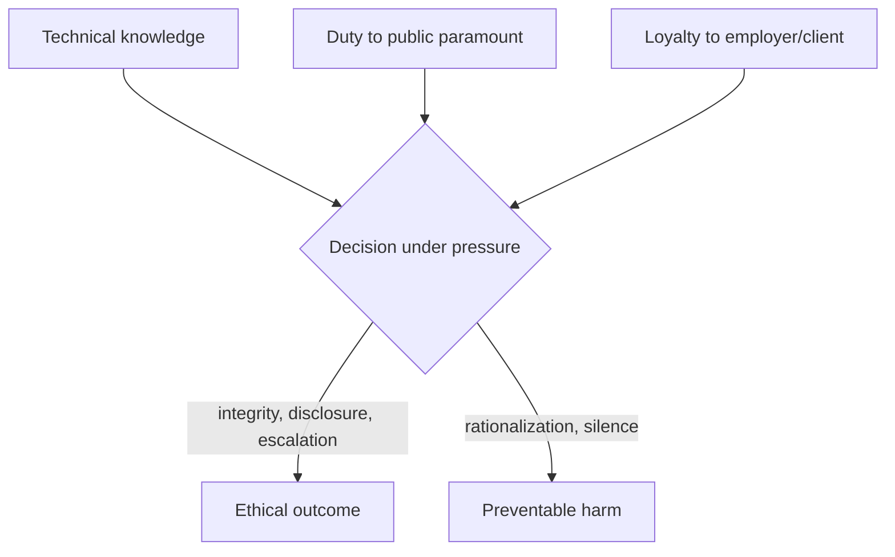

# Engineering Ethics

**Engineering ethics** is the study and practice of the moral obligations that come with
being an engineer. Because engineers build the artifacts and systems the public depends on
— bridges, aircraft, power grids, medical devices, software that mediates daily life — they
hold power that ordinary market transactions do not check. Engineering ethics exists to name
and constrain that power. Its organizing principle, stated at the top of nearly every
professional code, is blunt: **the safety, health, and welfare of the public is paramount** —
above the client's convenience, the employer's schedule, and the engineer's own advancement.

This is not decoration on top of the technical work; it is inseparable from it. The
[engineering method](the-engineering-method.md) makes choices under uncertainty with real
consequences, and [safety engineering](safety-engineering.md) is the technical arm of the
same duty of care.

## Codes of ethics

Professional societies codify the obligation. The **NSPE Code of Ethics** (US National
Society of Professional Engineers) is the best-known example; the IEEE, ASME, ACM, and most
national bodies maintain their own. The common core:

- **Hold public safety, health, and welfare paramount.** When a project would endanger the
  public, that concern overrides all others.
- **Practice only within your competence.** Do not sign off on work you are not qualified
  to judge.
- **Be truthful and objective.** No falsified data, no misleading claims, no telling clients
  what they want to hear against the evidence.
- **Act as a faithful agent** for each employer or client, *and* avoid and disclose
  **conflicts of interest** — competing loyalties that could bias judgment.
- **Uphold the profession's integrity** and hold peers accountable.

A code is a floor, not a ceiling: it states the minimum, and hard cases live in the tension
between clauses — most sharply when loyalty to an employer collides with the paramount duty
to the public.

## Recurring dilemmas

- **Conflict of interest.** Financial stakes, gifts, or divided loyalties that bias
  technical judgment. The remedy is disclosure and recusal, not private rationalization.
- **Honesty under pressure.** Schedule and cost pressure push toward optimistic reporting,
  hidden defects, and "it's probably fine." Rigor demands the opposite: state what you
  actually know, including that you do not know.
- **Whistleblowing.** When an internal warning is overruled and the public is endangered,
  the engineer may face a duty to escalate outside the organization — at real personal
  cost. Codes support it in principle; careers have been ended by it in practice. The
  ethical weight is highest exactly when it is hardest to act.

## Case studies

The field's conscience is built from its disasters — the same way its
[margins](margins-tolerances-and-uncertainty.md) are built from its failures
(see [petroski-to-engineer-is-human.md](petroski-to-engineer-is-human.md)).

- **Space Shuttle *Challenger* (1986).** Engineers at Morton Thiokol warned that the O-ring
  seals would not seal in the cold launch temperature and recommended against launch.
  Management overrode them. The seals failed and seven crew died. The case is the canonical
  study of engineering judgment defeated by organizational and schedule pressure — a
  breakdown of the system, not one bad actor.
- **Ford Pinto (1970s).** An internal cost-benefit analysis reportedly weighed the cost of a
  fuel-tank fix against the projected cost of burn deaths and lawsuits, and chose not to fix.
  A study in the moral limits of putting a price on human safety.
- **Therac-25 (1985–87).** A radiation-therapy machine delivered massive overdoses,
  killing and injuring patients, due to software race conditions, removal of hardware
  interlocks, and dismissal of user reports. It remains the foundational software-safety
  case: complex systems fail in the interactions, and accountability cannot be waved away
  because "the software did it."

Leveson's analysis of such accidents
([leveson-engineering-a-safer-world.md](leveson-engineering-a-safer-world.md)) reframes them
as *control-structure* failures: safety is an emergent property of the whole
socio-technical system, and ethical responsibility extends to the organization and its
decision processes, not just the engineer at the last keystroke.

## Relevance to AI and software today

Software and AI have made engineering ethics broader and more urgent, not less. Code now
mediates hiring, lending, medical triage, and safety-critical control, yet much of it ships
without the licensure, sign-off, or codified duty of care that governs a bridge. The
classical questions return in new form: competence (do the builders understand the system's
failure modes?), honesty (are the capabilities and limits stated truthfully?), conflicts of
interest (does the business model reward harmful behavior?), and the standing to raise an
alarm. These are exactly the concerns of
[../ai-governance/index.md](../ai-governance/index.md), and living up to them inside a
company — how responsibility is assigned, how dissent is heard, how safety is resourced — is
a matter of organizational design covered in [../ai-org/index.md](../ai-org/index.md).

## Why it matters

An engineer's decisions are, in aggregate, decisions about who is safe and who is at risk.
Ethics is what keeps technical skill in the service of human welfare rather than merely in
the service of whoever is paying. It is also self-interested in the long run: the
profession's license to operate — public trust — is spent by every avoidable disaster and
replenished only by consistent, visible integrity. Ethics is therefore not a constraint on
good engineering; it is part of the definition of it.

## References

- [Safety Engineering](safety-engineering.md) — the technical practice that operationalizes the duty of care.
- [Leveson, *Engineering a Safer World*](leveson-engineering-a-safer-world.md) — accidents as socio-technical control failures and the ethics that follow.
- [Petroski, *To Engineer Is Human*](petroski-to-engineer-is-human.md) — learning responsibility from failure.
- [The Engineering Method](the-engineering-method.md) — ethical judgment as part of deciding under uncertainty.
- [../ai-governance/index.md](../ai-governance/index.md) — the modern extension of these duties to AI systems.
- [../ai-org/index.md](../ai-org/index.md) — embedding responsibility and safety in organizational structure.
