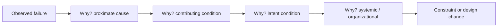

# Failure Analysis and Root Cause

Failure analysis is the disciplined study of *why something broke* so that the knowledge
feeds back into better design. It is engineering's central learning loop: rather than treat
each failure as an embarrassment to bury, mature engineering treats it as data. Henry
Petroski's argument in [To Engineer Is Human](petroski-to-engineer-is-human.md) is that
**failure, not success, is what drives design progress** — a design that works teaches little,
because it merely confirms assumptions; a design that fails reveals exactly where the model of
reality was wrong. Whole fields (structural engineering above all) advanced by dissecting
their collapses.

## Failure modes and forensic engineering

A **failure mode** is the specific way a component or system stops meeting its function:
fatigue cracking, buckling, corrosion, a race condition, resource exhaustion. Enumerating
failure modes in advance is the forward-looking work of FMEA under
[reliability engineering](reliability-engineering.md). **Forensic engineering** is the
backward-looking counterpart — reconstructing, after a collapse or crash or outage, the
physical and logical chain of events that produced it, often as painstakingly as a crime
scene. The two directions meet in the middle: what forensic analysis of past failures reveals
becomes the failure modes that future FMEA hunts for.

## Root-cause analysis techniques

**Root-cause analysis (RCA)** aims to get past the proximate trigger to the underlying
conditions that made the failure possible. Two workhorse techniques:

- **The Five Whys** — repeatedly ask "why?" of each answer, drilling from symptom toward
  cause. "The server crashed. Why? It ran out of memory. Why? A cache had no eviction. Why?
  The bound was never specified. Why? The requirement omitted it…" The method is simple and
  often useful, but it has a trap: it implies a single linear causal chain.
- **The fishbone (Ishikawa) diagram** — organizes candidate causes into categories (method,
  machine, material, people, environment, measurement), acknowledging that failures usually
  have *several* contributing causes converging, not one.

## The myth of the single root cause

A crucial caution: the phrase "root cause" is often misleading. Charles Perrow's
[Normal Accidents](perrow-normal-accidents.md) shows that in systems that are both
**interactively complex** (parts interact in ways no one fully anticipates) and **tightly
coupled** (little slack, so a disturbance propagates fast before anyone can intervene),
serious accidents are *not* the fault of one broken part or one careless operator — they are
an emergent property of the system's structure. Such accidents are, in Perrow's unsettling
term, *normal*: expected, given enough operating time, no matter how careful everyone is.

This lines up with [how complex systems fail](../systems-thinking/how-complex-systems-fail.md):
catastrophe requires *multiple* small failures to align, so searching for the single root
cause both misdescribes reality and stops the investigation too early. The productive question
is not "what was the root cause?" but "what set of conditions had to co-occur, and which of
them can we change?"

## Blameless investigation

Because attributing failure to a single culpable human is usually both wrong and
counterproductive, effective failure analysis is **blameless**. When operators fear blame
they hide information, and the organization loses exactly the data it needs to improve. The
[field guide to human error](../systems-thinking/field-guide-to-human-error.md) reframes
"human error" not as a cause to be punished but as a *symptom* of deeper systemic trouble —
a starting point for inquiry, not a verdict. Modern operations institutionalizes this as the
[blameless post-mortem](../devops-sre/index.md): a written, shared account of an incident
whose explicit purpose is learning and prevention, never assigning fault. This turns each
outage into durable organizational memory.

## Why it matters

Failure analysis is the mechanism by which engineering *gets better over time*. It closes the
loop between [safety engineering](safety-engineering.md)'s hazard analysis (which anticipates
failures) and the failures that actually occur (which reveal what the anticipation missed).
It disciplines [requirements and specifications](requirements-and-specifications.md) by
tracing accidents back to specification flaws. And its cultural core — treat failure as
information, look for systemic conditions rather than scapegoats, write it down — is arguably
the single most transferable practice across all of engineering, from bridges to distributed
systems to AI deployments, where opaque failures make honest, blameless post-incident learning
more valuable, not less.

## References

- [To Engineer Is Human (Petroski)](petroski-to-engineer-is-human.md)
- [Normal Accidents (Perrow)](perrow-normal-accidents.md)
- [How Complex Systems Fail](../systems-thinking/how-complex-systems-fail.md)
- [The Field Guide to Understanding Human Error](../systems-thinking/field-guide-to-human-error.md)
- [DevOps & SRE](../devops-sre/index.md)
