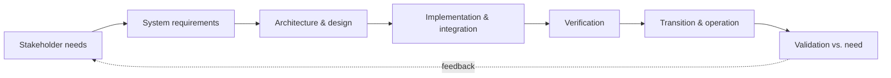

# INCOSE Systems Engineering Handbook

The *Systems Engineering Handbook* is the flagship reference of INCOSE (the International
Council on Systems Engineering), now in its 5th edition (Wiley, 2023, lead editors
Walden, Shortall, Roedler, Delicado, Mornas, Yew-Seng, and Endler). It is the field's
"state of good practice" document — the closest thing systems engineering has to an
authoritative canon — and it is structured as a practical guide to the **system life
cycle**, aligned with the international standard **ISO/IEC/IEEE 15288** (System Life Cycle
Processes, 2023 revision).

## Scope

Where classical engineering disciplines focus on a component (a beam, a circuit, an
algorithm), systems engineering owns the **whole**: the interdisciplinary problem of
conceiving, designing, building, operating, and retiring a complex system whose value
comes from the *interactions* among its parts, not the parts alone. The handbook codifies
how to do that across the full life cycle and across the boundaries between hardware,
software, people, and organizations — it is explicitly "domain free," meant to apply to
aerospace, defense, infrastructure, medical devices, or software-intensive systems alike.

## Central content

The handbook organizes the discipline around the ISO 15288 process groups. In broad
strokes:

- **Life-cycle framing.** A system passes through stages — concept, development,
  production, utilization, support, retirement — and the engineering activities are
  organized to serve whichever stage the system is in. The handbook treats the life cycle,
  not the artifact, as the unit of management.

- **Technical processes.** The core engineering work: *stakeholder needs and requirements
  definition*, *system requirements definition*, *architecture definition*, *design
  definition*, *system analysis*, *implementation*, *integration*, *verification*,
  *transition*, *validation*, *operation*, *maintenance*, and *disposal*. This chain — from
  eliciting what stakeholders need, through specifying and architecting, to proving the
  built system meets the need — is the spine of systems engineering.

- **Technical management processes.** *Project planning*, *assessment and control*,
  *decision management*, *risk management*, *configuration management*, *information
  management*, *measurement*, and *quality assurance* — the controls that keep the
  technical work coherent over time and across a large team.

- **Agreement and organizational-project-enabling processes.** Acquisition and supply, plus
  the infrastructure, portfolio, human-resource, quality, and knowledge-management
  processes that let an organization sustain systems engineering at all.

- **Tailoring and application.** The handbook is emphatic that the processes are not a
  rigid checklist; they must be *tailored* to the scale, risk, and domain of the specific
  program. It closes with guidance on systems engineering in practice, plus appendices such
  as an N² diagram of the process interactions.

## Why it anchors the engineering field

This handbook is the reference standard behind the [systems engineering](systems-engineering.md)
concept, and it operationalizes the front half of the technical chain covered by
[requirements and specifications](requirements-and-specifications.md) — the discipline of
turning ambiguous stakeholder needs into verifiable requirements is where the handbook
puts much of its rigor. Its emphasis on managing whole-system interactions across a life
cycle is the constructive, process-side counterpart to the systems-thinking literature on
why such systems fail (see [how complex systems fail](../systems-thinking/how-complex-systems-fail.md)),
and its verification/validation and operations processes connect directly to
[devops/SRE practice](../devops-sre/index.md).

## References

- [INCOSE Systems Engineering Handbook, 5th Edition — INCOSE](https://www.incose.org/resource/incose-systems-engineering-handbook-a-guide-for-system-life-cycle-processes-and-activities-5th-edition/)
- [INCOSE Systems Engineering Handbook, 5th Edition — Wiley](https://www.wiley.com/INCOSE+Systems+Engineering+Handbook,+5th+Edition-p-9781119814290)
