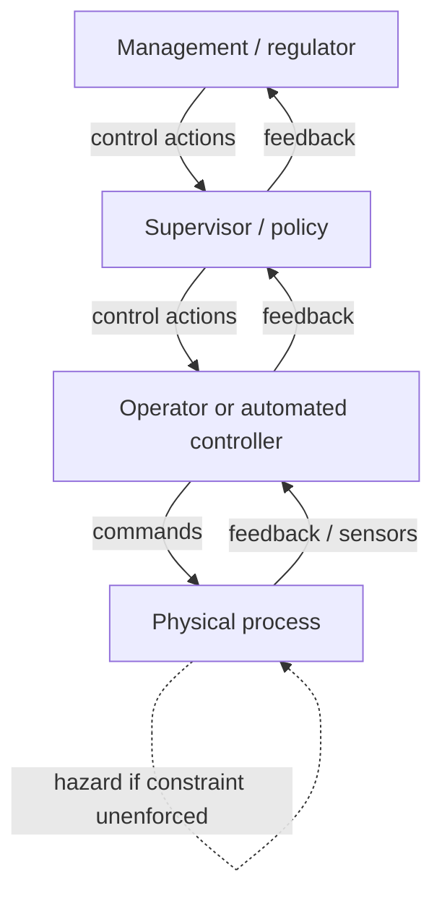

# Engineering a Safer World: Systems Thinking Applied to Safety

Nancy Leveson's 2011 book (MIT Press; a free online edition is linked from her MIT page)
argues that the traditional foundations of safety engineering — built for a simpler,
analog, hardware world — no longer fit today's complex, software-intensive,
sociotechnical systems. In their place she offers a new causal model grounded in modern
systems theory and control theory: **STAMP** (Systems-Theoretic Accident Model and
Processes). The central reframing is stark and consequential: **safety is a control
problem, not a failure or reliability problem.**

## Reliability is not safety

The book's foundational move is to separate two ideas that engineering routinely conflates.
*Reliability* is the property that components do what they were specified to do.
*Safety* is the property that the system does not reach a hazardous state. Leveson argues
these are distinct and can even oppose each other: a system can be built entirely from
perfectly reliable components and still be unsafe, because accidents arise from unsafe
*interactions* among components that were each behaving exactly as designed. Conversely,
component failures need not produce accidents if the system is properly controlled.
Chasing higher component reliability — the classic response — therefore misses the accidents
that matter most in complex systems.

## STAMP: safety as enforced constraints in a control hierarchy

In STAMP, safety is treated as an emergent property that is *controlled*, not a chain of
failure events that is *prevented*. A system is modeled as a hierarchical **control
structure**: at each level, controllers (regulators, management, operators, automated
controllers, physical actuators) issue control actions downward and receive feedback
upward. Every controller acts on a **process model** — its internal belief about the state
of what it is controlling. **Accidents happen when the control structure fails to enforce
the safety constraints** — because a control action is missing, wrong, ill-timed, or stopped
too soon, often because a controller's process model has drifted out of sync with reality.

**STPA (System-Theoretic Process Analysis)** is the hazard-analysis technique built on
STAMP. Rather than enumerate component failures (as FMEA or fault-tree analysis do), STPA
starts from system-level losses and hazards, maps the control structure, and
systematically identifies *unsafe control actions* and the flawed control loops or process
models that would allow them. This lets it catch software errors, requirements flaws,
human-automation mismatches, and organizational drift — the dominant accident causes today
that failure-enumeration methods structurally cannot see.

## Why it anchors the engineering field

*Engineering a Safer World* is the modern reference for [safety engineering](safety-engineering.md),
and it is the direct intellectual heir to Perrow's diagnosis: where
[Normal Accidents](perrow-normal-accidents.md) says complex tightly-coupled systems make
accidents inevitable, Leveson responds with a *constructive* method — control the
interactions rather than merely count the failures. Because STAMP models organizations,
software, and humans as parts of one control hierarchy, it is squarely a work of
[systems thinking](../systems-thinking/index.md), sharing DNA with Richard Cook's
[how complex systems fail](../systems-thinking/how-complex-systems-fail.md). Its
reliability-is-not-safety thesis reframes root-cause work
([failure analysis and root cause](failure-analysis-and-root-cause.md)): the useful
question is not "which component failed" but "which safety constraint went unenforced, and
why did the control structure allow it." That control-loop, blameless, process-model view
carries directly into modern [devops/SRE](../devops-sre/index.md) incident practice.

## References

- [Engineering a Safer World — Nancy Leveson, MIT (free online edition)](http://sunnyday.mit.edu/safer-world/)
- [Engineering a Safer World — MIT Press](https://mitpress.mit.edu/9780262533690/engineering-a-safer-world/)
