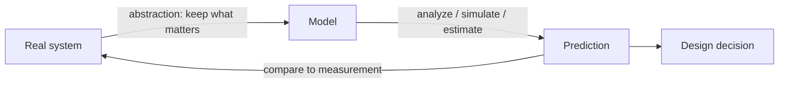

# Modeling and Abstraction

**Modeling** is how engineers reason about a system *before* — or *without* — building it.
A model is a deliberately simplified stand-in for a real system: it keeps the features
that matter for the question at hand and throws away everything else. **Abstraction** is
the act of choosing what to keep and what to discard. A beam becomes a line with a
stiffness; a transistor becomes a switch; a queue of customers becomes an arrival rate and
a service rate. The whole discipline of engineering runs on the bet that a cheap, tractable
model can tell you enough about an expensive, intractable reality to decide what to do.

This is a defining move of the [engineering method](the-engineering-method.md): rather than
discover universal truth, the engineer builds a good-enough representation, reasons inside
it, and accepts the residual error as a cost of doing business.

## Kinds of models

- **Physical models.** A scale wind-tunnel wing, a breadboard circuit, a crash-test
  dummy, a clay mock-up. They obey the same physics as the real thing (subject to scaling
  laws) and are used when the phenomena are too complex to compute cleanly.
- **Mathematical models.** Equations that relate the system's variables. A spring is
  *F = −kx*; a circuit is a set of Kirchhoff equations; a population or a chemical reactor
  is a system of [differential equations](../math/differential-equations.md). These let you
  predict behavior symbolically or numerically without touching hardware.
- **Computational / simulation models.** When the equations have no closed-form solution,
  you discretize and let a computer march the state forward — finite-element structural
  analysis, computational fluid dynamics, SPICE circuit simulation, discrete-event
  simulation of a factory floor. Simulation is a model executed rather than solved.
- **Statistical / empirical models.** When first-principles physics is unavailable or too
  costly, fit a model to data — a regression surface, a response curve, a learned
  predictor. These lean on [estimation](../statistics/estimation.md) and connect
  engineering to [../systems-thinking/index.md](../systems-thinking/index.md).

## The reasoning tools

**First-principles reasoning** starts from known physical laws (conservation of mass,
energy, momentum; Maxwell's equations) and derives behavior, rather than copying a prior
design. It is slower but trustworthy where analogy fails.

**Order-of-magnitude / back-of-the-envelope estimation** deliberately sacrifices precision
for speed. Round everything to one significant figure, keep only dominant terms, and ask:
is this device roughly the size of a breadbox or a building? Such estimates catch bad ideas
before detailed work begins and are a hallmark of engineering judgment — a *heuristic* in
Koen's sense (see [koen-discussion-of-the-method.md](koen-discussion-of-the-method.md)).

**Dimensional analysis** checks and even generates models using only the units of the
quantities involved. If an equation's two sides do not have matching dimensions, it is
wrong — full stop. The Buckingham π theorem goes further: it groups variables into
dimensionless numbers (Reynolds number, Mach number) that govern behavior and make scale
models valid. A single dimensionless group can collapse a whole family of experiments onto
one curve.

## The map-vs-territory caveat

Every model is a *map*, and the map is not the territory. The statistician George Box's
maxim — **"all models are wrong, but some are useful"** — is the engineer's working creed.
A model earns its keep not by being true but by being *useful within its validity range*
and by making its own limits knowable. Trouble arrives when an abstraction is used outside
the regime where it holds: a linear small-deflection beam model applied to a beam that has
begun to buckle, a fluid model run past the onset of turbulence, a laboratory correlation
extrapolated far beyond the data behind it. Because models are always approximate, their
output must be wrapped in
[margins, tolerances, and uncertainty](margins-tolerances-and-uncertainty.md) before it
touches a real design — the two ideas are inseparable.

## Why it matters

Modeling is what makes engineering *predictive* instead of purely trial-and-error. It lets
you explore a design space, run failure scenarios, and reject bad options for the cost of
computation rather than the cost of a crash — the analytic complement to the
build-and-test learning that Petroski describes in
[petroski-to-engineer-is-human.md](petroski-to-engineer-is-human.md). The same discipline
that draws the model's boundary must also track what falls *outside* it: the unmodeled
interactions and assumptions that recur in accident investigations
(see [leveson-engineering-a-safer-world.md](leveson-engineering-a-safer-world.md) and
[failure-analysis-and-root-cause.md](failure-analysis-and-root-cause.md)). Choosing the
right abstraction — simple enough to reason about, faithful enough to trust — is the core
intellectual act of the field.

## References

- [The Engineering Method](the-engineering-method.md) — modeling as a heuristic for acting under uncertainty.
- [Koen, *Discussion of the Method*](koen-discussion-of-the-method.md) — models and estimates as engineering heuristics.
- [Petroski, *To Engineer Is Human*](petroski-to-engineer-is-human.md) — the interplay of analysis and physical testing.
- [Margins, Tolerances, and Uncertainty](margins-tolerances-and-uncertainty.md) — how model error is turned into design allowance.
- [../math/index.md](../math/index.md) and [../math/differential-equations.md](../math/differential-equations.md) — the mathematics that most physical models are written in.
