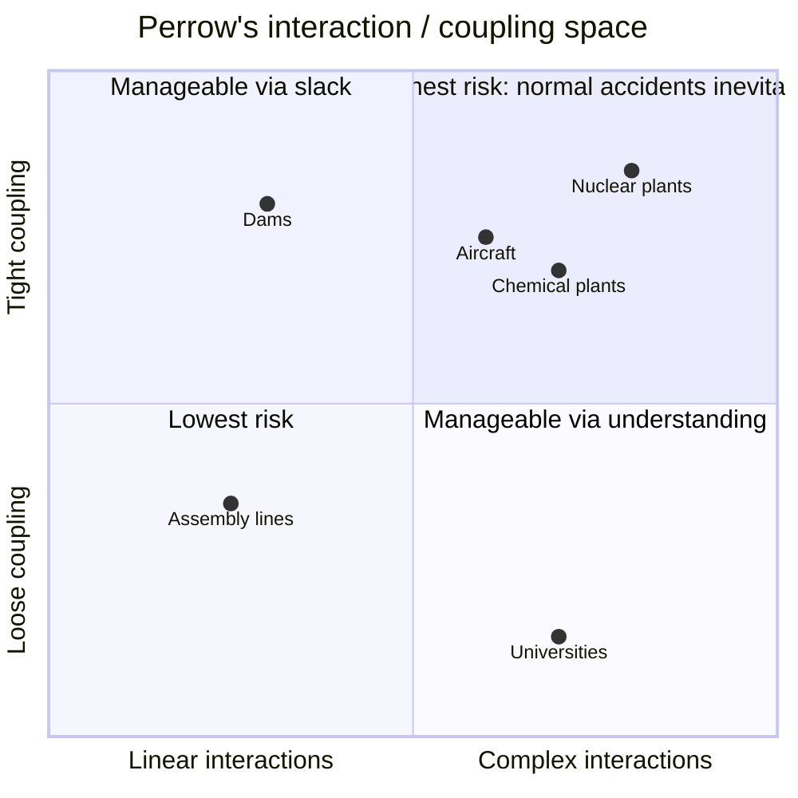

# Normal Accidents: Living with High-Risk Technologies

Charles Perrow's 1984 book (updated Princeton edition, 1999) analyzes the *social* side of
technological risk and delivers a conclusion that reshaped safety thinking: in certain
kinds of systems, serious accidents are not preventable freak events but **inevitable,
built-in features of the system's structure**. He calls these "normal accidents" — normal
not because they are frequent, but because they are the expected, unavoidable product of
the system's design. The book was inspired by the 1979 Three Mile Island partial
meltdown, which Perrow read not as operator error but as an unanticipated interaction of
multiple small failures in a system too complex to fully comprehend in real time.

## The two dimensions: interactions and coupling

Perrow's analytical core is a two-by-two classification of systems along two independent
axes:

- **Interactions: linear vs. complex.** *Linear* interactions are expected, visible, and
  proceed in a comprehensible sequence — a failure in one place produces effects you can
  trace and anticipate. *Complex* interactions are those where components affect each other
  in unfamiliar, unplanned, hidden ways; failures combine in sequences no designer
  foresaw, and operators cannot immediately understand what is happening.

- **Coupling: loose vs. tight.** *Tight* coupling means little slack — processes are
  time-dependent, sequences are invariant, there is only one way to reach the goal, and
  there is no buffer to absorb a disturbance before it propagates. *Loose* coupling allows
  delays, substitutions, and improvisation; a problem can be contained before it spreads.

**The dangerous quadrant is complex + tightly coupled.** When a system is both hard to
understand *and* has no slack to absorb a disturbance, the two properties defeat each
other's remedies. Complexity demands that operators be given time and latitude to diagnose
and improvise — but tight coupling denies exactly that, forcing fast, prescribed responses
before anyone understands the cascade. Nuclear power plants, chemical plants, and (to a
degree) aircraft and marine transport live in this quadrant. In such systems, the argument
goes, multiple independent failures will eventually interact in a way no one designed for,
and no amount of added safety machinery can prevent it.

**Safety devices can cause accidents.** Perrow's most counterintuitive point is that the
conventional engineering fix — adding warnings, interlocks, and redundant safeguards —
*increases* complexity, and thus can manufacture entirely new failure modes. At Chernobyl,
a test of a new safety system helped produce the disaster. Redundancy is not free; it adds
interactions.

**Failures are organizational, and start small.** Perrow stresses that most catastrophes
have trivial beginnings and that the deeper causes are organizational and managerial, not
merely technical. Technological disaster could no longer be dismissed as isolated
equipment malfunction, operator error, or an act of God.

## Why it anchors the engineering field

*Normal Accidents* is the founding text of "high-reliability vs. normal-accident" safety
debate and the origin of interactive-complexity-and-coupling as a risk vocabulary. It is a
structural, sociological account of [failure analysis and root cause](failure-analysis-and-root-cause.md):
in a true normal accident there is no single root cause to find — the cause *is* the
system's interactive complexity, which reframes what a post-mortem can even hope to
recover. It is a cornerstone of [safety engineering](safety-engineering.md), and its claim
that complexity itself is the hazard runs directly parallel to Richard Cook's clinical
observations in [how complex systems fail](../systems-thinking/how-complex-systems-fail.md).
Perrow's insistence that adding safeguards can create new accidents is the classic warning
against treating safety as an additive property.

## References

- [Normal Accidents — Princeton University Press](https://press.princeton.edu/books/paperback/9780691004129/normal-accidents)
