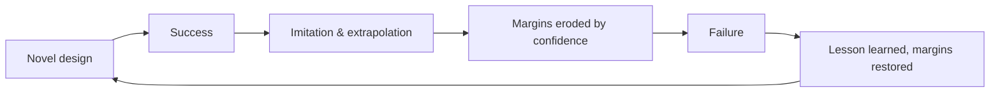

# To Engineer Is Human: The Role of Failure in Successful Design

Henry Petroski's 1985 book (Vintage, 1992) argues a claim that sounds paradoxical
until you sit with it: **failure, not success, is what drives engineering forward.**
Petroski — a civil engineer and historian at Duke — makes the case that engineering is
fundamentally the design of things that have not existed before, and that no amount of
analysis can fully anticipate how a genuinely new artifact will behave. The colossal,
public failures of engineering are therefore not aberrations to be embarrassed about;
they are the mechanism by which the discipline learns what its calculations left out.

## Central ideas

**Design is a hypothesis about the future.** Every structure — a bridge, a building, a
walkway — is a prediction that a particular arrangement of material will carry its loads
for its lifetime. That prediction can only be *disproven*, never fully proven, in the
Popperian sense. A bridge that stands tells you little; a bridge that falls tells you
exactly which assumption was wrong. This makes failure epistemically privileged:
**a collapse is a natural experiment that no ethical engineer could deliberately run.**

**Success breeds the next failure.** Petroski's most unsettling observation is a cyclic
one. A successful design invites imitation and, crucially, *extrapolation* — engineers
scale it up, stretch it further, shave its margins, confident because "it worked before."
Each successful iteration erodes the safety factor a little more until the accumulated
optimism outruns the physics and something breaks. The failure then resets the field's
humility, tightens the margins, and the cycle begins again. Progress is this sawtooth,
not a smooth climb.

**Case studies as the argument.** Petroski reasons through concrete disasters rather
than abstractions: the 1981 collapse of the suspended walkways at the Kansas City Hyatt
Regency (a seemingly trivial change to a hanger-rod detail that doubled a connection's
load), the 1940 aeroelastic destruction of the Tacoma Narrows Bridge in a mild wind, and
counter-examples of inspired success such as the Crystal Palace. Each shows a small,
overlooked assumption cascading into catastrophe — reinforcing that the useful
post-mortem question is not "who was negligent" but "what did our model omit."

**Engineering as a human, fallible, cultural act.** The title inverts the proverb "to err
is human": to engineer *is* to err, iterate, and improve. Petroski connects the
quantifiable world of stress analysis to the messy realities of budgets, deadlines,
imitation, and human judgment, insisting that maintainability and humility about the
limits of calculation matter as much as the calculation itself.

## Why it anchors the engineering field

This is the canonical popular articulation of failure-as-teacher, and it underwrites much
of how the engineering method treats iteration. It is the humanities-facing complement to
formal [failure analysis and root cause](failure-analysis-and-root-cause.md): where root-cause
technique dissects *how* a specific artifact failed, Petroski explains *why* failure is
structurally necessary to the discipline at all. It grounds the view of
[the engineering method](the-engineering-method.md) as a fallibilist, evidence-correcting
practice rather than a deductive one. The extrapolation-until-collapse cycle is the
engineering-artifact cousin of the drift described in
[how complex systems fail](../systems-thinking/how-complex-systems-fail.md), and its
lessons on learning from failure without blame carry directly into
[devops/SRE practice](../devops-sre/index.md).

## References

- [To Engineer Is Human — Penguin Random House](https://www.penguinrandomhouse.com/books/130247/to-engineer-is-human-by-henry-petroski/)
