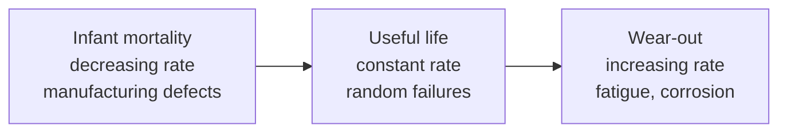

# Reliability Engineering

Reliability engineering is the discipline of designing systems so they keep performing
their intended function, for a stated time, under stated conditions. It treats failure not
as a moral lapse but as a statistical fact of physical and logical systems, and asks: given
that parts fail, how do we predict, measure, and reduce the rate at which the *whole* fails?
It emerged from mid-20th-century aerospace, electronics, and defence work — fields where a
single unreliable component in a chain of thousands could ground a fleet — and it is the
direct engineering ancestor of modern
[site reliability engineering](../devops-sre/site-reliability-engineering.md).

## Reliability as a probability

Formally, **reliability** R(t) is the probability that a system survives without failure up
to time t. Its complement is the probability of failure. For a component with a constant
failure rate λ (failures per unit time), reliability decays exponentially: R(t) = e^(−λt).
This constant-rate assumption is the workhorse model, but it only holds during one phase of
a component's life.

## The bathtub curve

Plotting failure rate against age for a population of components traces a characteristic
"bathtub" shape with three regimes:

- **Infant mortality** — early failures from latent manufacturing defects; burn-in testing
  screens these out before shipping.
- **Useful life** — a long, flat period of roughly constant, random failure rate; this is
  where the exponential model applies.
- **Wear-out** — rising failure rate as materials fatigue, corrode, or degrade; preventive
  replacement targets this phase.

Software has an analogous but distorted curve: no physical wear-out, but "infant mortality"
of new-release defects and a rising rate as unmaintained code decays against a changing
environment.

## Key metrics: MTBF, MTTR, and the difference between reliability and availability

Two summary numbers dominate practice:

- **MTBF (Mean Time Between Failures)** — average operating time between failures for a
  repairable system; the reciprocal of the failure rate. Higher is more reliable.
- **MTTR (Mean Time To Repair)** — average time to restore a failed system to service.

**Reliability** is about *not failing*; **availability** is about *being up when needed*, and
they are not the same thing. Availability combines both metrics:

  Availability = MTBF / (MTBF + MTTR)

A system can be unreliable yet highly available if it recovers fast enough — the insight that
SRE turns into its central lever, cutting MTTR through automation and observability rather
than chasing an unreachable zero failure rate. Conversely a very reliable system with slow,
manual repair can still deliver poor availability. This distinction between not-failing and
recovering-fast connects directly to
[resilience and robustness](../systems-thinking/resilience-and-robustness.md).

## Redundancy: buying reliability with duplication

The primary structural tool is **redundancy** — providing more than one way to accomplish a
function so that no single failure stops the whole. Two arrangements matter:

- **Active (parallel) redundancy** — units run simultaneously and share load; if one fails,
  the others carry on with no switchover. The system survives as long as *any* path works, so
  parallel components multiply reliability.
- **Standby redundancy** — a spare sits idle (cold) or lightly loaded (warm) and is switched
  in when the primary fails. Cheaper to run, but the switchover mechanism itself becomes a
  possible failure point.

Redundancy only helps against *independent* failures. Common-cause failures — a shared power
supply, a shared bug, a shared assumption — defeat it by taking out all copies at once, which
is why [fault tolerance in distributed systems](../distributed-systems/fault-tolerance-and-failure.md)
obsesses over failure independence and correlated risk.

## FMEA: systematically hunting failure modes

**Failure Mode and Effects Analysis (FMEA)** is the standard bottom-up method for finding
weaknesses before they bite. For each component you enumerate its possible failure modes,
trace the effect of each on the system, and rank them — classically by a Risk Priority
Number combining severity, likelihood of occurrence, and likelihood of detection. High-RPN
modes get design attention first. FMEA is a cousin of the top-down
[failure analysis and root-cause](failure-analysis-and-root-cause.md) methods: FMEA reasons
*forward* from cause to effect before the fact, while root-cause analysis reasons *backward*
from an observed failure after it.

## Why it matters

Reliability engineering gives every other engineering discipline a shared, quantitative
language for "how likely is this to break, and what happens when it does." It underlies
[safety engineering](safety-engineering.md) (though reliability and safety are distinct — a
reliable system can still be unsafe), informs
[margins, tolerances, and uncertainty](margins-tolerances-and-uncertainty.md) by justifying
how much redundancy and margin to buy, and provides the conceptual backbone that operations
teams inherited when they scaled software services to internet size. It is also the honest
answer to the fantasy of perfect systems: you cannot make failure impossible, only rare,
recoverable, and understood.

## References

- [Site Reliability Engineering](../devops-sre/site-reliability-engineering.md)
- [Fault Tolerance and Failure](../distributed-systems/fault-tolerance-and-failure.md)
- [Safety Engineering](safety-engineering.md)
- [Failure Analysis and Root Cause](failure-analysis-and-root-cause.md)
- [Resilience and Robustness](../systems-thinking/resilience-and-robustness.md)
