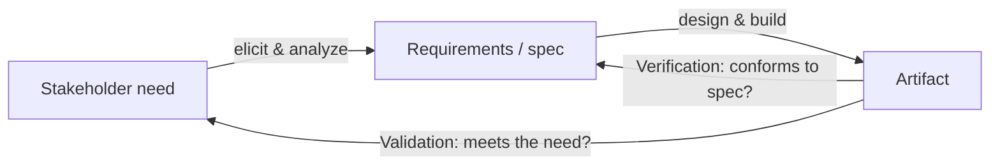

# Requirements and Specifications

Between a stakeholder's vague need and a buildable artifact sits the work of
**requirements and specifications**: turning "we need a bridge that people trust" into
"the deck shall carry a live load of 5 kN/m² with a factor of safety of 2.5, verified by
proof load test." A requirement states *what* is needed and *why*; a specification pins it
down precisely enough to build against and — crucially — to **test** against. Getting this
wrong is the most expensive mistake in engineering, because everything downstream inherits
the error. This is where a design problem acquires its objectives and constraints (see
[design-under-constraints](design-under-constraints.md)) and where the systems
[systems-engineering](systems-engineering.md) V-model gets its acceptance criteria.

## Functional vs non-functional requirements

Requirements split into two broad kinds:

- **Functional requirements** describe *what the system does* — the behaviors, inputs, and
  outputs. "The pump shall deliver 200 L/min." "The system shall issue a refund when a
  return is approved."
- **Non-functional requirements** (also called *quality attributes* or *the -ilities*)
  describe *how well* it must do it — the properties cutting across all behaviors:
  reliability, safety, performance, cost, maintainability, usability, security. "Mean time
  between failures shall exceed 10,000 hours." "99th-percentile response time shall be
  under 200 ms."

Non-functional requirements are where most trade-offs and most conflicts live, and they
tie directly to [reliability-engineering](reliability-engineering.md),
[safety-engineering](safety-engineering.md), and
[margins-tolerances-and-uncertainty](margins-tolerances-and-uncertainty.md).

## Good requirements are falsifiable

A requirement earns its keep only if you can tell, unambiguously, whether the finished
artifact meets it. The discipline is to write **falsifiable acceptance criteria** — a
concrete, measurable test that a design either passes or fails. Compare:

| Weak (untestable) | Strong (falsifiable) |
|---|---|
| "The system should be fast." | "Search results shall return in ≤ 300 ms at the 95th percentile under 1,000 concurrent users." |
| "The beam must be strong." | "The beam shall not yield under 1.5× the maximum design load." |
| "The app should be easy to use." | "A first-time user shall complete checkout in ≤ 3 steps, verified with 10 usability sessions." |

If you cannot state the test, you do not yet have a requirement — you have a wish. This is
the same rigor that
[../process-and-teams/software-requirements.md](../process-and-teams/software-requirements.md)
brings to software, and it is why acceptance-test-driven and specification-by-example
practices insist on concrete examples before code.

## Verification vs validation

Two questions look similar and are constantly confused, but they check different things:

- **Verification — "Did we build it *right*?"** Does the artifact conform to its
  specification? This is objective: run the test, check the number against the spec.
- **Validation — "Did we build the *right thing*?"** Does the artifact meet the real need,
  regardless of the spec? A system can pass every verification test and still be useless
  because the requirements themselves were wrong.

You can verify against a bad spec and produce exactly the wrong product on time and on
budget. Validation guards against that by checking the artifact against the *need*, not
the paperwork. Both are required; neither substitutes for the other.

## Traceability

**Traceability** is the thread linking each requirement forward to the design elements that
implement it, the tests that verify it, and back to the stakeholder need that justifies
it. A traceability matrix lets you answer: *Why does this component exist? What breaks if
we drop this requirement? Is every requirement tested? Is every test tied to a
requirement?* Traceability is what makes change safe — when a need shifts, you can find
everything it touches. In the [systems-engineering](systems-engineering.md) V-model, the
dashed links between decomposition and test are traceability made visible.

## Why it matters

- **Requirements errors are the costliest errors.** A mistake in requirements propagates
  through design, build, and test; the later it is caught, the more it costs to fix.
- **"Done" is undefined without falsifiable criteria.** If you cannot test a requirement,
  you cannot know when the work is finished — the loop never closes.
- **Passing tests is not success.** Verification without validation ships the wrong
  product flawlessly. Always ask both questions.
- **Change is inevitable; traceability is how you survive it.** The graph of need →
  requirement → design → test is the map you navigate when anything moves.

## References

- [incose-systems-engineering-handbook.md](incose-systems-engineering-handbook.md) —
  INCOSE, on requirements engineering, verification, and validation across the lifecycle.
- [koen-discussion-of-the-method.md](koen-discussion-of-the-method.md) — Billy Vaughn
  Koen, on stating the problem well as the heart of the engineering method.
