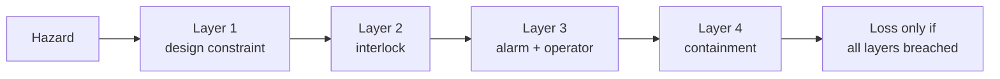

# Safety Engineering

Safety engineering is the discipline of designing systems so that when things go wrong,
people, property, and the environment are not harmed. Its defining insight — easy to state,
hard to internalize — is that **safety is not the same as reliability**. A system can do
exactly what it was designed to do, every time, and still be dangerous, because the danger
lives in the *design intent* and the *interactions*, not in component failure. Safety
engineering therefore reasons about hazards and losses, not just about parts breaking.

## Reliability is not safety

Reliability asks "does each component perform its specified function?" Safety asks "can the
system, even while every component works, reach a state that causes a loss?" The two come
apart constantly:

- A perfectly reliable machine that was *specified wrong* reliably does the wrong thing.
- A pump reliably pumping into an already-full tank causes an overflow — no failure, a
  hazard.
- Two components, each individually safe and reliable, interact to produce a state neither
  designer foresaw.

Nancy Leveson's central argument in
[Engineering a Safer World](leveson-engineering-a-safer-world.md) is that in modern
software-intensive systems, the dominant cause of accidents is not component failure but
**flawed interactions and inadequate control** — problems that
[reliability engineering](reliability-engineering.md)'s failure-rate mathematics simply does
not see.

## Hazard analysis: reasoning about loss before it happens

The core activity is **hazard analysis** — systematically identifying system states or
conditions that, together with an environment, can lead to a loss, and then constraining the
design so those states cannot be reached (or are made acceptably improbable and mitigated).
Classical techniques include Fault Tree Analysis (top-down, from a hazard to its contributing
causes) and Hazard and Operability studies (HAZOP). These pair naturally with the forward
reasoning of FMEA covered under [reliability engineering](reliability-engineering.md) and the
backward reasoning of [failure analysis and root cause](failure-analysis-and-root-cause.md).

## Fail-safe vs fail-operational

A key design choice is what a system does *when* it fails:

- **Fail-safe** — on failure, move to a state that is safe even if non-functional. A railway
  signal that defaults to red, a dead-man's switch that stops a train when released, a valve
  that closes on loss of power. The safe state may halt the mission, and that is acceptable.
- **Fail-operational** — on failure, continue delivering the function, because *stopping* is
  itself the hazard. A fly-by-wire aircraft or a ventilator cannot simply switch off; it must
  keep flying or keep breathing the patient through redundancy and reconfiguration.

Choosing between them depends entirely on which state — stopped or running — is the dangerous
one for that system.

## Defense in depth and safety factors

Two structural principles recur:

- **Defense in depth** — no single barrier is trusted; independent layers of protection are
  stacked so that a hazard must breach several at once to cause a loss. James Reason's "Swiss
  cheese" image captures it: each layer has holes, and an accident happens only when holes in
  every layer momentarily line up.

- **Safety factors** — deliberately over-provisioning capacity relative to the worst expected
  load, so that ordinary variation and unknown-unknowns stay well inside the survivable
  envelope. A cable rated to hold ten times its working load embodies a safety factor of ten.
  This is [margins, tolerances, and uncertainty](margins-tolerances-and-uncertainty.md)
  applied to the specific goal of not hurting anyone.

## STAMP: safety as a control problem

Leveson's **STAMP** (Systems-Theoretic Accident Model and Processes) reframes safety from a
chain-of-failures view to a **control** view. In STAMP, safety is an *emergent property* of
the whole system, enforced (or not) by a hierarchy of control loops — automated controllers,
operators, managers, regulators — each imposing safety constraints on the level below.
Accidents happen when those constraints are inadequate or the control loops receive bad
feedback, not merely when a part breaks. This systems view aligns tightly with
[how complex systems fail](../systems-thinking/how-complex-systems-fail.md): catastrophe is a
property of interactions and eroded margins, and there is rarely a single "root cause" to
blame. It also explains why automation can *reduce* safety even as it improves reliability —
the theme of [ironies of automation](../systems-thinking/ironies-of-automation.md).

## Why it matters

Safety engineering is where the cost of being wrong is measured in lives rather than
downtime, and its lessons flow back into every other field. It disciplines
[requirements and specifications](requirements-and-specifications.md) (most accidents trace
to requirements flaws, not coding errors), it demands honest treatment of
[margins and uncertainty](margins-tolerances-and-uncertainty.md), and it insists that
"it never failed a test" is not the same as "it is safe." For AI systems — powerful,
opaque, and embedded in control loops over real-world processes — the STAMP lens is
increasingly the right one: the danger is less that a model "breaks" and more that a
reliably-functioning model, given inadequate constraints and feedback, drives the larger
system into an unsafe state.

## References

- [Engineering a Safer World (Leveson)](leveson-engineering-a-safer-world.md)
- [Reliability Engineering](reliability-engineering.md)
- [Failure Analysis and Root Cause](failure-analysis-and-root-cause.md)
- [How Complex Systems Fail](../systems-thinking/how-complex-systems-fail.md)
- [Ironies of Automation](../systems-thinking/ironies-of-automation.md)
