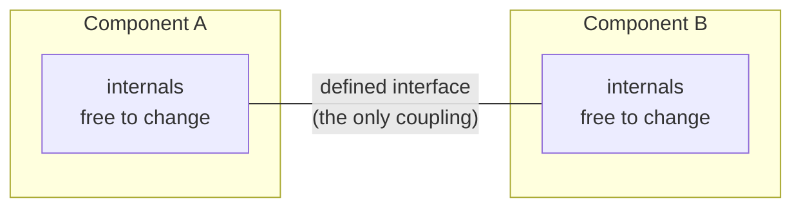

# Standards and Interfaces

Standards and interfaces are what let parts built by different people, at different times, in
different places, fit together and work. A standard is an agreed specification that many
parties conform to; an interface is the defined boundary at which two components meet and
exchange something — force, current, data, meaning. Together they are the quiet enabling
technology behind almost all large engineering: no single organization builds everything, so
the *rules of the seam* determine whether independently-built pieces compose into a working
whole or into an expensive pile of incompatible parts.

## Standardization and interchangeable parts

The foundational move is **standardization** — deciding that a class of parts will be made to
a common specification rather than fitted individually. The historical breakthrough was
**interchangeable parts**: manufacturing components to tight enough
[tolerances](margins-tolerances-and-uncertainty.md) that any one unit could replace any other
without hand-fitting. This decoupled *making* a part from *using* it, enabled mass production
and field repair, and turned craftsmanship into a specification anyone could meet. Every
standard since — screw threads, voltages, paper sizes, character encodings — is the same idea
applied to a new domain.

## Interfaces: the contract at the boundary

An **interface** specifies what crosses a boundary and how, while deliberately hiding what
happens on either side. A well-designed interface is a *contract*: as long as both sides honor
it, each can change internally without disturbing the other. This is the mechanism of
**decoupling**. The physical world enforces interfaces through
[tolerances at the interface](margins-tolerances-and-uncertainty.md) — a bolt and a nut mate
only if both fall within the specified dimensional envelope; the logical world enforces them
through protocols and type contracts.

## Modularity and decoupling

**Modularity** is the design strategy of splitting a system into components that interact only
through well-defined interfaces, so that internal complexity is contained behind each
boundary. The payoff is that modules can be designed, built, tested, replaced, and reasoned
about independently — the essence of managing complexity. Modularity is inseparable from good
interfaces: a module is only as decoupled as its interface is clean, and a leaky interface
(one that exposes internal assumptions) silently recouples parts that were supposed to be
independent. This is a core concern of [systems engineering](systems-engineering.md), which
spends much of its effort defining and controlling the interfaces *between* subsystems, and it
is the organizing principle of [software architecture](../software-architecture/index.md).

## The economic power of standards

Standards create value out of proportion to their technical content because they generate
**network effects** and **compatibility markets**:

| Standard | What it decoupled | Economic effect |
|---|---|---|
| Interchangeable parts | Making from using | Mass production, field repair |
| Shipping container | Cargo from ship/train/truck | Collapsed freight cost, globalized trade |
| Screw threads / fasteners | Fastener maker from user | A universal supply of parts |
| Internet protocols (IP, HTTP) | Applications from networks | Permissionless global interoperability |

The shipping container is the canonical case: a single agreed box size let cargo move between
ships, trains, and trucks without repacking, and that one interface standard reshaped global
trade more than any vessel design. Likewise, layered network protocols let anyone build an
application without coordinating with network operators — **interoperability** as a public good.
The lesson is that the *interface* often captures more value than the *implementation*,
because it is what lets an entire ecosystem grow around it.

## The tension: standards vs. optimization

Standards trade some per-case optimality for system-wide composability. A bespoke,
hand-fitted joint may be lighter or stronger than a standardized one; a proprietary protocol
may outperform an open one. Engineering judgment weighs that local loss against the enormous
systemic gain of parts that just fit — and usually the gain wins at scale, which is why
standardization tends to dominate as systems grow.

## Why it matters

Standards and interfaces are how engineering scales beyond what any one team can hold in its
head. They let [systems engineering](systems-engineering.md) integrate subsystems built by
different vendors, they make [reliability](reliability-engineering.md) achievable through
replaceable standardized components, and they turn tolerances into a coordination mechanism.
For AI, the same logic is now playing out in the standardization of model interfaces, tool
and function-calling protocols, and agent-to-agent conventions: the systems that interoperate
through shared interfaces will compose into larger capabilities, and the ones that do not will
stay islands — exactly as with every prior wave of engineering.

## References

- [Systems Engineering](systems-engineering.md)
- [Margins, Tolerances, and Uncertainty](margins-tolerances-and-uncertainty.md)
- [Reliability Engineering](reliability-engineering.md)
- [Software Architecture](../software-architecture/index.md)
