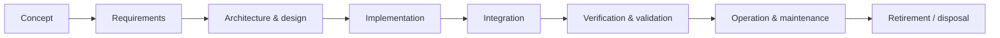
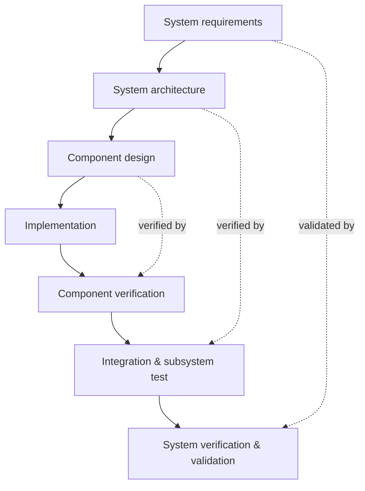

# Systems Engineering

Systems engineering is **engineering the whole rather than the parts** — the discipline of
making a large, multi-part artifact work as one coherent system across its entire life,
not just optimizing each subsystem in isolation. A jet aircraft, a spacecraft, a power
grid, a hospital's IT infrastructure: each is built by specialists (structures,
avionics, propulsion, software, human factors), and each fails if no one owns the
interactions *between* those specialties. Systems engineering is the role and the method
that owns the interactions. The canonical reference is the
[incose-systems-engineering-handbook.md](incose-systems-engineering-handbook.md).

## Why the whole is not the sum of the parts

A system exhibits **emergent behavior** — properties that exist only at the level of the
whole and cannot be predicted from any single component. Safety, reliability, performance,
and cost are almost always emergent: a plane can be assembled from individually excellent
parts and still be unsafe because of how they interact. This is the systems-thinking
insight that
[../systems-thinking/complex-systems.md](../systems-thinking/complex-systems.md) develops
in general form. Systems engineering exists precisely because local optimization of parts
does not add up to a good whole — and because the **interfaces** between parts are where
most integration problems, and most failures, live (see
[standards-and-interfaces](standards-and-interfaces.md) and
[failure-analysis-and-root-cause](failure-analysis-and-root-cause.md)).

## The lifecycle

Systems engineering organizes work around the artifact's full lifecycle, not just its
construction:

Each phase feeds the next and constrains it. Decisions made in *concept* (what problem are
we even solving?) dominate the cost and success of everything downstream — errors caught
in requirements are orders of magnitude cheaper to fix than errors caught in operation.

## The V-model

The **V-model** is the emblematic systems-engineering diagram. It pairs each phase of
decomposition (going down the left, from broad system requirements to detailed component
design) with a corresponding phase of integration and testing (coming up the right, from
component tests to full system validation). The left side asks "what do we build and how?";
the right side asks "did we build it right, and did we build the right thing?"

The dashed links are the point: each level of decomposition on the left has a matching
level of test on the right. Requirements written on the way down define the acceptance
criteria used on the way up — which is why
[requirements-and-specifications](requirements-and-specifications.md) is the backbone of
the whole model.

## Managing complexity across subsystems

The systems engineer's daily work is complexity management:

- **Decomposition and allocation** — break the system into subsystems, allocate
  requirements and resource budgets (mass, power, latency, cost) down to each.
- **Interface control** — define and freeze the contracts between subsystems so teams can
  work in parallel without integration surprises ([standards-and-interfaces](standards-and-interfaces.md)).
- **Integration** — bring subsystems together incrementally, testing interactions as they
  join, because that is where emergent problems surface.
- **Trade studies** — evaluate whole-system options against objectives, since a change
  that helps one subsystem often hurts another
  ([design-under-constraints](design-under-constraints.md)).
- **Verification and validation** — confirm the system meets its spec (verification) and
  meets the real need (validation).

Software teams practice the same discipline under different names — architecture, API
contracts, integration testing, staged rollout — because a large software system is a
system in exactly this sense.

## Why it matters

- **Big things fail at the seams.** Most catastrophic system failures trace not to a bad
  part but to a mismatched interface or an unanticipated interaction — a lesson central to
  [safety-engineering](safety-engineering.md).
- **Cost is committed early.** The concept and requirements phases lock in most of the
  lifecycle cost; disciplined systems engineering front-loads the thinking where it is
  cheapest to change.
- **Parallel work needs contracts.** Frozen interfaces are what let many specialists build
  simultaneously and still integrate — the same reason software teams depend on stable
  APIs.

## References

- [incose-systems-engineering-handbook.md](incose-systems-engineering-handbook.md) —
  INCOSE, *Systems Engineering Handbook*, the field's standard reference.
- [perrow-normal-accidents.md](perrow-normal-accidents.md) — Charles Perrow, on how tight
  coupling and interactive complexity make system-level failure inevitable.
