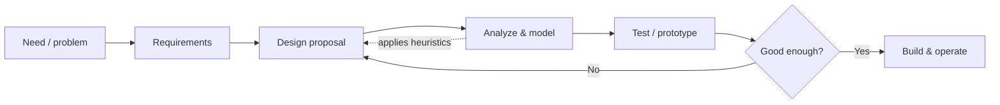

# The Engineering Method

**Engineering is the use of heuristics to cause the best change in a poorly understood
situation within the available resources.** That definition, from Billy Vaughn Koen,
strips engineering down to its actual practice: not the confident application of settled
truth, but disciplined action under uncertainty, constrained by time, money, and
knowledge. Engineering *applies* science, but it is not applied science — it is a distinct
way of knowing and acting.

## The core: heuristics, not proofs

A **heuristic** is anything that plausibly aids in solving a problem but is not guaranteed
to work and may even contradict other heuristics. Koen's central claim is that the whole
method of engineering is the use of heuristics — the engineer never has complete
information, so instead of deriving the answer, they reach for rules of thumb refined by
the profession over time. Examples cut across every discipline:

- **Factors of safety.** A civil engineer sizes a beam to carry two or three times its
  expected load. The multiplier is not derived from first principles; it is a heuristic
  encoding accumulated ignorance about materials, loads, and human error. See
  [margins-tolerances-and-uncertainty](margins-tolerances-and-uncertainty.md).
- **State of the art (SOTA).** The current best set of heuristics a profession endorses.
  It changes over time — yesterday's acceptable practice becomes today's malpractice.
- **Rules of thumb.** "Make it strong enough and then double it." "When in doubt, make it
  stout." Chemical, electrical, and aerospace engineering each carry their own catalog.
- **Allocation of resources to reduce the greatest uncertainty first** — invest effort
  where you know the least.

Because heuristics are provisional and sometimes conflict, engineering judgment is the
skill of choosing *which* heuristic fits *this* situation. This is why experience matters
so much: the engineer is not recalling formulas but a repertoire of when-to-use-what.

## Engineering versus science: create versus discover

Science and engineering are often conflated, but their aims diverge:

| | Science | Engineering |
|---|---|---|
| Goal | Discover what *is* true | Make something that *works* |
| Object | The natural world, as given | An artifact that did not exist |
| Success | An accurate, falsifiable model | A device meeting its requirements on budget |
| Failure mode | Being wrong about reality | The bridge falls down |
| Attitude to the unknown | Reduce it through inquiry | Act despite it, with margins |

Science *discovers*; engineering *creates*. Henry Petroski frames engineering as
fundamentally about **design** — and design as fundamentally about anticipating failure.
An engineer succeeds by imagining all the ways a thing could break and forestalling them,
so failure analysis is not a postmortem afterthought but the engine of good design (see
[failure-analysis-and-root-cause](failure-analysis-and-root-cause.md) and
[design-under-constraints](design-under-constraints.md)).

## Design as the central activity

If engineering has a nucleus, it is **design**: the iterative, creative act of specifying
an artifact that satisfies requirements under constraints. Design is where heuristics are
applied, trade-offs are made, and uncertainty is managed. It is rarely linear. The
engineer proposes, analyzes, tests, discovers the proposal is inadequate, and revises —
looping until the design is good enough.

This loop is the same shape whether the artifact is a bridge, a jet engine, a chemical
plant, or a software system. Software engineering is one specialization of the general
method — same iteration, same design-centrality, same reliance on heuristics (idioms,
patterns, "rules of thumb") in place of proof (see
[../software-engineering/learning-the-craft.md](../ai-org/learning-the-craft.md)).
The newer discipline of [../harness-engineering/harness-engineering.md](../harness-engineering/harness-engineering.md)
is engineering applied to the tooling around AI code generation — heuristics for making
poorly understood generative systems produce reliable, changeable code.

## Why it matters

Understanding engineering as a heuristic method under uncertainty reframes several things:

- **Certainty is not available, and the method does not require it.** Waiting for complete
  information means never building. The method is precisely how you act well without it.
- **Judgment is the profession's core competency**, not calculation. Formulas are tools;
  knowing which to trust here is the skill.
- **The state of the art is a moving target.** Continuous learning is not optional; the
  heuristics evolve, and practicing yesterday's SOTA can become negligence.
- **Failure is informative, not shameful.** Every collapse updates the profession's
  heuristics. This is why engineering advances even when — especially when — things break.

## References

- [koen-discussion-of-the-method.md](koen-discussion-of-the-method.md) — Billy Vaughn
  Koen, *Discussion of the Method: Conducting the Engineer's Approach to Problem Solving*.
- [petroski-to-engineer-is-human.md](petroski-to-engineer-is-human.md) — Henry Petroski,
  *To Engineer Is Human: The Role of Failure in Successful Design*.
