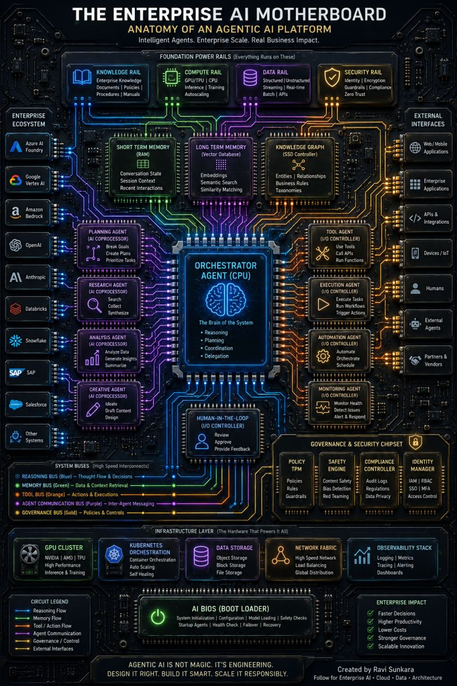

# The Enterprise AI Motherboard

An extended-metaphor diagram (Ravi Sunkara) rendering an agentic AI platform as a
computer motherboard — "intelligent agents, enterprise scale, real business impact."

- **Orchestrator Agent (CPU)** — "the brain of the system": reasoning, planning,
  coordination, delegation.
- **Foundation power rails** — knowledge rail (docs, policies, procedures/manuals),
  compute rail (CPU/GPU, inference, training), data rail (structured/unstructured, vector
  store), security rail (identity, encryption, guardrails, zero trust).
- **Memory** — short-term memory (RAM: conversation state, session context, recent
  interactions), long-term memory (SSD: semantic & similarity matching), knowledge graph.
- **Enterprise ecosystem** (left) — model/data providers (Azure AI Foundry, Google Vertex
  AI, Amazon Bedrock, OpenAI, Anthropic, Databricks, Snowflake, SAP, Salesforce, etc.)
  wired in as expansion cards.
- **Tool / execution / automation / monitoring agents** (right) with external interfaces
  (web/mobile apps, enterprise apps, APIs & integrations, devices/IoT, humans, external
  agents, partners & vendors).
- **System buses** — reasoning bus, action bus, tool/API bus, agent-communication bus,
  governance bus — carrying thought flow, actions & executions, inter-agent messaging,
  policies & controls.
- **Human-in-the-loop** — review, approve, provide feedback.
- **Governance & security chipset** — policy TPM, safety engine, compliance controller,
  identity manager.
- **Infrastructure layer** — GPU cluster, Kubernetes, data storage, network fabric,
  observability stack.

Tagline: "Agentic AI is not magic. It's engineering. Design it right. Build it smart.
Scale it responsibly."

## Cross-links

A maximalist sibling of [AI Harness Architecture](ai-harness-architecture.md) and the
[Agentic Engineering Stack](agentic-engineering-stack.md); same author's era view is
[The Mother of All Architecture Diagrams](mother-of-all-architecture-diagrams.md). The
orchestrator-as-CPU echoes the model=CPU / harness=OS analogy in
[Agent Harness Engineering](agent-harness-engineering.md).

## References

- 
