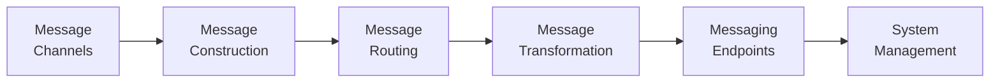

Gregor Hohpe and Bobby Woolf's *Enterprise Integration Patterns* (2003) is a
pattern language of **65 patterns** for asynchronous messaging between
applications. It gives integrators a technology-independent vocabulary and a
visual notation for the recurring problems of connecting systems that were never
designed to talk to each other — asynchrony, partial failure, incompatible data
models, and API drift. The patterns outlived their original technologies (JMS,
SOAP, MSMQ, WCF) and reappear intact in microservices, serverless, service
meshes, and event buses; they spurred a generation of ESB implementations (Apache
Camel, Mule, ServiceMix).

## Why messaging

The book frames four **integration styles** — File Transfer, Shared Database,
Remote Procedure Invocation, and Messaging — and argues messaging best handles
the realities of distributed integration: it is asynchronous, decouples sender
from receiver in time and space, and tolerates partial failure. Hohpe's later
"ramblings" temper the enthusiasm: queues invert control flow and demand explicit
*flow control*, and event-driven does not automatically mean loosely coupled.

## The pattern categories

- **Channels** — how messages travel: Point-to-Point, Publish-Subscribe,
  Dead Letter Channel, Guaranteed Delivery, Channel Adapter, Message Bus.
- **Construction** — how a message is shaped: Command / Document / Event Message,
  Request-Reply, Return Address, **Correlation Identifier**, Message Expiration.
- **Routing** — directing messages: Content-Based Router, Message Filter,
  Recipient List, **Splitter**, **Aggregator**, Resequencer, Scatter-Gather,
  Routing Slip, **Process Manager**, Message Broker.
- **Transformation** — reconciling formats: Envelope Wrapper, **Content
  Enricher**, Content Filter, Claim Check, Normalizer, **Canonical Data Model**.
- **Endpoints** — how apps connect to messaging: Messaging Gateway, Messaging
  Mapper, Transactional Client, Polling vs. Event-Driven Consumer, **Competing
  Consumers**, Message Dispatcher, Selective Consumer, Durable Subscriber,
  **Idempotent Receiver**.
- **System management** — operating the flow: Control Bus, Detour, Wire Tap,
  Message History, Message Store, Smart Proxy, Test Message, Channel Purger.

## A few load-bearing patterns

- **Idempotent Receiver** — since guaranteed delivery is usually at-least-once,
  receivers must tolerate duplicate messages without duplicating effects. This is
  the same idempotence discipline central to
  [Designing Data-Intensive Applications](designing-data-intensive-applications.md).
- **Correlation Identifier** — tags a reply so it can be matched to its request
  across an asynchronous round trip.
- **Dead Letter Channel** — where undeliverable messages go instead of being lost.
- **Competing Consumers** — multiple consumers on one channel to scale throughput.

These patterns are the vocabulary behind the [outbox pattern](outbox-pattern.md),
[microservice architecture](microservice-architecture.md), and
[production-ready microservices](production-ready-microservices.md); they sit
alongside the application-tier patterns in
[Patterns of Enterprise Application Architecture](patterns-of-enterprise-application-architecture.md).

## References

- [Enterprise Integration Patterns — Gregor Hohpe & Bobby Woolf](https://www.enterpriseintegrationpatterns.com/)
