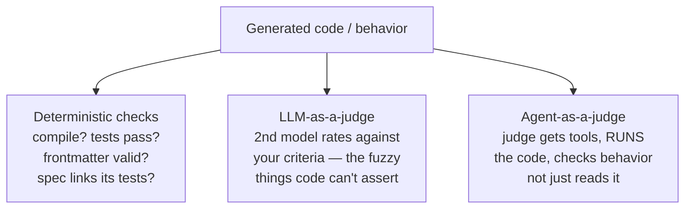

# Evals & LLM-as-a-Judge

**If context is the new code, evals are its tests.** The context, rules, skills,
and prompts you hand a coding agent now do much of the work code used to — and
like code, they aren't trustworthy just because they looked right once. An
**eval** is a repeatable check that your setup still produces the behavior you
want. Ben Stein: *"a testing framework for probabilistic AI."*

The concrete question: *change a few lines in your `AGENTS.md` or rules, or let
the model get upgraded under you — does the agent still do the right thing?* You
won't know by eye. An eval turns that into something re-runnable.

## Three ways to check — cheap to thorough

- **Deterministic checks** — the mechanical parts: did the code compile and pass
  its tests, is a skill's frontmatter valid, does a spec link its tests.
- **LLM-as-a-judge** — a second model reads the generated code and rates it
  against your criteria, for the fuzzy things code can't assert.
- **Agent-as-a-judge** — give that judge *tools* so it can **run** the code and
  check behavior, not just read it.

## Why it matters: two everyday jobs

- **Regression.** Context and skills are an input you keep editing, and the model
  underneath changes without asking. A saved eval suite tells you whether last
  week's `AGENTS.md` tweak, this morning's model upgrade, or a switch to a
  different agent still holds up. Maintaining context for several agents at
  once? It's the only sane way to keep them all honest. (This is the check step
  in the [self-improving harness loop](self-improving-harness-loop.md).)
- **Pruning.** A before/after eval shows when the model already knows something
  unaided — so you can delete that guidance and keep the
  [context window lean](context-engineering.md). *What the eval proves
  redundant, you can cut.*

## Evals vs public benchmarks

A [**benchmark**](public-benchmarks.md) scores a model on *someone else's*
tasks; an **eval** runs on *your* codebase — the only place your context and
skills actually have to perform. Tessl's own framework, over real library tasks, found spec + context
documentation lifted idiomatic API use **~35%** — a number that only exists
because they built the eval to measure it.

## The hard part

Writing evals that catch what matters. The method (Hamel Husain & Shreya
Shankar): **collect real traces → error analysis to name the failure modes →
write a check for each**. Related to
[TDD's five practices](tdd-five-practices.md) — spec-by-example, applied to
probabilistic systems.

## References
- [Evals & LLM-as-a-Judge — Tessl Patterns](https://tessl.io/patterns/agentic-development-workflow/evals/)
