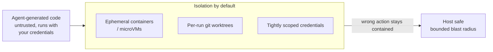

# Execution Sandboxing

Running agent-generated code in an **isolated environment that cannot harm the
host, leak data, or escape its bounds.** The reframe is the whole point —
Harshil Agrawal (Cloudflare): *"Strip away all the hype, strip away the AI
framing. What we are actually doing is running untrusted code from the
internet."* An LLM is a black box emitting text that looks like code, which you
then run **with your credentials** — something you'd never do with a snippet
from a random website.

## The threats aren't only adversarial

With no bad actor at all:

- **Hallucinated code** can blow the stack, spin an infinite loop, or import a
  package that crashes the process.
- An **over-helpful agent** can take destructive actions.
- Prompts can be **adversarially manipulated** (prompt injection).

## Isolation by default

The platform answer: **ephemeral containers or microVMs, per-run git worktrees,
tightly scoped credentials** — so a wrong action stays contained. Managed
runtimes now offer this as infrastructure (AWS Bedrock AgentCore, Cloudflare's
sandbox, hardened JS runtimes like Bun).

## Why it matters: the precondition for autonomy

Unattended [loops](loop-engineering.md) make this **non-negotiable** — *a loop
running unattended is also a loop failing unattended*, and isolation is what
bounds the **blast radius** when it does. **Sandboxing is the precondition for
autonomy:** you can only let an agent act without a human watching if the worst
it can do is contained.

It's the execution substrate that the construction stage of the
[AI SDLC](ai-sdlc.md) runs inside — and the platform realization of the *"give
parallel agents their own sandbox"* move in
[harness engineering](harness-engineering.md).

## Related

- [Loop Engineering](loop-engineering.md) — unattended loops need bounded blast
  radius.
- [Harness Engineering](harness-engineering.md) — per-agent sandboxes as an
  in-practice move.
- [Guardrails Proxy](guardrails-proxy.md) — the sibling runtime safety layer
  (content/policy vs execution isolation).
- [AI Code Security](ai-code-security.md) — the security trio: this contains the
  running agent, that scans the artifact it produces.

## References
- [Execution Sandboxing — Tessl Patterns](https://tessl.io/patterns/agentic-platform/execution-sandboxing/)
