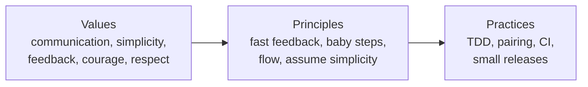

# Extreme Programming Explained: Embrace Change

Kent Beck's foundational statement of **Extreme Programming (XP)**. The second edition
(2004, with Cynthia Andres) reorganizes the method around a three-layer model — **values,
principles, and practices** — and reframes XP less as a rigid recipe and more as a set of
values you live out through practices, with principles as the bridge between them. The
subtitle, *Embrace Change*, is the thesis: the cost of change need not rise steeply over
a project's life, so build a way of working that welcomes change instead of resisting it.

## The three layers

- **Values** — what you care about. XP names five: **Communication**, **Simplicity**,
  **Feedback**, **Courage**, and **Respect**. Values are too abstract to act on directly.
- **Practices** — concrete things you do (write a test first, pair up, integrate
  continuously). Practices are clear and testable but can feel arbitrary without a reason.
- **Principles** — the domain-bridging ideas (e.g. *rapid feedback*, *assume simplicity*,
  *incremental change*, *flow*, *baby steps*) that explain *why* a practice serves a value.

The point of the layering: don't cargo-cult the practices. Understand which value each one
serves, so you can adapt them to your context.

## The practices

The second edition splits practices into **primary** (start here) and **corollary**
(adopt once the primaries are solid). The recurring ones:

- **Whole team** sitting together; **informative workspace**.
- **Pair programming** — two people, one workstation, continuous review.
- **Test-first / TDD** — write the failing test before the code (see
  [Test-Driven Development by Example](test-driven-development-by-example.md) and
  [The Five Practices That Set TDD Apart](tdd-five-practices.md)).
- **Continuous integration** — integrate and build many times a day, keeping the system
  always working.
- **Small releases** and a sustainable **weekly/quarterly cycle** with **slack** built in.
- **Ten-minute build**, **incremental design**, **collective code ownership**,
  **coding standard**, and design that evolves rather than being fixed up front.

## Embracing change: the cost curve

The classic argument that change gets exponentially more expensive the later it happens
is treated as a *consequence of how we work*, not a law of nature. Fast feedback loops
(tests, CI, small releases, pairing) flatten that curve: defects surface minutes after
introduction, and the system stays continuously shippable — the same insight
[Continuous Delivery](continuous-delivery.md) later industrialized. Courage is required
because embracing change means being willing to throw work away and refactor aggressively;
[Refactoring](refactoring-improving-the-design-of-existing-code.md) is the mechanical
skill that makes incremental design safe.

## Relation to other notes

- The **test-first** practice is elaborated in [TDD by Example](test-driven-development-by-example.md)
  and [tdd-five-practices](tdd-five-practices.md).
- XP's values and disciplined-flow ethos carry into DevOps culture —
  [Effective DevOps](effective-devops.md).
- **Simplicity** ("do the simplest thing that could possibly work") is the same instinct
  as [Tidy First?](tidy-first.md) and [The Pragmatic Programmer](the-pragmatic-programmer.md).

## References

- [Extreme Programming Explained: Embrace Change (2nd ed.) — O'Reilly](https://www.oreilly.com/library/view/extreme-programming-explained/0201616416/)
