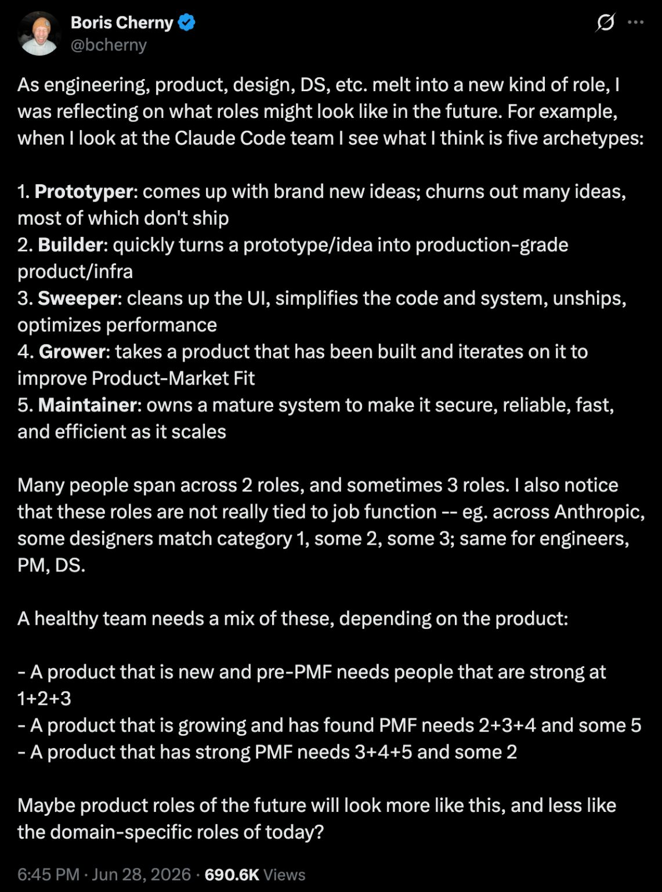

# Five Engineering Archetypes (Boris Cherny)

A tweet (Boris Cherny, @bcherny, Jun 28 2026) on how engineering/product/design/DS roles
melt together — reflecting on the Claude Code team, he names five archetypes:

1. **Prototyper** — comes up with brand-new ideas; churns out many, most of which don't ship.
2. **Builder** — quickly turns a prototype/idea into production-grade product/infra.
3. **Sweeper** — cleans up the UI, simplifies code and system, unships, optimizes performance.
4. **Grower** — takes a built product and iterates to improve product-market fit.
5. **Maintainer** — owns a mature system to keep it secure, reliable, fast, efficient as it scales.

People span 2–3 roles, and the roles aren't tied to job function (a designer or PM can
be any of them). A healthy team mixes them by product stage:

- New / pre-PMF → strong at **1+2+3**.
- Growing / found PMF → **2+3+4** and some 5.
- Strong PMF → **3+4+5** and some 2.

Suggestion: future product roles may look more like these archetypes than today's
domain-specific titles.

## References

- 
