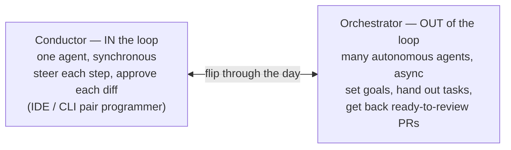

# From Coder to Orchestrator

As agents do the typing, the engineer's job shifts from **authoring** code to
**directing** it — scoping work, choosing approaches, reviewing output, steering
several agents at once. **The unit of work moves up a level:** from writing
functions to **specifying intent and judging results.** Kent Beck: *"The value
of 90% of my skills just dropped to $0. The leverage for the remaining 10% went
up 1000x."*

Coding was never *only* typing — you already broke features down, weighed
approaches, reviewed. Agents shift the **balance**: generating moves to them;
your time concentrates on **framing and judging.** The developer becomes "the
orchestra conductor."

## Two modes on a spectrum (Osmani)

The same person **flips between them** through the day; what changes is whether
you sit *in* the loop (hands on every step) or *out* of it (reviewing outcomes
after the fact). Which mode a task wants is its own skill. This is the
orchestration end of [loop engineering](loop-engineering.md), leaning on the
[coding interfaces](coding-interfaces.md) that make running a fleet practical.

**Effort front-loads into the spec and back-loads into review, with little in
the middle.** (OpenHands: parallel agents resolve ~90% of CVEs across a
codebase automatically, humans take the 10% that didn't pass — vendor,
directional.)

## The roles converge

The orchestrator's job resembles several senior roles at once:

- **Manager** — run a team of agents and a pipeline, not one assistant.
- **Architect** — give direction and constraints, not implementations.
- **Product owner** — prototype to discover what's worth building.

The *four patterns of AI-native development* map the same shift:
**producer→manager, implementation→intent, delivery→discovery, data→knowledge** —
pushing developers toward "the work senior engineers have always done: managing,
specifying, discovering, and curating knowledge," not faster typing. (Compare
[agentic coding vs AI engineering](agentic-coding-vs-ai-engineering.md) and the
[five engineering archetypes](five-engineering-archetypes.md).)

## Not everyone wants to let go

The shift cuts against **temperament**: some love the craft of detailed coding
and want the code under their own hands; others happily give direction and judge
results. Even enthusiasts feel it — *"a part of you dies when you realize you
can't implement stuff anymore"* (Beck). The market reprices too: *"AI won't take
your job, but it will take your ability to charge a premium for it"* — **the
skill premium, not the role, erodes** (Choudhary).

For a **team lead**, the transition is a **management task, not a mandate** —
people sit at different comfort levels and need active support. Where someone
still wants the details, **channel that craft where precision still pays:** have
them write the rules and guardrails agents follow (`AGENTS.md`, lint/policy
gates) and improve the [harness](harness-engineering.md) itself — so their
instinct for getting it *right* shapes the system instead of fighting the
workflow.

## Related

- [Loop Engineering](loop-engineering.md) — the orchestration end this describes
  as a human role.
- [Coding Interfaces](coding-interfaces.md) — the surfaces that make fleet
  orchestration practical.
- [Agentic Coding vs AI Engineering](agentic-coding-vs-ai-engineering.md) — the
  role this reshapes.

## References
- [From Coder to Orchestrator — Tessl Patterns](https://tessl.io/patterns/changing-roles/from-coder-to-orchestrator/)
