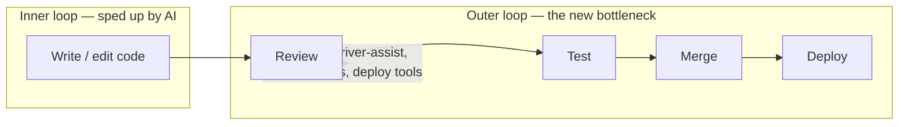

# Don't Get One-Shotted: An AI-Native Outer Loop

Tomas Reimers (co-founder, Graphite) frames software delivery as **two loops**:

- **Inner loop** — writing the feature: get the code working the way you want.
- **Outer loop** — everything after: test, review, merge, deploy.

AI has transformed the inner loop (nearly every surveyed developer uses AI tools;
~46% of code on GitHub is Copilot-written per the GitHub survey he cites). The
inner loop got faster; the outer loop did not. So **the outer loop is now the
bottleneck** — the same problem that used to afflict only large companies now
hits everyone, because AI produces code at a volume no review queue was sized for.
This is the same "volume the review queue wasn't built for" pressure described in
[AI code security](ai-code-security.md) and the reviewer shortage in
[automated review & verification](automated-review-verification.md).

## The thesis: your whole toolchain must be AI-native, not just your IDE

Adding AI *teammates* (background agents, bot reviewers) is part of the story but
not enough. If developers are orders of magnitude more productive, the outer loop
needs matching tooling:

Requirements for the new outer loop: tools to prioritize/track/notify on PRs;
driver-assist features to focus reviewers; optimized CI pipelines and merge queues
for the volume; better deployment tooling.

## Diamond (their AI code reviewer)

Aims for **high signal, low noise**, with deep understanding of the codebase and
change history. It summarizes, prioritizes, and reviews each change, and integrates
with CI/testing to summarize errors and correct failures.

Reported numbers (as of March, self-reported): bot comments dismissed at **<4%**;
Diamond comments integrated into the PR at **~52%**, versus **~45–50%** for human
comments. Read as directional vendor data, but the point stands — the goal is
review feedback good enough to act on, so the human focuses on whether the feature
actually works, not on mechanical review toil.

## Related

- [AI code security](ai-code-security.md) — scanning the artifact before merge.
- [Automated review & verification](automated-review-verification.md) — why the
  human still owns the gate.
- [The hidden vulnerabilities behind AI code](hidden-vulnerabilities-ai-code.md) —
  what slips through when reviewers are overwhelmed.

## References
- [Don't get one-shotted: Use AI to test, review, merge, and deploy code — Tomas Reimers, Graphite (AI Engineer)](https://www.youtube.com/watch?v=H6MrR5NbTZA)
