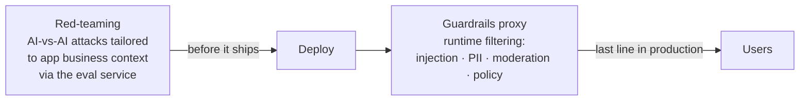

# Guardrails Proxy

A **policy-and-safety layer that inspects model traffic in real time** and
enforces rules the org can't leave to the model's goodwill: **prompt-injection
detection, PII redaction, content moderation, and usage/compliance policy.** It
sits in the request path — often beside the [model router](model-router.md), but
as a **distinct concern**: the router decides *where* a call goes; the guardrails
proxy decides whether it's **allowed and safe**.

## Necessary but not sufficient

The honest framing: runtime filtering catches a *class* of harms, but the real
risks are **application-specific** — improper RAG access controls, business-logic
mistakes — and a foundation model's safety training won't stop them. Ian Webster
(Promptfoo), on shipping AI to 200M Discord users: *"Traditional guardrails
aren't enough… you can't fix stupid."* The dangerous failures live at the
**application layer**, not in the base model.

## Defense in depth, not an on/off box

The platform pairs two lines of defense:

- **Pre-deployment red-teaming** — AI-versus-AI attacks tailored to each app's
  business context, run through the [eval service](evals-llm-as-a-judge.md). The
  line *before* it ships.
- **Runtime guardrails proxy** — the *last* line in production.

Treating guardrails as a single on/off box is the mistake; treating them as
**defense in depth** is the pattern. Common implementation: usagepanda/proxy (a
security & compliance proxy for LLM APIs).

## Related

- [Model Router](model-router.md) — the sibling request-path layer (where vs
  allowed-and-safe vs worth).
- [AI Code Security](ai-code-security.md) — the security trio: this guards
  runtime traffic, that guards the produced artifact.
- [Evals & LLM-as-a-Judge](evals-llm-as-a-judge.md) — where red-teaming runs.
- [Six Layers for AI Governance](six-layers-ai-governance.md) /
  [AI Governance by Design](ai-governance-by-design.md) — the broader governance
  frame this security layer sits inside.

## References
- [Guardrails Proxy — Tessl Patterns](https://tessl.io/patterns/agentic-platform/guardrails-proxy/)
