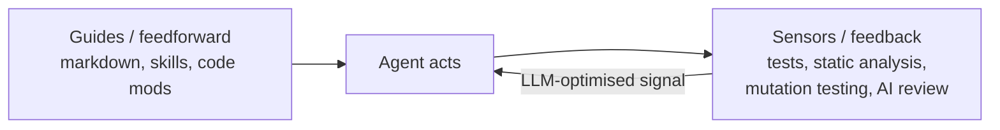

# Harness Engineering Beyond Skills: Using Sensors to Keep Your Coding Agent in Check

A Thoughtworks conversation between **Birgitta Böckeler** and **Chris Ford** (2026)
that argues the dominant way people try to control coding agents — piling up more and
more markdown instruction files (AGENTS.md, skills, rules) — is only half of the job.
Guidance tells the agent what to do *before* it acts; it does not tell the agent whether
what it just did actually worked. The missing half is **feedback**: real signals the
agent can react to and self-correct against. The talk is the applied, worked-example
companion to Böckeler's written piece, [AI Coding Sensors](ai-coding-sensors.md) and
[Harness Engineering (Sensors & Simulators)](harness-engineering.md).

## The core distinction

A harness combines two kinds of control:

- **Guides (feedforward)** — anticipate behaviour and steer *before* the agent acts.
  Markdown instruction files, skills, code mods. This is where most teams stop.
- **Sensors (feedback)** — observe *after* the agent acts and let it self-correct.
  Tests, linters, type checkers, static analysis, mutation testing, AI review.

Guidance-only harnesses encode rules but never learn whether they held. Feedback-only
harnesses let the agent thrash on the same mistake. You need both — and the talk's thesis
is that teams are badly underinvested on the sensor side.

The most powerful sensors emit signals **optimised for LLM consumption**: a custom linter
message that not only flags the violation but tells the agent how to fix it — a
deliberate, benevolent kind of prompt injection.

## Computational vs inferential sensors

Sensors split by execution type:

- **Computational** — deterministic, fast, CPU-run. Tests, linters, type checkers,
  structural/architecture tests, static code analysis. Milliseconds to seconds, reliable
  enough to run on *every* change alongside the agent.
- **Inferential** — semantic, GPU-run. AI code review, LLM-as-judge. Slower, costlier,
  non-deterministic, but able to give rich guidance and semantic judgement.

The talk deliberately leans into the underused computational side — static analysis and
mutation testing — because it is cheap enough to run continuously and its signals are
trustworthy.

## The worked experiment

The heart of the session is a demonstration on a sample application, structured around a
**sensors sidecar** — a companion process that watches the agent's changes and feeds
signals back. The presenters run the same task **with versus without** the sensor sidecar
to show the difference in output quality, then go deep on three sensor families:

- **Static code analysis** — catches structural and correctness issues the agent would
  otherwise leave.
- **Test quality** — using mutation testing to check that the tests the agent wrote
  actually *detect* faults, not just pass. Coverage that never fails is theatre; mutation
  testing is the sensor that exposes it.
- **Modularity** — structural tests that check module boundaries hold, so the agent's
  changes do not quietly erode architecture.

## Harness goals

Böckeler frames the point of the harness in terms of goals, not tooling: sensors exist to
raise the probability of good results and to place feedback *across the whole path to
production*, not just at the moment of code generation. The takeaway is to stop treating
"add another markdown file" as the answer and start engineering the feedback loop.

This connects directly to [Loop Engineering](loop-engineering.md) (the harness is what a
loop iterates *inside* of), [Context Engineering](context-engineering.md), and
[Building Effective Agents (Anthropic)](building-effective-agents.md)'s gather–act–verify
inner cycle — the sensor *is* the verify step made real.

---

*Note on sourcing: the video's auto-generated transcript was not retrievable
programmatically. This synthesis is built from the talk's full title, description, and
chapter markers, plus Böckeler's own companion article (linked in the video description),
which the notes above already capture.*

## References

- [Harness engineering beyond skills: Using sensors to keep your coding agent in check — Thoughtworks / Birgitta Böckeler & Chris Ford (YouTube)](https://www.youtube.com/watch?v=uLWOLmeHOSE)
- Companion article: <https://martinfowler.com/articles/harness-engineering.html>
