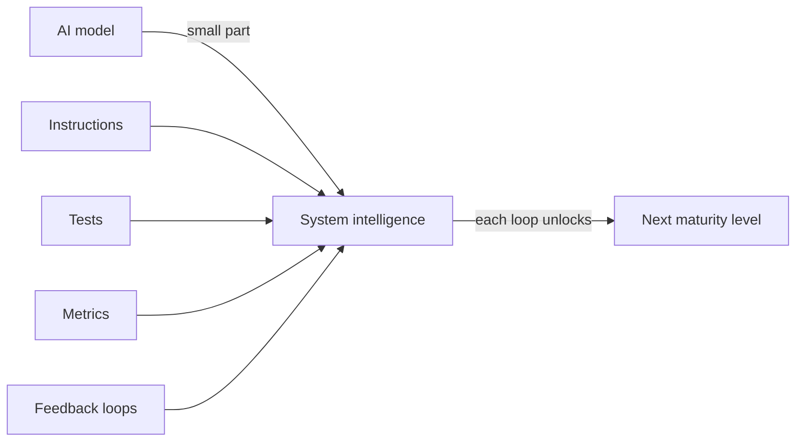

# The AI Codebase Maturity Model (ACMM)

Andy Anderson's paper argues that most teams adopting AI coding tools **plateau
at "prompt-and-review"** because they lack a framework for systematic
progression. The AI Codebase Maturity Model (ACMM) is a **6-level framework**
describing how a codebase evolves from basic AI-assisted coding to fully
autonomous systems. It is explicitly inspired by CMMI, but with a distinctive
organizing principle: each level is defined by its **feedback-loop topology** —
the specific mechanisms that must exist before the *next* level becomes possible.

## The central finding

> The intelligence of an AI-driven development system resides **not in the AI
> model itself**, but in the infrastructure of instructions, tests, metrics, and
> feedback loops that surround it.

This is the same thesis that runs through [harness
engineering](harness-engineering.md) and [loop
engineering](loop-engineering.md): the model is a commodity; the leverage is in
the harness built around it. You cannot skip levels, because each level's
feedback loops are the precondition for the next.

## Validation

The model is grounded in two production case studies, not just theory:

- **KubeStellar Console** — a 100-day experience report maintaining a CNCF
  Kubernetes dashboard built from scratch with Claude Code (Opus) and GitHub
  Copilot.
- **Hive** — an open-source multi-agent orchestration system that realizes
  **Level 6 (full autonomy)**. In production it runs with **74 CI/CD workflows,
  32 nightly test suites, 91% code coverage, and bug-to-fix times under 30
  minutes, operating 24 hours a day.**

The numbers make the point concretely: autonomy at the top of the ladder is
purchased with dense, always-on automated feedback — CI, tests, coverage, and
fast fix loops — not with a smarter prompt.

## Related

- [Harness engineering](harness-engineering.md) — the surrounding infrastructure is the leverage.
- [Loop engineering](loop-engineering.md) — feedback loops as the unit of progress.
- [Agentic maturity models](../ai-org/agentic-maturity-models.md) — the broader family of assisted→autonomous ladders.
- [The Code AI Maturity Model](../ai-org/code-ai-maturity-model.md) — Sourcegraph's parallel 6-level framing.
- [Autonomy ladder](autonomy-ladder.md)

## References
- [The AI Codebase Maturity Model: From Assisted Coding to Fully Autonomous Systems — arXiv:2604.09388](https://arxiv.org/abs/2604.09388)
