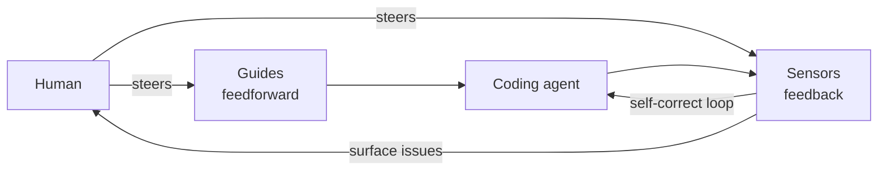

# Harness Engineering for Coding Agent Users (Böckeler)

Birgitta Böckeler (Thoughtworks) offers a mental model for letting coding agents work
with *less supervision* by systematically increasing our confidence in their output.
The premise is a **natural trust barrier**: LLMs are nondeterministic, they don't know
our context, and they don't truly understand code — they think in tokens. A harness is
what we build around the agent to earn back that trust.

## Guides and sensors

The harness has two kinds of components, distinguished by direction:

- **Guides (feedforward)** shape the agent *before/while* it works: principles,
  conventions (AGENTS.md), CfRs, rules, reference docs, how-tos, language servers, CLIs,
  scripts, codemods.
- **Sensors (feedback)** check the agent's work *after*: static analysis, tests, logs,
  browser checks, review agents.

Sensors point at both the human *and* the agent's own self-correcting loop, so many
issues get caught and fixed before they ever reach human eyes. This aligns with HAL's
existing [harness engineering](harness-engineering.md) and
[AI coding sensors](ai-coding-sensors.md) notes.

## Computational vs inferential

The key distinction Böckeler draws is *how* a guide or sensor executes:

- **Computational** — deterministic and fast, run by the CPU: tests, linters, type
  checkers, structural analysis, codemods. Milliseconds to seconds; results are
  reliable. Cheap enough to run on every change.
- **Inferential** — semantic analysis, AI code review, "LLM as judge," conventions in
  AGENTS.md/Skills. Run by GPU/NPU; slower, more expensive, non-deterministic. Good for
  fuzzy, exploratory rules and rich guidance.

The guidance: prefer computational where you can. Successful teams move away from
repeatedly *asking* an agent to write a test and hoping it complies, toward
**deterministic constraints that provide guarantees**. LLM judgment is great for fuzzy
rules, but once you want something objective and consistent, a formal, unambiguous,
deterministic tool gives real assurance. Inferential controls still earn their keep for
semantic judgment — especially with a strong, task-suited model. This maps onto the
computational/inferential split of [LLM-as-a-judge](../ai-platform/llm-as-a-judge-complete-guide.md)
sensors and [automated review & verification](automated-review-verification.md).

| Concern | Direction | Type | Example |
| --- | --- | --- | --- |
| Coding conventions | feedforward | inferential | AGENTS.md, Skills |
| Bootstrap a new project | feedforward | both | Skill + bootstrap script |
| Code mods | feedforward | computational | Tool w/ OpenRewrite recipes |
| Structural tests | feedback | computational | Pre-commit hook running ArchUnit |
| How to review | feedback | inferential | Skills |

## Harnesses within harnesses

The word "harness" is context-dependent. Böckeler pictures concentric circles: the
**model** at the core (the thing ultimately harnessed), the coding agent's **builder
harness** around it, and the user's **outer harness** as the outermost ring. A
well-built outer harness serves two goals: raise the probability the agent gets it right
the first time, and provide a self-correcting feedback loop that fixes issues before
humans see them — reducing review toil, raising system quality, and wasting fewer tokens.

## Related

- [Harness engineering (general)](harness-engineering.md)
- [AI coding sensors](ai-coding-sensors.md)
- [Automated review & verification](automated-review-verification.md)
- [Context engineering](context-engineering.md)
- [LLM-as-a-Judge: Complete Guide](../ai-platform/llm-as-a-judge-complete-guide.md)

## References

- [Harness Engineering for Coding Agent Users — Birgitta Böckeler, martinfowler.com](https://martinfowler.com/articles/harness-engineering.html)
