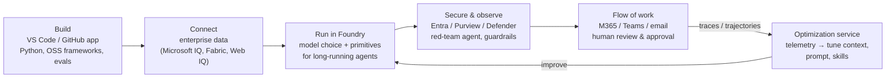

# Building More Than Just an Agent Harness

A Stack Overflow Podcast episode recorded at Microsoft Build. Host **Ryan Donovan**
interviews **Jay Parikh** (Microsoft VP, AI Core; earlier ran scaling engineering at
Facebook and Cloud Security). The through-line: in the enterprise, a coding agent is
**never just a harness** — it is an end-to-end *system* spanning build → deploy → run →
improve, and the hard, valuable part is wiring those pieces together, not any single
component.

## The core claim: system, not component

Enterprises don't want "a model" or "a harness" or "a tool call" — they want the whole
continuum, because their business processes are complex, span many data sources and
approvals, and often include undocumented exception paths. The differentiator is the
**end-to-end system** with enterprise-grade trust and security baked in, running in a
loop that keeps improving as the agents run longer. This is the enterprise counterpart to
the thesis that [the harness, not the model, is the moat](2025-agents-2026-agent-harnesses.md),
and the direct answer to [the naked agent](hightower-the-naked-agent.md): a framework
gives you a loop, but production needs the surrounding system.

Parikh's own analogies for that system: a **service mesh for microservices**, or an
**operating system for large-scale agent deployments** — echoing the
[harness as "AI operating system"](ai-harness-architecture.md).

## The end-to-end loop

- **Build** locally in VS Code or the new GitHub app — real code, your own agent loop /
  harness or an open-source one, your own evals. Prototype and check correctness locally,
  then push to deploy. Parikh frames this as **"a new CI/CD pipeline"**: prototype local,
  promote to the big platform.
- **Connect** the agent to enterprise data (Microsoft IQ, Fabric, "Web IQ" for grounding
  in live internet data) — grounding is what buys correctness and ROI.
- **Run** in **Foundry**, a purpose-built platform (~a year old) giving model choice plus
  the primitives to run agents on harder tasks for longer.
- **Secure & observe**: agents must not go off the rails. An agent "lights up" by
  registering in **Entra** like a human employee or an app, then is governed by the
  existing security stack (Entra, Purview, Defender) — you don't install new
  foundational security, you hook into what you already run. This is
  [human-in-the-loop](hightower-human-in-the-loop.md) and
  [observability](hightower-observability.md) at org scale.
- **Flow of work**: agents still need human review/approval, so they land in M365, Teams,
  or email where people already work.
- **Improve**: telemetry and trajectories flow back into an **optimization service** that
  continually tunes context, prompt, and skills — so the longer an agent runs, the better
  it performs. This is a [self-improving harness loop](self-improving-harness-loop.md) /
  [feedback-is-the-new-bottleneck](feedback-is-the-new-bottleneck.md) made into a product.

## Scale: tens of thousands of agents

The unit of concern isn't a couple of agents — an enterprise can run **tens of thousands**.
That demands software-engineering discipline applied to agents: CI/CD, versioning,
tracking, observability, and governance of *which agent may touch which data*. His worry
scenario: "I found an agent operating on data it shouldn't — what happened, how do I
debug that?" Governance-by-identity here rehearses the lesson in
[the allergy was in the vector store](hightower-allergy-vector-store.md): access must be
bound to identity and policy, not left implicit.

## Models eating the harness

Donovan raises the thesis that as models improve they **eat parts of the harness**.
Parikh agrees and reframes it as **destruction and creation**: a year ago you built
scaffolding, context, and prompts to compensate for what the model couldn't do; as the
model absorbs that, the gap you must fill shrinks — but customer expectations rise, so you
cut old scaffolding *and* build new capability on top. It's a continual churn, "a new
mindset of building." Same current as [harness engineering beyond skills](harness-engineering-beyond-skills.md)
and [engineer the loop, not the prompt](engineer-the-loop.md): don't over-invest in
scaffolding the model is about to make redundant.

## Evals: the feedback mechanism at scale

Asked for eval best practices, Parikh's honest answer is **"it depends"** (a self-aware
nod to the senior-engineer tell). His layered approach:

1. **Start with public benchmarks** — they set the *floor* for a use case.
2. **Grow bespoke evals** as agents specialize to your brand, products, culture, and
   customer data — narrower but sharper over time.
3. **Run evals continuously**, not just at deploy time; the telemetry feeds the
   optimization loop.
4. **Red-team agent**: Foundry can dispatch a red-team agent to probe where your agent
   leaves its guardrails, then grade it and suggest where to improve tool calling,
   context, prompt, or skills.

Evals are "the feedback mechanism at scale" — the gut check for everything else, which
squares with [automated review & verification](automated-review-verification.md) (you
only catch what you specified). For self-improving agents that *build their own skills*,
reliability comes back to the same two levers: strong continuously-shaped evals +
red-team guardrail testing.

## Local LLMs and hybrid dev

A surprising Build focus was **local**: more capable hardware means a local developer
experience that runs LLMs on the device to generate code/tokens for agents, reaching out
to the cloud only for premium tokens or big-model cases — a **hybrid** model. Windows gets
an out-of-the-box "AI development mode" (fast config, AI-powered CLI/tools). Build and
test locally, then deploy to Foundry for scale, model choice, and governance.

## Cost: the new cloud bill

Companies are discovering the real cost of AI use — "it used to be the cloud bill,
now it's the AI bill." Levers Parikh describes:

- **Auto mode** in GitHub / VS Code: a model infers intent and routes to the most
  accurate *and cheapest* LLM behind the scenes.
- **Model router** in Foundry: give it a dial ("I care about cost, I accept this quality
  range") and it tunes traffic across LLMs from real request patterns; all token-sourcing
  is visible.
- **Task decomposition**: start on frontier models, then break work into smaller
  tasks/sub-agents optimizable on cheaper, faster, smaller models — the
  [multi-agent orchestration](hightower-multi-agent-orchestration.md) cost trade-off.
- **Inference-layer techniques**: speculative decoding, KV caching, prompt caching,
  right-sizing the model, and **not too many tools** (the right *amount* of tools).
- **ROI is still immature**: cloud got good at TCO; agents haven't yet. The goal is to
  contextualize *value* against *cost* so investment decisions can be made. His example:
  a manual 5-day reconciliation process compressed to 1 day, freeing the team to do more
  reviews and unlock more customer budget.

## The frontier problem is cultural

Beyond the tech frontier (longer-running agents, more complex tasks, quantifiable ROI),
Parikh's emphasis lands on **organizational adaptation**. Any new tool is a culture
problem. The SDLC is compressing — almost collapsing — so if agents let you build more,
you must run more experiments and use data to decide which of "the 20 things we tried
today" actually serves customers. "Everyone's just making decisions, not writing code."
A different mindset for how work gets delivered — the human moving
[up a layer](harness-engineering-openai-codex.md), on the loop rather than in it
([Morris's why-loop / how-loop](humans-and-agents-morris.md)).

## References

- [Building more than just an agent harness — Stack Overflow Podcast (Jay Parikh & Ryan Donovan, at Microsoft Build)](https://stackoverflow.blog/2026/07/10/building-more-than-just-an-agent-harness/)
