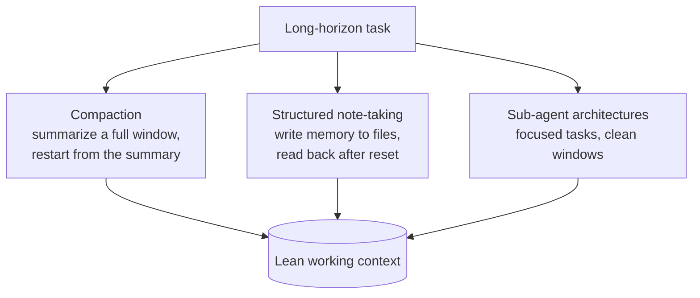

# Effective Context Engineering for AI Agents (Anthropic)

Anthropic's engineering guide frames **context as a finite resource with a
diminishing marginal return**: LLMs have an *attention budget*, and every token
spent draws it down. So good context engineering means finding **the smallest set
of high-signal tokens that maximize the odds of the desired outcome**. This is
the practical companion to the [context engineering](context-engineering.md)
pattern.

## The anatomy of effective context

- **System prompts — the "right altitude."** Aim for the Goldilocks zone between
  two failure modes: brittle hardcoded if-else logic (fragile, high maintenance)
  and vague high-level guidance (no concrete signal, false assumption of shared
  context). Be specific enough to guide behavior, flexible enough to leave the
  model strong heuristics. Organize into sections (`<background_information>`,
  `<instructions>`, `## Tool guidance`, `## Output description`) — though exact
  formatting matters less as models improve. **Minimal ≠ short:** give enough to
  fully specify behavior, and start from a minimal prompt on the best model, then
  add instructions/examples driven by observed failures.
- **Tools** are the contract between the agent and its action/information space.
  They must be **token-efficient** — return the right information and encourage
  efficient agent behavior.

## Just-in-time context retrieval

The field is shifting from **pre-inference embedding-based retrieval** (surface
everything up front) toward **"just in time"** strategies:

- The agent holds **lightweight identifiers** — file paths, stored queries, web
  links — and loads data at runtime via tools.
- Claude Code writes targeted queries, stores results, and uses `head`/`tail` to
  analyze large data without loading full objects — bypassing stale indexing and
  complex syntax trees.
- **Metadata is signal.** `test_utils.py` in `tests/` means something different
  from the same filename in `src/core_logic/`. Folder hierarchy, naming, and
  timestamps guide both humans and agents. This enables **progressive
  disclosure**: understanding assembled layer by layer through exploration.
- **Hybrid is often best.** Retrieve some data up front for speed, then explore
  autonomously. Claude Code is hybrid: `CLAUDE.md` is dropped in up front; glob
  and grep retrieve files just-in-time. Guiding principle: *"do the simplest
  thing that works."*

## Context engineering for long-horizon tasks

For tasks that outrun a single window, three techniques:

- **Compaction** — summarize a near-full window and continue from the summary.
- **Structured note-taking / memory** — the agent writes notes to a file-based
  system and reads them back after resets, sustaining multi-hour coherence. (The
  **memory tool** shipped in public beta with the Sonnet 4.5 launch.)
- **Sub-agent architectures** — a lead agent holds the high-level plan; each
  specialized sub-agent explores with its own clean window (tens of thousands of
  tokens) but returns only a **distilled 1,000–2,000-token summary**. Clean
  separation of concerns keeps the lead agent's context lean.

As models get more capable, design trends toward letting intelligent models act
intelligently, with progressively less human curation.

## Related

- [Context engineering](context-engineering.md) — the pattern this operationalizes.
- [Managing context on the Claude Developer Platform](claude-context-management.md) — the product-side context editing + memory tool.
- [No Vibes Allowed (Dex Horthy)](no-vibes-allowed-dex-horthy.md) — compaction and RPI in practice.
- [Four-files AI workflow](../agentic-coding/four-files-ai-workflow.md)

## References
- [Effective context engineering for AI agents — Anthropic](https://www.anthropic.com/engineering/effective-context-engineering-for-ai-agents)
