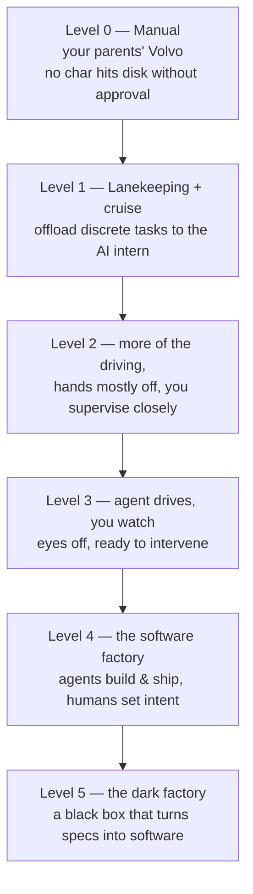

# The Five Levels — from Spicy Autocomplete to the Dark Factory

Dan Shapiro maps AI-assisted coding onto the **NHTSA five levels of driving
automation** (created 2013), giving teams a shared language for both where they
are and where they're heading. The backdrop is *technical deflation*: the cost of
code is dropping so fast that smart teams defer human-hour tech debt today to
repay it in cheaper AI hours tomorrow — but only if you actually climb the ladder
rather than "just typing faster."

## The ladder (driving analogy)

- **Level 0 — Manual.** vi or Visual Studio; nothing hits the disk without your
  approval. AI is at most a search engine on steroids or a tab-complete. The code
  is unmistakably yours — manual labor in a deflationary world.
- **Level 1 — Lanekeeping + cruise control.** You still write the important stuff
  but hand *specific, discrete* tasks to the AI as an intern ("write a unit test
  for this").
- **Levels 2–4** climb through progressively more delegation — the AI does more of
  the "driving," you supervise less closely, until at the **software factory** the
  agents build, test, and ship while humans define **intent** and review
  **outcomes**, not code.
- **Level 5 — the Dark Factory.** "It's not really a car any more… it's a black
  box that turns specs into software." Production runs lights-out.

## Where it points

Shapiro's ladder is the source lineage for the [dark
factory](dark-factory.md) pattern and pairs directly with the
[autonomy ladder](autonomy-ladder.md) and [agentic maturity
models](../ai-org/agentic-maturity-models.md). The concrete Level-5 exemplar is
[StrongDM's software factory](strongdm-software-factory.md).

## Related

- [Dark Factory](dark-factory.md) — the top rung, in depth.
- [Autonomy Ladder](autonomy-ladder.md) — a parallel rung-by-rung framing.
- [Agentic Maturity Models](../ai-org/agentic-maturity-models.md) — related staged models.
- [The StrongDM Software Factory](strongdm-software-factory.md) — Level 5 in practice.

## References
- [The Five Levels: from Spicy Autocomplete to the Dark Factory — Dan Shapiro](https://www.danshapiro.com/blog/2026/01/the-five-levels-from-spicy-autocomplete-to-the-software-factory/)
