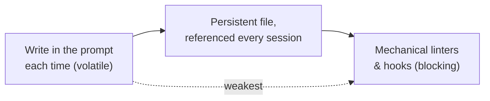

# Harness Engineering with Nothing but Markdown

A dev.to / AWS Builders post arguing that **harness engineering isn't only for coding agents** —
it applies just as much to *non-coding* business-automation agents, and there you build the
harness out of **nothing but Markdown**. The author runs a business agent via Claude Desktop over
MCP (Slack, Confluence, Google Calendar, Jira), has written zero code, and edits almost nothing
by hand — the agent generates its own Markdown instruction/knowledge files; the human approves or
requests revisions in chat. This markdown-only instruction-file style is what Ian calls **the
"charter."**

## Origin and the core shift

- **Mitchell Hashimoto** ("Engineer the Harness," Feb 2026): when an agent makes a mistake, don't
  fix the *prompt* — build an environment where the same mistake **can't happen again.**
- Days later, **OpenAI's "Harness engineering" report**: a small team, 5 months, ~1M LOC, zero
  hand-written code, Codex-only — cemented the term. See
  [Harness Engineering with Codex](harness-engineering-openai-codex.md).

Core: **from "asking" (prompts) to "building" (environment).** MCP's 2025 spread pushed agents
into Slack/Jira/Calendar, so "agents making mistakes on their own" spilled out of coding —
harnesses are no longer coding-only.

## The mistake the author kept making

Write "don't post directly to Slack — draft only," it posts anyway. Write "commit & push at
session end," it forgets. Rewrite the prompt, assuming *clearer wording will fix it*. Wrong
assumption: **no matter how polished, the prompt is volatile** — instructions get buried in long
context, and memory vanishes when the session ends. **Stop expecting the agent to remember; change
the environment.**

## Coding harness → non-coding (Markdown) equivalents

| Coding agent | Non-coding agent (Markdown) |
|---|---|
| ESLint / TypeScript strict | **Prohibited Actions** section under `agents/` |
| `AGENTS.md` command definitions | **Context routing rules** in the main instruction file |
| Pre-commit hooks | **Mandatory actions at session end** |
| CI gates (no merge unless tests pass) | **Forced knowledge accumulation** rules under `knowledge/` |

Different materials, same design intent: **build an environment outside the agent where it can
behave correctly.** Prerequisite — put these files in the auto-loaded slot (Claude Desktop
*Project Knowledge*, ChatGPT *Custom Instructions*). That channel is separate from chat messages
and is **structurally harder to bury** as the conversation grows.

## Three patterns (each a persistent-file protocol)

1. **Prohibited Actions** — a `## Prohibited Actions / Follow these without exception` list
   (draft-only Slack, no definitive financial judgments, flag confidential info). Moves rule
   lifespan from *per-session* to *permanent*. Mirrors [gating the irreversible /
   high-stakes](hightower-human-in-the-loop.md).
2. **Mandatory Actions at Session End** — adds explicit **trigger conditions** ("done," "thanks,"
   "commit") plus mandatory steps (write `docs/work-logs/YYYY-MM-DD-topic.md`, append `CHANGELOG`,
   git commit & push). The load-bearing line is **"Skipping is prohibited"** — leave discretion
   and a long conversation makes the agent decide "probably fine to skip." Removing discretion
   stabilizes behavior; the file also becomes **shared vocabulary** ("commit" now means the whole
   protocol). Applied [clean-handoff-every-session](learn-harness-engineering/clean-state-every-session.md).
3. **Forced Knowledge Accumulation** — a `## Knowledge Accumulation (Mandatory Check)` the agent
   runs *before each response*: does the last turn contain new facts / decisions / learnings /
   client-specifics? If so, append a **knowledge-capture proposal** pointing at
   `knowledge/{project}/…`. Not a mechanical gate (LLMs can skip), but it raises capture
   probability even when the human forgets to say "save that." See [Memory
   Engineering](memory-engineering.md).

## The enforcement gap — honestly stated

Markdown prohibitions lack a linter's mechanical enforcement (an agent can read past them,
especially if buried). But the fair comparison isn't against mechanical enforcement — it's against
**writing it in the prompt each time.** File beats prompt for two reasons: (1) **different
reference mechanism** — separate channel, harder to bury; (2) **accumulation is irreversible** —
prompt instructions don't survive the next session; file instructions persist (and live in git).



Non-coding agents sit in the **middle** — stronger than left, short of right, but the move to the
middle is what buys stability.

## Repository structure as a design decision

```
ai-agents/
├── agents/            # role-specific instruction files
│   ├── assistant.md   # main: prohibitions, mandatory actions, routing
│   ├── project-a/     # sre-support.md, qa-support.md, …
│   └── project-b/     # accounting.md, …
├── knowledge/         # accumulated knowledge (+ writing-style-guide.md)
├── docs/work-logs/    # per-session logs
└── CHANGELOG.md
```

Two principles shared with coding harnesses:

- **Separation of concerns** — a monolithic `AGENTS.md` fails (OpenAI's report says so too): *when
  everything is "important," nothing is.* Keep the main file to ~100 lines as a **map/pointer**
  that only does **context routing** ("AWS/SRE signals → `agents/project-a/`"; ambiguous → ask),
  delegating detail to specialized files. This is exactly [why one giant instruction file
  fails](learn-harness-engineering/split-instructions-across-files.md).
- **Version control** — git preserves *when a rule was added* and *which change made things
  stable*, and a remote frees the harness from a single machine. And [if it isn't in the repo, it
  doesn't exist for the agent](learn-harness-engineering/repository-as-system-of-record.md) —
  true for non-coding agents too.

## Getting started (emergent order)

1. Agent makes the **same mistake twice** → write it in a **file**, not a prompt.
2. File **bloats** → split by role.
3. Info **lost between sessions** → build an accumulation system.

Same loop Hashimoto describes — coding builds it with linters/hooks, non-coding with Markdown
structure; the material differs, the thinking loop is identical.

## References
- [Harness Engineering with Nothing but Markdown](https://dev.to/aws-builders/harness-engineering-with-nothing-but-markdown-g6b)
