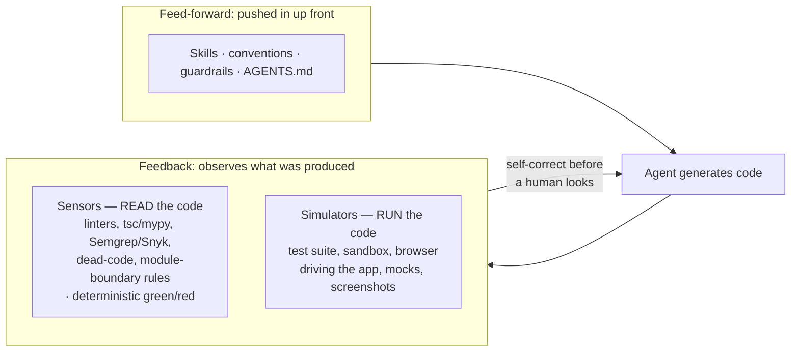

# Harness Engineering (Sensors & Simulators)

A coding agent is a **model plus everything built around it**. Most of the
leverage in agentic development sits in the harness — prompts, hooks, sandboxes,
feedback loops, memory policies — **not** in model selection. Addy Osmani: *"A
decent model with a great harness beats a great model with a bad harness."*

The formula: `coding agent = AI model(s) + harness`. Claude Code, Cursor, Codex,
and Aider run on similar or identical models yet produce dramatically different
results — the difference is the harness. **If you're not the model provider, the
harness is your leverage.**

> Complements [What Is Agent Harness Engineering?](agent-harness-engineering.md)
> (the 5-layer scaffolding view) and [AI Harness Architecture](ai-harness-architecture.md)
> (the harness as an OS). This note is the **sensors/simulators + feedback**
> framing.

## Inner vs outer harness

- **Inner harness** — ships *inside* the coding agent: tool-use loop, context
  management, sub-agents, built-in prompts. You rarely control it.
- **Outer harness** — everything *you* wrap around the agent: system prompts &
  `AGENTS.md`, skills, tools & MCP servers, sandboxes, hooks, observability.
  This is where your leverage lives.

## Feed-forward vs feedback (Böckeler)

The outer harness splits into two halves:

The **feedback** half carries most of the leverage:

- **Sensors** — static checks that *read* code without running it. Mostly
  deterministic (green/red), giving guarantees the model's own judgment can't.
- **Simulators** — ways to actually *run* the code so the agent observes
  behavior. **Sensors say the code *looks* right; simulators say whether it
  *works*.** (This is the eval surface — see
  [evals & LLM-as-a-judge](../ai-platform/evals-llm-as-a-judge.md).)

**The core move** (Mitchell Hashimoto, who popularized the term): when an agent
makes a mistake, don't just correct it — *build the sensor or simulator it can
call to catch that mistake next time.* **Good harnesses aren't downloaded; they
accumulate from your own failure history.** This is the
[self-improving harness loop](self-improving-harness-loop.md).

## Why it matters

Wire enough sensors and simulators together and the **harness, not the model,
carries the behavior** — which is why leading agents now resemble each other
more than their underlying models. *"2025 was agents; 2026 is agent harnesses."*
Harness-as-a-Service SDKs (Claude Agent SDK, Codex SDK, OpenAI Agents SDK) move
the baseline from *building* a harness to *configuring* one well. It's the old
control-loop idea — you stop writing code and start designing the loop the agent
runs inside; pushed to the limit, OpenAI's frontier harness reportedly produced
a million lines in five months with zero written by hand.

**The catch is calibration:** sensors and simulators only help if they encode
*your* standards. Agents don't learn by osmosis — *"if you don't write it down,
the agent makes the same mistakes on the hundredth run as the first."* The real
work is making what "good" means for your system **machine-checkable**.

## In practice

A few moves separate a working harness from a frustrating one:

- **Tool descriptions are prompts, not docs.** The agent re-reads them every
  turn and acts immediately — iterate like a system prompt: cross-reference
  related tools, describe a flag's *consequence* not its definition, shape input
  schemas to how the model already behaves.
- **Separate generation from verification, adversarially.** Cloudflare's
  vuln-hunting harness runs in phases — recon, fan ~50 agents out to hunt
  concurrently, then have *independent* agents try to *disprove* each finding
  before it counts. A finding that survives a skeptic beats one a single agent
  asserts.
- **Give parallel agents their own sandbox.** Many agents at once only works if
  each gets an isolated environment, so they don't trample each other's working
  tree or ship half-finished changes.
- **Keep it model-agnostic.** Proprietary harnesses are overly tuned to their
  own models; decouple if you want to swap models.

## References
- [Harness Engineering — Tessl Patterns](https://tessl.io/patterns/agentic-development-workflow/harness-engineering/)
