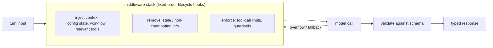

# Harness Is the Architecture: How We Rebuilt Industrial AI Agents from the Ground Up

A ReshapeX engineering case study (Mejia, Builes, Navarrete, Pinto, Castaño, Vanegas) on
rebuilding industrial-sales AI agents. The thesis, stated bluntly: **the models are good
enough; the architecture around them is not.** Or: *the model is a commodity — the harness
is not.* This is the [harness-engineering](harness-engineering.md) hub's argument told as a
production war story.

## The core problem

Every cloud vendor's agent pitch is the same — spin up a model, point it at your docs, add
chat. It fails where it matters: ask which valve seat material is compatible with a
chlorine fluid at 180°C and it answers *fluently and wrong*. Most deployments assume
**intelligence is the bottleneck**, so teams chase better models, bigger context, fancier
RAG. But the real bottleneck is **the gap between what the model was given and what it
needed to know**. In industrial sales that knowledge isn't in training data — it's in
private APIs, live inventory, and the customer's own session.

And the stakes invert the usual tradeoff: **a wrong answer is worse than no answer**, since
a confident-but-incorrect spec erodes trust faster than an honest "I don't have that."

## Where they started: the Langflow ceiling

2025 agents were built in **Langflow** (visual node canvas on LangChain 0.3 "classic"
Chains): fast to ship — RAG over PDFs (PyPDF → LlamaParse), hardcoded product
configurators — but fragile. Two ceilings with no in-platform fix:

1. **Vector search doesn't understand relationships.** Customer knowledge (catalogs, spec
   sheets, ERP) isn't flat: a part belongs to a family, cross-references a competitor
   equivalent, one spec constrains three others. Embedding-similarity finds *semantically
   close* text, not *structurally connected* info — relationships never reach retrieval;
   the model gets raw fragments to reassemble. Exact-match queries (part number
   `FVAM-2050-B`) fail worst — similarity puts `-B` and `-C` right next to each other. →
   demands a **[knowledge graph](agent-memory-systems-knowledge-graphs.md)**, not just a
   vector store. (Stuffing whole docs into context fails too: token caps, cost, and
   accuracy that *peaks then drops* past a context size — Databricks across 13 models.)
2. **Workflow orchestration ≠ agent orchestration.** Langflow gives high-level predefined
   flows with a hardcoded ReAct loop; the hooks needed (input guardrails, context trimming,
   fallback providers, tool-call limits — logic *before a model call, after a tool call,
   between reasoning steps*) don't exist. **LangChain v1 / LangGraph** makes **middleware**
   first-class, which is exactly the low-level control needed. Not a compatible
   migration — a rebuild from scratch.

## The harness = six disciplines

> The model at the center is a commodity. The harness around it is not.

Context engineering decides *what the model sees*; grounding, tool governance, safety,
robustness, and observability are the rest.

### 1. Context engineering — five overlapping concerns

The wall better prompting can't fix: *what the model knows at the moment it answers.* For
every call, decide what goes in the window, in what form, at what granularity, and what
stays out. (See [context engineering](context-engineering.md),
[Anthropic's version](effective-context-engineering-anthropic.md).)

- **Prompt engineering** — role, reasoning strategy, constraints; fixes the blank-slate model.
- **RAG / grounding** — pull from manufacturer APIs + a hybrid-search KB of curated docs;
  the model reasons over *cited retrieved data*, doesn't hallucinate specs.
- **State & history** — carry established constraints (voltage, form factor, mounting)
  across turns so answers don't reset.
- **Memory** — session checkpoints persist the conversation graph across sessions; a
  returning customer resumes instead of re-explaining. (See [memory engineering](memory-engineering.md).)
- **Structured output** — typed objects, not prose, so responses are composable: trigger
  UI, update config state, feed the next tool call reliably.

These interlock: retrieval informs prompt composition; state shapes what's worth
retrieving; memory decides which state is still relevant; structured outputs make state
updates trustworthy.



### 2–5. Grounding, tool governance, safety, robustness

The production middleware stack fires at fixed lifecycle hooks (order non-negotiable):

```
NoAssistantPrefillMiddleware()          # before everything (Claude compat)
LoggingModelFallbackMiddleware([...])   # wraps the model call
SafetyGuardrailMiddleware(0.5)          # before_agent: can stop early
ToolHardLimitMiddleware(per_tool=3)     # before model call: caps tool access
ToolOutputTrimmerMiddleware()           # after tool: caps result size
ToolCallLimitMiddleware(run_limit=30)   # hard ceiling for the whole turn
SummarizationIgnoreToolMessagesMiddleware()  # compresses history
ContextOverflowCleanupMiddleware()      # around model call: overflow recovery
LeadCaptureIntentMiddleware(window=8)   # after_agent
SafetyOutputGuardrailMiddleware()       # after_agent: screens output
StripToolHistoryMiddleware()            # after_agent: cleanup
```

**Robustness** isn't an uptime SLA — it's *output stays correct even when the model,
provider, or runtime degrades.* Mechanisms:

- **Provider fallbacks** — run on Anthropic *and* OpenAI; both have bad days (errors, or
  up-but-crawling). A backup is valid only if policy-equivalent (echoes
  [governed agents](../ai-governance/building-governed-agents.md)).
- **Tool-call limits** — per-tool and per-turn ceilings; caps runaway loops.
- **Runtime** — moved off AWS App Runner (which killed idle connections mid-reasoning);
  conversation state checkpointed to a durable store; **fail loud** — refuse to start on
  misconfigured state rather than silently drop to in-memory the customer later loses.
- **Three independent layers** — knowledge graph / tool harness / reasoning layer each can
  fail without taking down the whole system.

The goal is an agent that's **accountable, not smarter**: when the easy path fails, the
answer degrades into a *correct, narrower* response, not a confident wrong one.

### 6. Observability

A thumbs-down with no context is a data point you can count but not learn from. Every turn
opens a **Langfuse trace** with an ID seeded deterministically from `session_id:message_id`
— the same message always maps to the same trace, so late-arriving feedback still attaches
to the exact span that produced the answer (which model, which tools, which KB chunks,
whether a fallback fired). (See [observability](hightower-observability.md).)

## Why it belongs in HAL

This is the field's central claim in miniature: quality is bounded by the harness, not the
model. Pairs with [harness engineering](harness-engineering.md),
[the AI harness architecture](ai-harness-architecture.md),
[tool contracts & validators](hightower-tool-contracts-and-validators.md),
[the retry](hightower-the-retry.md), and
[systems thinking for agentic AI](systems-thinking-for-agentic-ai.md).

## References
- [Harness Is the Architecture: How We Rebuilt Industrial AI Agents from the Ground Up](https://www.reshapex.com/en/engineering/harness-is-the-architecture)
