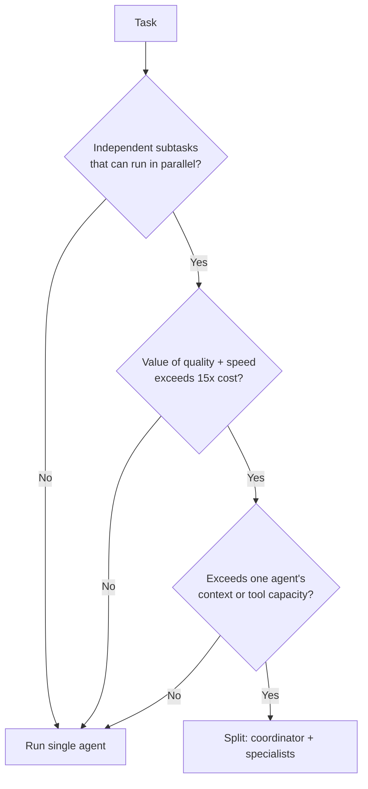
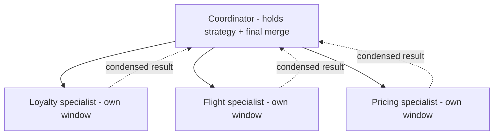

# Multi-Agent Orchestration: When to Split the Agent, and How Not to Pay 15x for It

Part 6 of Rick Hightower's *Harness Engineering, Two Frameworks* series. The argument: the
most expensive agent failure is not the one that crashes — it is the one that keeps
thinking, keeps spending, and still leaves the user to solve the problem. Splitting a task
across agents is a decision to make deliberately, behind a gate, not a default architecture.

## The 15x tax is real

Start with the number, because it governs the whole decision:

- A **single-agent loop** costs roughly **4x** the tokens of a plain chat turn.
- A **naive multi-agent system** costs about **15x**.

On agentic benchmarks, token usage alone explains the large majority of performance
variance, because coordination chatter accumulates at every agent boundary. The worst bills
come from **context explosion**: every agent accumulates the *full* workflow history
instead of a scoped slice, and over a long task the agents drift off the original goal. The
story's cautionary case ("Marcus's nine-loop spiral") is two agents each carrying the whole
conversation, each re-deriving who owns the booking, neither finishing.

## The gate: three conditions, all required

Going multi-agent is a gate, not a feature. Split only when **all three** hold:

1. The task decomposes into genuinely **independent** subtasks that can run in parallel.
2. The combined value of higher quality and faster wall-clock time **exceeds the 15x cost**.
3. The task **exceeds one agent's capacity** — more context than one window, or more tool
   diversity than one configuration.

If any condition fails, run the single agent. The honest default, after hardening a single
agent through every other harness function, is to **keep it single**. If you can't defend
the 15x bill in a code review, you don't have a multi-agent system — you have an outage
waiting.

## When it is worth it: hub-and-spoke

When the gate opens, the pattern that keeps cost near **4–6x** instead of 15x is
**hub-and-spoke**: one coordinator holds the strategy and the final merge; each specialist
runs a narrowly scoped task in its own context window and returns a **condensed** result.
The spokes never talk to each other — all coordination flows through the hub.

This is [context isolation](../agentic-coding/principles-of-agentic-development.md) applied across agents. A
specialist with a clean window cannot have its reasoning contaminated by the coordinator's
history; a coordinator that receives only a terse summary never inherits the specialist's
intermediate chatter. The contamination that sank the failing case is structurally
impossible when the boundary is drawn this way.

Both frameworks give the boundary as a first-class construct:

- **Claude Agent SDK:** a specialist is an `AgentDefinition` registered under `agents`, with
  its own prompt, its own toolset, and its own window. The coordinator delegates through the
  `Agent` tool. The specialist prompt forces a compressed, structured output so the hub
  receives a few facts, not a transcript.
- **LangChain Deep Agents:** the same coordinator-plus-specialist shape expressed in that
  framework's constructs.

## Keep the three coordinator layers separate

The coordinator has three distinct jobs — **orchestration** (deciding what runs),
**delegation** (handing scoped work to a spoke), and **synthesis** (merging condensed
results). Keeping them separate is what prevents the coordinator's own context from
ballooning back into the 15x regime.

## Why it matters

Multi-agent is the harness function most prone to being adopted for prestige rather than
need. The discipline is the same as everywhere else in the series: draw clean boundaries,
scope context tightly, and only pay for coordination when the output justifies it. It sits
alongside [durable recovery](hightower-the-retry.md),
[human-in-the-loop gates](hightower-human-in-the-loop.md), and
[observability](hightower-observability.md) as a harness job the model cannot do for you.
See also [from coder to orchestrator](../ai-org/from-coder-to-orchestrator.md) for the role shift this
implies.

## References

- [Multi-Agent Orchestration: When to Split the Agent — Rick Hightower](https://rickhigh.substack.com/p/harness-engineering-multi-agent-orchestration)
