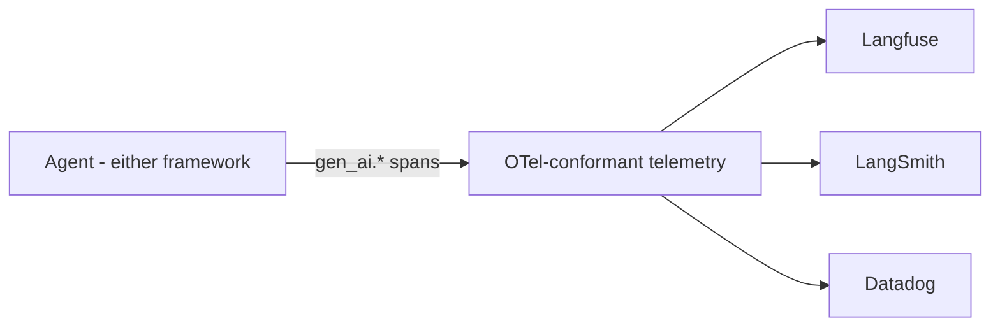

# Observability: The Green Dashboard and the Seven Customers Who Were Never Booked

Part 8 (the finale) of Rick Hightower's *Harness Engineering, Two Frameworks* series. The
framing incident: at 3 a.m. an upstream API silently changed its date format, so
`search_flights` returned an empty set for forty minutes with **no HTTP error**. The agent,
keeping no record of what the tool actually returned, served stale cache as fresh
confirmations. Seven customers got confirmation numbers for flights that were never booked.
The system-health dashboard stayed **green** the whole time; the eighth customer, calling
support, was the first signal. Reconstructing it took three days because there was no trace.

## You are monitoring the server, not the agent

Latency, error rate, and uptime tell you the *process* is alive. They cannot tell you what
the agent **decided**, why, what a tool returned, or where the booking went wrong. Server
metrics and agent-level telemetry measure different layers, and the gap between them is
exactly where the seven bookings disappeared. The fix is not a smarter model — it is making
every decision the harness makes visible enough to read, query, and alert on.

## The unit is the span: seven span kinds

Agent-level telemetry is built from **spans** — structured records of one decision, with
queryable attributes. A travel-booking harness carries seven span kinds, each guarding a
failure mode that is invisible without it:

| Span kind | What it guards against |
| --- | --- |
| **Model call** | No cost attribution |
| **Tool call** (name, args, and crucially the **result**) | The missing span at 3 a.m. |
| **Validator** | A rejection with no audit trail |
| **Memory write** | An untraceable corrupted fact |
| **Subagent handoff** | A runaway delegation loop, invisible until the bill arrives |
| **Evaluator decision** | Quality drift with no signal |
| **Promotion gate** | A broken release shipping |

The one span that would have ended the incident in a single query is the **tool-call result
span** — recording e.g. `gen_ai.tool.call.result: {"status": "error", "flights": null}` and
`error.type: DATE_FORMAT_MISMATCH`. Build that one first. Capture what the tool *returned*,
not merely that it was called.

## Instrument once, choose the vendor later

The framework-spanning answer to "which observability tool": instrument against the
**OpenTelemetry GenAI semantic conventions** — a vendor-neutral vocabulary of `gen_ai.*`
span attributes — and the backend becomes a *configuration choice*. Langfuse today,
LangSmith next quarter, Datadog next year, with no span rewrite. Both frameworks emit
telemetry that lands in OTel-compatible backends, so the discipline is identical: name the
spans, set the standard attributes, point the exporter wherever you like. In the Claude
Agent SDK a post-tool hook records the spans; in LangChain Deep Agents, environment-variable
tracing flags turn capture on ambiently without touching agent code.

This is the same portability argument made for
[OpenLLMetry](../ai-platform/openllmetry-is-all-you-need.md): standardize the emission, keep the backend
swappable.

## Drift and the promotion gate

Observability is not just forensic; it feeds a control. The article names **three
operationally distinct kinds of drift** — the gap between your eval set and your real users
being the central one — and wires a drift signal into a **promotion gate** that blocks a bad
deploy *before* it reaches users. Traces are the substrate evals attach to: they are where
new failure modes surface before you have a metric for them, and they catch the
non-deterministic regression trap where "fixing" one thing quietly produces others. This is
the operational complement to [why AI evals are the hottest skill](../ai-platform/why-ai-evals-are-the-hottest-skill.md)
and the Arize view in [agent observability, evals, and experimentation](../ai-platform/arize-observability-evals-experimentation.md).

## Why it matters

A green dashboard is a lie when it measures the wrong layer. Agent observability is the
platform layer that records what the agent *actually did* — every reasoning step, tool call,
result, and handoff — because a non-deterministic system cannot be reasoned about from code
alone. It closes the series' loop: [durable recovery](hightower-the-retry.md),
[multi-agent orchestration](hightower-multi-agent-orchestration.md), and
[human-in-the-loop gates](hightower-human-in-the-loop.md) all become auditable only once
their decisions are on a trace.

## References

- [Observability: The Green Dashboard and the Seven Customers Who Were Never Booked — Rick Hightower](https://rickhigh.substack.com/p/harness-engineering-observability)
